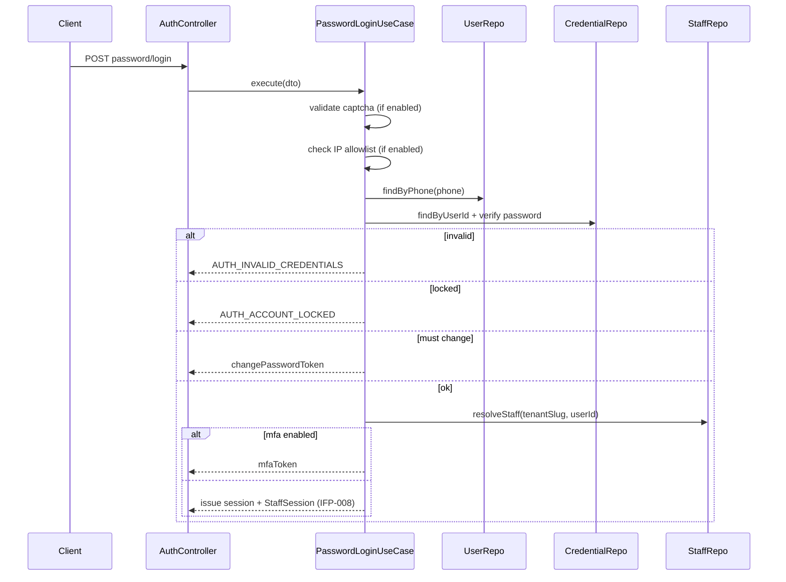

# IFP-TASK-002: Use Case + API Password Login (Staff)

## Metadata

| فیلد | مقدار |
|------|--------|
| Phase | 01 — Auth & Security |
| Epic | Epic-01-Password-Credentials |
| ID | IFP-002 |
| Priority | P0 |
| Depends on | IFP-001, Phase 0 TASK-037, TASK-038 |
| Blocks | IFP-003, IFP-004, IFP-008, IFP-013 |
| Estimated | 8h |

---

## هدف

پیاده‌سازی **ورود staff با شماره موبایل + رمز عبور** در لایه application و API. پس از اعتبارسنجی credential، flow مشابه OTP login: resolve `User` → `Staff` در tenant، بررسی suspension، صدور JWT یا `NEED_TENANT_SLUG`، و gating برای MFA step-up (IFP-004).

---

## معیار پذیرش

- [ ] `POST /api/v1/auth/password/login` — staff actor
- [ ] phone normalize `09xxxxxxxxx` (TASK-039)
- [ ] password صحیح + staff active → session یا `mfa_required` (اگر TOTP enabled)
- [ ] password اشتباه → increment `failedLoginCount` + audit `auth.login_failed`
- [ ] `mustChangePassword=true` → 403 `AUTH_MUST_CHANGE_PASSWORD` + `changePasswordToken`
- [ ] multi-tenant → 409 `NEED_TENANT_SLUG` + tenants list
- [ ] Staff/Tenant suspended → 403
- [ ] بدون credential → 404 `AUTH_CREDENTIAL_NOT_FOUND` (پیام عمومی: invalid credentials)
- [ ] Captcha token اجباری وقتی IFP-012 فعال (header/feature flag)
- [ ] IP allowlist check وقتی IFP-014 tenant setting فعال

---

## مشخصات فنی

### Endpoint

```
POST /api/v1/auth/password/login
Content-Type: application/json
X-Captcha-Token: <optional until IFP-012>
```

### Request (`PasswordLoginSchema`)

```typescript
{
  phone: string;           // phoneSchema — 09xxxxxxxxx
  password: string;        // min 1 — never log
  tenantSlug?: string;     // required if multi-tenant staff
  rememberMe?: boolean;    // default false — IFP-011
  captchaToken?: string;   // required when captcha enabled
}
```

### Response — Full Session (no MFA)

```json
{
  "kind": "session",
  "accessToken": "eyJ...",
  "expiresIn": 900,
  "staff": { "id": "uuid", "tenantId": "uuid", "name": "علی" },
  "tenant": { "id": "uuid", "slug": "demo", "name": "فروشگاه" },
  "lastLogin": {
    "at": "2026-06-29T10:00:00Z",
    "ip": "1.2.3.4",
    "deviceLabel": "Chrome — Windows"
  }
}
```
Cookie: `hivork_staff_refresh` (httpOnly, path `/api/v1/auth`)

### Response — MFA Required (IFP-004)

```json
{
  "kind": "mfa_required",
  "mfaToken": "eyJ...",
  "expiresIn": 300,
  "methods": ["otp", "totp"]
}
```

### Response — Must Change Password

```json
{
  "kind": "must_change_password",
  "changePasswordToken": "eyJ...",
  "expiresIn": 600
}
```
HTTP 403 — code `AUTH_MUST_CHANGE_PASSWORD`

### Response — Need Tenant

```json
{
  "code": "NEED_TENANT_SLUG",
  "tenants": [
    { "slug": "shop-a", "name": "فروشگاه الف" },
    { "slug": "shop-b", "name": "فروشگاه ب" }
  ]
}
```
HTTP 409

### Use Case Flow



### Tokens

| Token | Purpose | TTL |
|-------|---------|-----|
| `mfaToken` | step-up after password | 300s |
| `changePasswordToken` | forced password change | 600s |

Payload `mfaToken`: `{ sub: userId, actor: 'staff', tenantId, staffId, type: 'mfa_pending' }`

### Security — Uniform Error Messages

همیشه برای wrong phone / wrong password / no credential:
- HTTP 401
- `AUTH_INVALID_CREDENTIALS` — جلوگیری از user enumeration

### Audit

| Action | Metadata |
|--------|----------|
| `auth.login_success` | method: `password`, staffId, tenantId, ip |
| `auth.login_failed` | method: `password`, reason, ip (no password) |

### Permissions

Public — pre-auth endpoint.

---

## فایل‌ها

| عمل | مسیر |
|-----|------|
| Create | `packages/contracts/src/auth/password-login.schema.ts` |
| Create | `packages/application/src/auth/password-login.use-case.ts` |
| Update | `apps/api/src/auth/auth.controller.ts` |
| Create | `packages/application/src/auth/ports/credential.port.ts` |
| Update | `docs/09-development/ERROR-CODES.md` |

---

## مراحل پیاده‌سازی

1. Contract Zod + mfa/tenant conditional validation
2. `PasswordLoginUseCase` — orchestrate verify + staff resolve
3. Integrate lockout from IFP-013 (or inline until merged)
4. Hook `StaffSession` create (IFP-008 stub OK initially)
5. Controller + cookie set + audit
6. Integration tests with Testcontainers

---

## Edge Cases & Errors

| سناریو | HTTP / Code | رفتار |
|--------|-------------|--------|
| Invalid phone format | 400 `INVALID_PHONE` | رد |
| Wrong credentials | 401 `AUTH_INVALID_CREDENTIALS` | + failed count |
| Account locked | 423 `AUTH_ACCOUNT_LOCKED` | `lockedUntil` in details |
| No credential | 401 `AUTH_INVALID_CREDENTIALS` | uniform message |
| MFA enabled | 200 `kind: mfa_required` | no refresh cookie yet |
| mustChangePassword | 403 `AUTH_MUST_CHANGE_PASSWORD` | change token |
| NEED_TENANT_SLUG | 409 | tenant picker |
| TENANT_SUSPENDED | 403 `TENANT_SUSPENDED` | |
| STAFF_SUSPENDED | 403 `STAFF_SUSPENDED` | |
| Captcha invalid | 400 `AUTH_CAPTCHA_INVALID` | |
| IP not allowed | 403 `AUTH_IP_NOT_ALLOWED` | |
| Rate limited | 429 `AUTH_LOGIN_RATE_LIMITED` | |

---

## تست

- [ ] Integration: happy path → access + refresh cookie
- [ ] Integration: wrong password → failed count increment
- [ ] Integration: multi-tenant without slug → 409
- [ ] Integration: suspended staff → 403
- [ ] Integration: cross-tenant slug → 404 TENANT_NOT_FOUND
- [ ] RBAC: N/A (public)

---

## UX (اگر UI دارد)

Handled in IFP-003 — API only task.

---

## Flow

```
/login password tab → POST password/login
  → session → /dashboard
  → mfa_required → MFA step (IFP-004)
  → must_change_password → /auth/change-password
  → NEED_TENANT_SLUG → tenant picker → retry with slug
```

---

## Policy Alignment

- [ ] EXCELLENCE-STANDARDS §9 backend — audit + validation
- [ ] ADR-017 — User → Staff resolution
- [ ] ADR-015 — no branchId in JWT
- [ ] SOFT-DELETE-POLICY — credential soft-deleted → invalid credentials

---

## مراجع

- [TASK-036-auth-otp-verify.md](../../../Phases/Phase-0-Foundation/Epic-06-Auth/TASK-036-auth-otp-verify.md)
- [TASK-037-auth-jwt-tokens.md](../../../Phases/Phase-0-Foundation/Epic-06-Auth/TASK-037-auth-jwt-tokens.md)
- [IFP-TASK-001-adr-user-credential-schema.md](./IFP-TASK-001-adr-user-credential-schema.md)

---

## Self-Review Score

| محور | سقف | امتیاز | یادداشت |
|------|-----|--------|---------|
| Metadata | /10 | 10 | |
| Completeness | /25 | 25 | full API spec |
| Policy | /25 | 24 | ADR cited |
| Executability | /25 | 25 | flow + errors |
| Alignment | /15 | 14 | OTP parity |
| **جمع** | **/100** | **98** | Ready |
