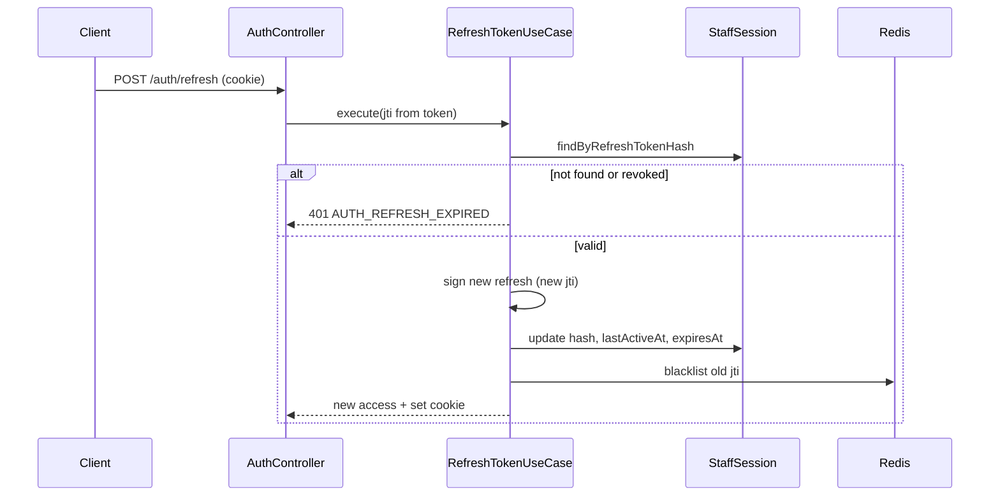

# IFP-TASK-011: Remember Me — Refresh Token Rotation Policy

## Metadata

| فیلد | مقدار |
|------|--------|
| Phase | 01 — Auth & Security |
| Epic | Epic-03-Session-Device |
| ID | IFP-011 |
| Priority | P0 |
| Depends on | IFP-008, Phase 0 TASK-037 |
| Blocks | IFP-018 |
| Estimated | 6h |

---

## هدف

تعریف و پیاده‌سازی سیاست **Remember Me**: TTL متفاوت refresh token، rotation امن در هر refresh، و binding به `StaffSession` — جلوگیری از token reuse attacks.

---

## معیار پذیرش

- [ ] `rememberMe=true` → refresh TTL 30 روز (default env)
- [ ] `rememberMe=false` → refresh TTL 24 ساعت — session cookie semantics
- [ ] هر `POST /auth/refresh` → new refresh token (rotation) + update StaffSession hash
- [ ] Reuse detected (old refresh presented) → revoke **all** sessions for staff — audit `security.token.reuse_detected`
- [ ] Cookie `maxAge` matches TTL
- [ ] Checkbox در login forms (OTP + password) wired
- [ ] Document policy in ADR-018 appendix or security doc

---

## مشخصات فنی

### TTL Configuration

| rememberMe | Refresh TTL | Env override |
|------------|-------------|--------------|
| false | 86400s (24h) | `JWT_REFRESH_SESSION_TTL` |
| true | 2592000s (30d) | `JWT_REFRESH_TTL` |

Access token unchanged: 15 min.

### Refresh Rotation Flow



### Reuse Detection

If refresh token verifies cryptographically BUT jti already blacklisted:
1. `RevokeAllStaffSessions(staffId, reason: 'token_reuse')`
2. Audit `security.token.reuse_detected`
3. Return 401 `AUTH_REFRESH_COMPROMISED`

### StaffSession Update on Refresh

```typescript
{
  refreshTokenHash: sha256(newJti),
  lastActiveAt: now(),
  expiresAt: now() + ttl(rememberMe),
}
```

### Cookie Attributes

```
rememberMe=true  → maxAge=30d, persistent
rememberMe=false → maxAge=24h OR session cookie (no maxAge) — choose maxAge=24h for API consistency
```

### Login Forms

Pass `rememberMe` to:
- `POST /auth/password/login`
- `POST /auth/otp/verify` (intent=login, staff)
- MFA verify (from mfaToken payload)

---

## فایل‌ها

| عمل | مسیر |
|-----|------|
| Update | `packages/application/src/auth/refresh-token.use-case.ts` |
| Update | `packages/infrastructure/auth/jwt-token.service.ts` — dual TTL |
| Update | `packages/application/src/auth/create-staff-session.service.ts` |
| Update | login/MFA use cases — pass rememberMe |
| Update | `.env.example` — `JWT_REFRESH_SESSION_TTL` |
| Update | `docs/06-operations/security-and-audit.md` |

---

## مراحل پیاده‌سازی

1. Dual TTL in JwtTokenService
2. Rotation in RefreshTokenUseCase
3. Reuse detection + revoke all
4. StaffSession hash update
5. Wire rememberMe checkbox UI
6. Integration tests for rotation + reuse

---

## Edge Cases & Errors

| سناریو | Code | رفتار |
|--------|------|--------|
| Expired refresh | 401 `AUTH_REFRESH_EXPIRED` | re-login |
| Reuse old refresh | 401 `AUTH_REFRESH_COMPROMISED` | all sessions revoked |
| rememberMe changed mid-session | — | TTL on next refresh |
| Logout then refresh | 401 | blacklisted |
| Multiple tabs refresh race | — | first wins; second gets new rotation chain OK |

---

## تست

- [ ] Integration: refresh rotates jti
- [ ] Integration: old refresh after rotation → compromised flow
- [ ] Integration: rememberMe false → 24h expiry
- [ ] Integration: rememberMe true → 30d

---

## UX

- [ ] Checkbox label: «مرا به خاطر بسپار (۳۰ روز)»
- [ ] Help text: «در صورت عدم انتخاب، پس از ۲۴ ساعت نیاز به ورود مجدد است»
- [ ] Unchecked by default (secure default)

---

## Flow

```
Login + rememberMe checked → 30d cookie
Login unchecked → 24h cookie
Active use → refresh extends lastActiveAt
```

---

## Policy Alignment

- [ ] OWASP refresh rotation best practice
- [ ] Audit on reuse detection
- [ ] ADR-016 API versioning — `/api/v1/auth/refresh`

---

## مراجع

- [TASK-037-auth-jwt-tokens.md](../../../Phases/Phase-0-Foundation/Epic-06-Auth/TASK-037-auth-jwt-tokens.md)
- [IFP-TASK-008-staff-session-schema.md](./IFP-TASK-008-staff-session-schema.md)

---

## Self-Review Score

| محور | سقف | امتیاز |
|------|-----|--------|
| Metadata | /10 | 10 |
| Completeness | /25 | 25 |
| Policy | /25 | 24 |
| Executability | /25 | 25 |
| Alignment | /15 | 14 |
| **جمع** | **/100** | **98** |
