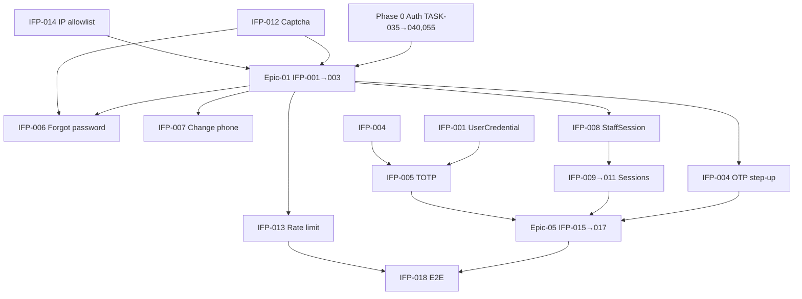

# Phase 01 — Auth & Security

> **وضعیت:** Approved — v1.0  
> **نسخه:** 1.0 — 1405/04/10  
> **ADRهای مرتبط:** ADR-013, ADR-015, ADR-016, ADR-017, ADR-018 (جدید — UserCredential)  
> **منبع محصول:** [`installment-module-features.md`](../../docs/01-product/installment-module-features.md) — §۱ صفحه ورود، §۲۰ امنیت  
> **قوانین:** [`PHASE_EPIC_TASK_AUTHORING_RULES.md`](../../docs/09-development/PHASE_EPIC_TASK_AUTHORING_RULES.md)

---

## هدف فاز

تکمیل **ورود Enterprise** و **تنظیمات امنیتی** پنل فروشنده روی پایه Phase 0 (OTP، JWT، ADR-017). این فاز password credential، MFA، مدیریت نشست/دستگاه، سخت‌سازی ورود (captcha، rate limit، IP allowlist) و UI تنظیمات امنیت را اضافه می‌کند — بدون نقض soft delete یا جداسازی actor.

---

## Exit Criteria (فاز کامل شد وقتی…)

- [ ] همه تسک‌های **P0** (IFP-001 → IFP-017) Done
- [ ] IFP-018 vertical slice E2E + RBAC pass
- [ ] ADR-018 (UserCredential) در `docs/08-decisions/` ثبت و لینک شده
- [ ] کدهای خطای جدید AUTH_* در `ERROR-CODES.md` sync
- [ ] Permissionهای `core.security.*` seed شده
- [ ] هیچ `prisma.*.delete()` روی business models
- [ ] self-review ≥ **95/100** روی همه task specs

---

## Epics

| Epic | مسیر | تسک‌ها | حوزه محصول |
|------|------|--------|------------|
| Epic-01 | [Epic-01-Password-Credentials](./Epic-01-Password-Credentials/) | IFP-001 → 003 | §۱ ورود با رمز |
| Epic-02 | [Epic-02-OTP-MFA](./Epic-02-OTP-MFA/) | IFP-004 → 007 | §۱ OTP/MFA، فراموشی رمز، تغییر شماره |
| Epic-03 | [Epic-03-Session-Device](./Epic-03-Session-Device/) | IFP-008 → 011 | §۱ نشست، دستگاه، Remember Me |
| Epic-04 | [Epic-04-Login-Hardening](./Epic-04-Login-Hardening/) | IFP-012 → 014 | §۱ Captcha، rate limit؛ §۲۰ IP مجاز |
| Epic-05 | [Epic-05-Security-Settings-UI](./Epic-05-Security-Settings-UI/) | IFP-015 → 017 | §۲۰ امنیت (رمز، 2FA، نشست، API key) |
| Epic-06 | [Epic-06-Phase01-Tests](./Epic-06-Phase01-Tests/) | IFP-018 | Vertical slice تست |

**مجموع:** ۱۸ تسک (IFP-001 → IFP-018)

---

## ترتیب اجرا (dependency graph)



### ترتیب پیشنهادی (فاز)

```
IFP-001 → IFP-012 (موازی) → IFP-002 → IFP-003
IFP-002 → IFP-004, IFP-006, IFP-007, IFP-008, IFP-013, IFP-014
IFP-004 → IFP-005
IFP-008 → IFP-009 → IFP-010 → IFP-011
IFP-005 + IFP-009 + IFP-010 → IFP-015 → IFP-016 → IFP-017
همه P0 → IFP-018
```

---

## وابستگی به فاز قبل

| پیش‌نیاز Phase 0 | استفاده در Phase 01 |
|------------------|---------------------|
| TASK-035/036 OTP request/verify | step-up، forgot password، change phone |
| TASK-037 JWT + refresh cookies | session rotation، Remember Me |
| TASK-038 actor separation | staff-only endpoints |
| TASK-040 OTP rate limit | الگوی rate limit برای password |
| TASK-055 onboarding flow | register → set initial password (IFP-001) |
| ADR-017 User identity | credential روی `User` نه `Staff` |

---

## قوانین

- قبل از هر تسک: `AGENTS.md` + `DEVELOPMENT_RULES.md` + `EXCELLENCE-STANDARDS.md` + `SOFT-DELETE-POLICY.md`
- **ایجاد/ویرایش Task:** [PHASE_EPIC_TASK_AUTHORING_RULES.md](../../docs/09-development/PHASE_EPIC_TASK_AUTHORING_RULES.md)
- Credential و MFA روی **User** (platform) — Staff فقط membership (ADR-017)
- Session روی **Staff** + `tenantId` — tenant-scoped
- Audit اجباری: `auth.*`, `security.password.*`, `security.mfa.*`, `security.session.*`, `security.apikey.*`

---

## مراجع

| موضوع | سند |
|--------|-----|
| RBAC | [rbac.md](../../docs/02-architecture/rbac.md) |
| امنیت | [security-and-audit.md](../../docs/06-operations/security-and-audit.md) |
| ADR-017 | [ADR-017-user-platform-identity.md](../../docs/08-decisions/ADR-017-user-platform-identity.md) |
| کدهای خطا | [ERROR-CODES.md](../../docs/09-development/ERROR-CODES.md) |

---

*آخرین به‌روزرسانی: 1405/04/10*
