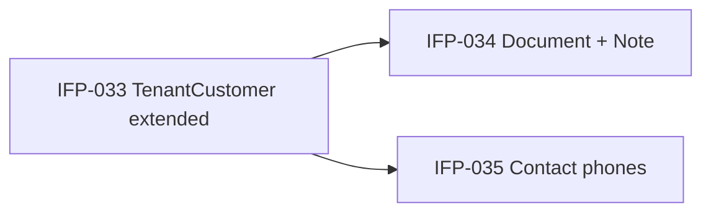

# Epic-01 — Customer Schema Extended

> **Phase:** IFP-03 Customer Enterprise  
> **وضعیت:** Ready for implementation  
> **ADR:** ADR-002, ADR-013, ADR-015, ADR-017

---

## هدف Epic

گسترش schema مشتری tenant برای پوشش §۳ محصول: دسته‌بندی، blacklist، آدرس‌های چندگانه با geo، مخاطبین اضطراری، مدارک (CustomerDocument)، یادداشت ساخت‌یافته (CustomerNote)، و شماره‌های تماس ثانویه (CustomerContactPhone). همه مدل‌ها tenant-scoped، soft delete، base fields کامل.

---

## Tasks

| ID | فایل | عنوان | Depends | Priority |
|----|------|--------|---------|----------|
| IFP-033 | [IFP-TASK-033-extend-tenant-customer-schema.md](./IFP-TASK-033-extend-tenant-customer-schema.md) | Extend TenantCustomer schema | Phase 0 TASK-023, TASK-027 | P0 |
| IFP-034 | [IFP-TASK-034-customer-document-note-models.md](./IFP-TASK-034-customer-document-note-models.md) | CustomerDocument + CustomerNote models | IFP-033 | P0 |
| IFP-035 | [IFP-TASK-035-customer-contact-phone-secondary.md](./IFP-TASK-035-customer-contact-phone-secondary.md) | CustomerContactPhone secondary numbers | IFP-033 | P0 |

---

## Dependency Graph (داخلی Epic)

---

## Policy Notes

| موضوع | قانون |
|-------|--------|
| Base fields | id, timestamps, audit, soft delete, version, metadata — همه مدل‌ها |
| tenantId | روی CustomerAddress, CustomerDocument, CustomerNote, CustomerContactPhone, CustomerEmergencyContact |
| onDelete | Restrict روی FKها — بدون Cascade hard delete (ADR-013) |
| Phone primary | فقط روی User (ADR-017) — secondary در CustomerContactPhone |
| TenantCustomer | زیر Branch نیست — defaultBranchId اختیاری (ADR-002) |
| Archive | `archivedAt` جدا از soft delete — مشتری archived در list عادی مخفی، restore/archive audit |
| Blacklist | `isBlacklisted` + reason — block create sale (domain rule در IFP-052) |

---

## مراجع

- `docs/02-architecture/tenancy-and-entities.md` §TenantCustomer
- `docs/09-development/EXCELLENCE-STANDARDS.md` §8
- `Phases/Phase-0-Foundation/Epic-04-Database/TASK-023-prisma-tenant-customer.md`
