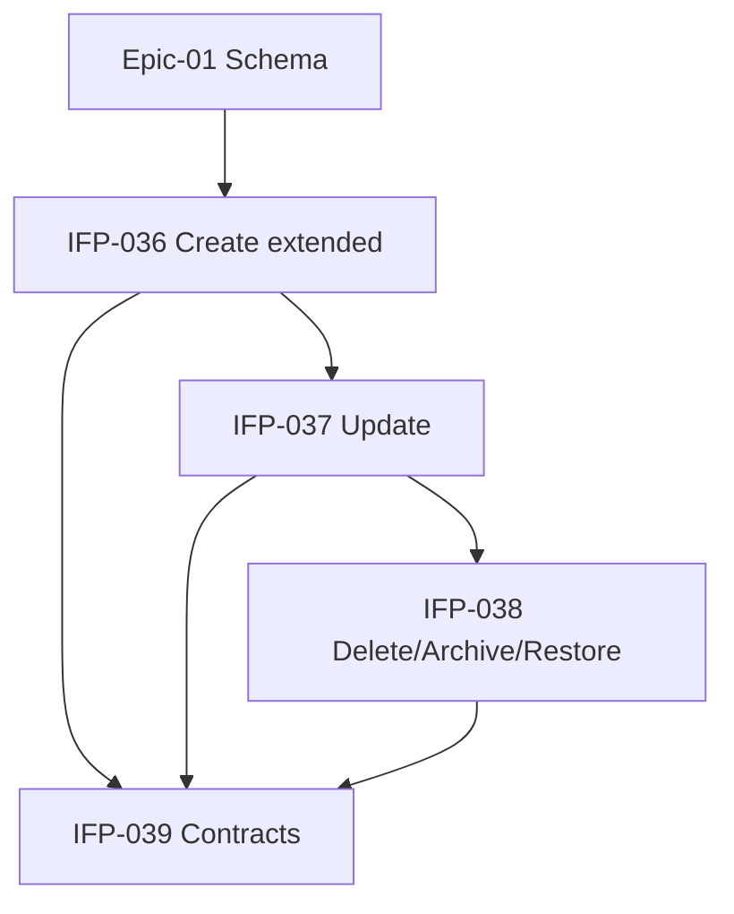

# Epic-02 — Customer CRUD

> **Phase:** IFP-03 Customer Enterprise  
> **وضعیت:** Ready for implementation  
> **ADR:** ADR-013, ADR-015, ADR-016, ADR-017

---

## هدف Epic

Use caseهای Enterprise برای create/update/soft-delete/archive/restore مشتری با فیلدهای گسترده Epic-01، validation کامل، optimistic lock، audit، data scope، و contracts Zod هم‌تراز API.

---

## Tasks

| ID | فایل | عنوان | Depends | Priority |
|----|------|--------|---------|----------|
| IFP-036 | [IFP-TASK-036-create-tenant-customer-extended.md](./IFP-TASK-036-create-tenant-customer-extended.md) | CreateTenantCustomer extended use case | IFP-033, IFP-035, Phase 0 TASK-058 | P0 |
| IFP-037 | [IFP-TASK-037-update-tenant-customer-validation.md](./IFP-TASK-037-update-tenant-customer-validation.md) | UpdateTenantCustomer + validation | IFP-033, IFP-035, IFP-036, Phase 1 TASK-084 | P0 |
| IFP-038 | [IFP-TASK-038-soft-delete-archive-restore-customer.md](./IFP-TASK-038-soft-delete-archive-restore-customer.md) | Soft delete + archive + restore | IFP-036, IFP-037, Phase 0 TASK-046 | P0 |
| IFP-039 | [IFP-TASK-039-customer-contracts-zod.md](./IFP-TASK-039-customer-contracts-zod.md) | Customer contracts Zod (EXCELLENCE §8) | IFP-036, IFP-037, IFP-038 | P0 |

---

## Dependency Graph (داخلی Epic)

---

## Policy Notes

| موضوع | قانون |
|-------|--------|
| Permissions | `installments.customer.create|update|delete|restore|archive` |
| Phone | immutable در update — primary از User (ADR-017) |
| Plan limit | فقط create/link جدید — نه restore |
| Audit | `customer.create|update|delete|restore|archive` |
| Version | optimistic lock 409 `OPTIMISTIC_LOCK_CONFLICT` |
| Blacklist | create sale block — IFP-052 domain rule |

---

## مراجع

- `Phases/Phase-0-Foundation/Epic-08-Core-Services/TASK-058-create-tenant-customer-use-case.md`
- `Phases/Phase-1-Seller-Panel/Epic-07-Customer-Backend/TASK-084-usecase-update-tenant-customer.md`
- `docs/03-modules/installments/STAFF-FLOWS.md` — SF-007
