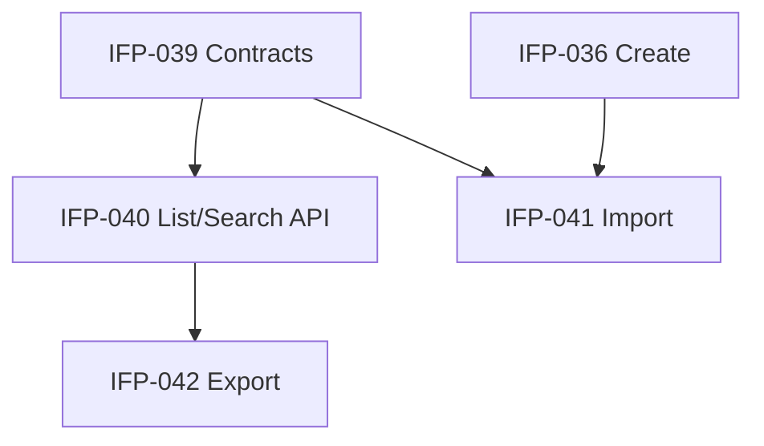

# Epic-03 — Customer Search List

> **Phase:** IFP-03 Customer Enterprise  
> **وضعیت:** Ready for implementation  
> **ADR:** ADR-015, ADR-016

---

## هدف Epic

API جستجوی زنده (live search)، لیست با فیلتر/مرتب‌سازی/cursor pagination، import Excel با فیلدهای Enterprise، و export Excel/PDF برای §۳ محصول.

---

## Tasks

| ID | فایل | عنوان | Depends | Priority |
|----|------|--------|---------|----------|
| IFP-040 | [IFP-TASK-040-live-search-list-api-filters.md](./IFP-TASK-040-live-search-list-api-filters.md) | Live search + list API with filters | IFP-039, Phase 1 TASK-085 | P0 |
| IFP-041 | [IFP-TASK-041-import-customers-excel-extended.md](./IFP-TASK-041-import-customers-excel-extended.md) | Import customers Excel (extended fields) | IFP-036, IFP-039, Phase 1 TASK-087 | P0 |
| IFP-042 | [IFP-TASK-042-export-customers-excel-pdf.md](./IFP-TASK-042-export-customers-excel-pdf.md) | Export customers Excel/PDF | IFP-040, IFP-039 | P1 |

---

## Dependency Graph (داخلی Epic)

---

## Policy Notes

| موضوع | قانون |
|-------|--------|
| Pagination | cursor-based — نه offset برای list بزرگ |
| Search | debounce سمت client؛ server min 2 char یا phone prefix |
| Import | max 5MB، row errors، audit `customer.import` |
| Export | respect data scope — فقط مشتریان مجاز staff |
| PII in logs | ❌ phone/name در log plain text |

---

## مراجع

- `Phases/Phase-1-Seller-Panel/Epic-07-Customer-Backend/TASK-085-usecase-list-tenant-customers.md`
- `Phases/Phase-1-Seller-Panel/Epic-07-Customer-Backend/TASK-087-usecase-import-customers-excel.md`
