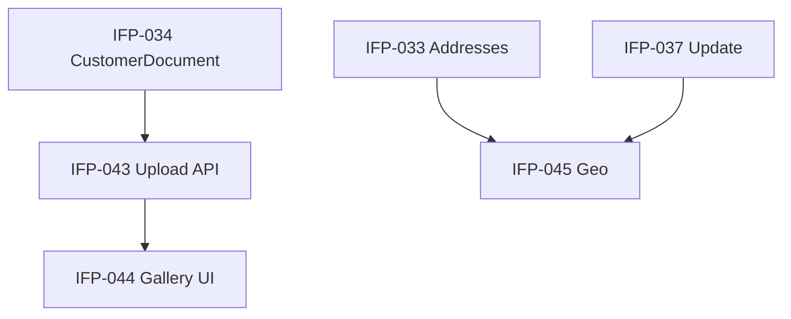

# Epic-04 — Customer Documents

> **Phase:** IFP-03 Customer Enterprise  
> **وضعیت:** Ready for implementation  
> **ADR:** ADR-013, ADR-015

---

## هدف Epic

آپلود و مدیریت فایل‌های مشتری (کارت ملی، شناسنامه، قرارداد، تصاویر)، gallery UI، و geo/لوکیشن روی آدرس مشتری.

---

## Tasks

| ID | فایل | عنوان | Depends | Priority |
|----|------|--------|---------|----------|
| IFP-043 | [IFP-TASK-043-upload-customer-files.md](./IFP-TASK-043-upload-customer-files.md) | Upload customer files | IFP-034, IFP-039 | P0 |
| IFP-044 | [IFP-TASK-044-customer-file-gallery-ui.md](./IFP-TASK-044-customer-file-gallery-ui.md) | Customer file gallery UI | IFP-043, **IFP-019** | P0 |
| IFP-045 | [IFP-TASK-045-location-geo-customer-address.md](./IFP-TASK-045-location-geo-customer-address.md) | Location/geo on customer address | IFP-033, IFP-037 | P1 |

---

## Dependency Graph (داخلی Epic)

---

## Policy Notes

| موضوع | قانون |
|-------|--------|
| File types | image/jpeg, image/png, application/pdf — max size per tenant setting |
| Virus scan | hook placeholder — async job if infra موجود |
| Soft delete | CustomerDocument soft delete — فایل فیزیکی retain تا retention policy |
| Geo | lat/lng optional؛ validation ایران bounds approximate |
| Permission | `installments.customer.document.upload|delete` |

---

## مراجع

- `docs/01-product/installment-module-features.md` §۳ — فایل‌های مشتری
- `InstallmentFeaturePhases/Phase-02-CrossCutting-UI/` — IFP-019 (file upload component if any)
