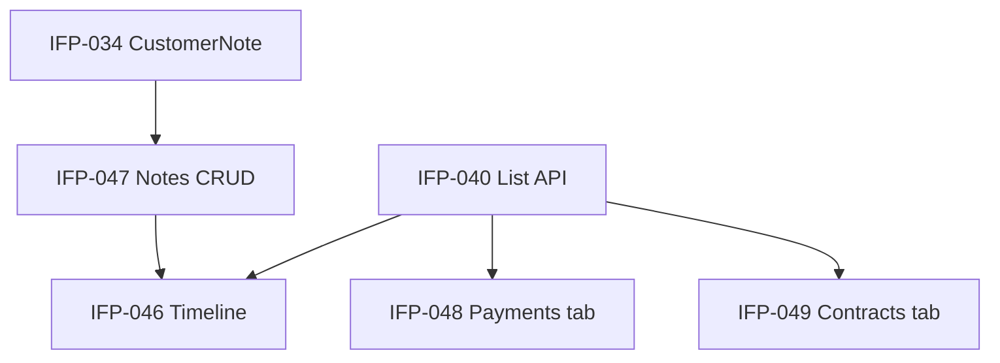

# Epic-05 — Customer History

> **Phase:** IFP-03 Customer Enterprise  
> **وضعیت:** Ready for implementation  
> **ADR:** ADR-013, ADR-015

---

## هدف Epic

Timeline یکپارچه مشتری (پرداخت، قرارداد، SMS، اعلان، تماس)، CRUD یادداشت داخلی ساخت‌یافته، و tabهای سوابق پرداخت/قرارداد در API + data برای UI.

---

## Tasks

| ID | فایل | عنوان | Depends | Priority |
|----|------|--------|---------|----------|
| IFP-046 | [IFP-TASK-046-customer-timeline.md](./IFP-TASK-046-customer-timeline.md) | Customer timeline | IFP-040, IFP-047, Phase 4 TASK-130 | P0 |
| IFP-047 | [IFP-TASK-047-internal-notes-crud.md](./IFP-TASK-047-internal-notes-crud.md) | Internal notes CRUD | IFP-034, IFP-039 | P0 |
| IFP-048 | [IFP-TASK-048-payment-history-tab.md](./IFP-TASK-048-payment-history-tab.md) | Payment history tab | IFP-040, Phase 1 sales/payments | P0 |
| IFP-049 | [IFP-TASK-049-contract-history-tab.md](./IFP-TASK-049-contract-history-tab.md) | Contract history tab | IFP-040, Phase 1 sales | P0 |

---

## Dependency Graph (داخلی Epic)

---

## Policy Notes

| موضوع | قانون |
|-------|--------|
| Timeline | read-only aggregate — منابع: Sale, Payment, NotificationLog, CustomerNote, AuditLog (filtered) |
| Notes | staff-only — هرگز در customer PWA |
| Pagination | cursor per tab |
| Call log | stub entity یا metadata — اگر telephony بعداً |

---

## مراجع

- `Phases/Phase-4-Bale-Marketing/Epic-03-Notification-Database/TASK-130-prisma-notification-log.md`
- `docs/01-product/installment-module-features.md` §۳ — تاریخچه
