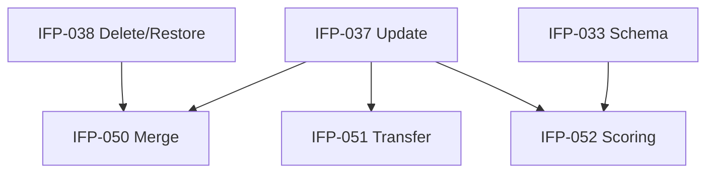

# Epic-06 — Customer Advanced

> **Phase:** IFP-03 Customer Enterprise  
> **وضعیت:** Ready for implementation  
> **ADR:** ADR-013, ADR-015, ADR-017

---

## هدف Epic

عملیات پیشرفته §۳: ادغام دو مشتری tenant (با audit و re-link sales)، انتقال مالکیت/مسئولیت مشتری بین staff، و قوانین امتیازدهی + blacklist.

---

## Tasks

| ID | فایل | عنوان | Depends | Priority |
|----|------|--------|---------|----------|
| IFP-050 | [IFP-TASK-050-merge-customers-use-case.md](./IFP-TASK-050-merge-customers-use-case.md) | Merge customers use case (with audit) | IFP-038, IFP-037 | P0 |
| IFP-051 | [IFP-TASK-051-transfer-ownership-use-case.md](./IFP-TASK-051-transfer-ownership-use-case.md) | Transfer ownership use case | IFP-037 | P1 |
| IFP-052 | [IFP-TASK-052-customer-scoring-blacklist-rules.md](./IFP-TASK-052-customer-scoring-blacklist-rules.md) | Customer scoring + blacklist rules | IFP-033, IFP-037 | P0 |

---

## Dependency Graph (داخلی Epic)

---

## Policy Notes

| موضوع | قانون |
|-------|--------|
| Merge | source soft-deleted؛ target retains data؛ sales re-pointed؛ irreversible without admin |
| Audit | `customer.merge` با full payload old/new ids |
| Transfer | `assignedStaffId` یا metadata owner — tenant setting |
| Blacklist | block new Sale create — existing sales unchanged |
| Scoring | domain service — recalc on payment overdue events |

---

## مراجع

- `docs/09-development/SOFT-DELETE-POLICY.md` §5 — customer merge implications
- `docs/03-modules/installments/BUSINESS-RULES.md`
