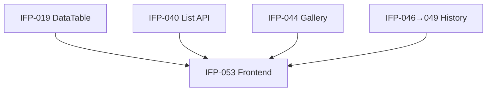

# Epic-07 — Customer Frontend

> **Phase:** IFP-03 Customer Enterprise  
> **وضعیت:** Ready for implementation  
> **ADR:** ADR-015

---

## هدف Epic

صفحات Enterprise مشتری: لیست با DataTable (IFP-019)، فیلتر، live search، جزئیات با tabها (overview، documents، timeline، payments، contracts، notes)، و تمام page states.

---

## Tasks

| ID | فایل | عنوان | Depends | Priority |
|----|------|--------|---------|----------|
| IFP-053 | [IFP-TASK-053-customer-list-detail-pages.md](./IFP-TASK-053-customer-list-detail-pages.md) | Customer list + detail pages (all states) | **IFP-019**, IFP-040, IFP-044, IFP-046→049, IFP-039 | P0 |

---

## Dependency Graph

---

## Policy Notes

| موضوع | قانون |
|-------|--------|
| Route | `/admin/customers`, `/admin/customers/[id]`, `/admin/customers/new` |
| Permission UX | دکمه‌ها بر اساس RBAC — backend authoritative |
| RTL + mobile | Excellence §5–§7 |
| Unsaved warning | forms create/edit |
| Print | از export/print view IFP-042 |

---

## مراجع

- `InstallmentFeaturePhases/Phase-02-CrossCutting-UI/` — IFP-019 DataTable
- `docs/09-development/EXCELLENCE-STANDARDS.md` §5, §7
