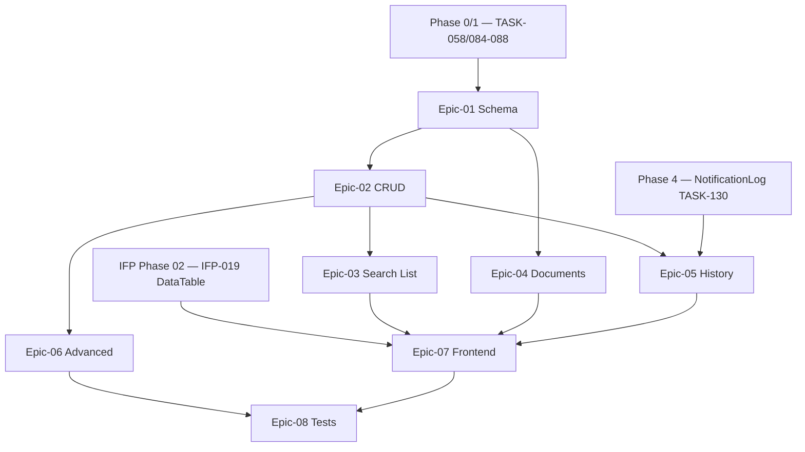

# Phase 03 — Customer Enterprise

> **وضعیت:** Ready for implementation  
> **نسخه:** 1.0 — 1405/04/10  
> **ADRهای مرتبط:** ADR-002, ADR-013, ADR-015, ADR-016, ADR-017  
> **منبع محصول:** [`docs/01-product/installment-module-features.md` §۳](../../docs/01-product/installment-module-features.md)  
> **قوانین:** [`PHASE_EPIC_TASK_AUTHORING_RULES.md`](../../docs/09-development/PHASE_EPIC_TASK_AUTHORING_RULES.md)

---

## هدف فاز

ارتقای **مدیریت مشتریان** از CRUD MVP (Phase 0/1) به سطح **Enterprise** مطابق §۳ محصول: schema گسترده، جستجو/فیلتر حرفه‌ای، import/export، فایل‌ها و آدرس/لوکیشن، timeline کامل، یادداشت داخلی، ادغام/انتقال مالکیت، امتیازدهی و blacklist، و UI کامل با تمام page states.

---

## Exit Criteria (فاز کامل شد وقتی…)

- [ ] همه IFP-TASKهای **P0** (033→054) Done
- [ ] Vertical slice: ثبت مشتری Enterprise → آپلود مدارک → timeline → merge با audit → export Excel
- [ ] هیچ `prisma.*.delete()` روی business models
- [ ] Integration test cross-tenant روی merge/list/update → **fail**
- [ ] E2E merge scenario (IFP-054) pass
- [ ] UI مشتری (IFP-053): loading / empty / error / no-permission / partial load
- [ ] self-review ≥ **95/100** روی همه task specs
- [ ] TRACEABILITY: ۱۰۰٪ bulletهای §۳ `installment-module-features.md` پوشش داده شده

---

## Epics

| Epic | مسیر | تسک‌ها | حوزه |
|------|------|--------|------|
| 01 | [Epic-01-Customer-Schema-Extended](./Epic-01-Customer-Schema-Extended/) | IFP-033→035 | Schema گسترده |
| 02 | [Epic-02-Customer-CRUD](./Epic-02-Customer-CRUD/) | IFP-036→039 | Use case + contracts |
| 03 | [Epic-03-Customer-Search-List](./Epic-03-Customer-Search-List/) | IFP-040→042 | جستجو، import/export |
| 04 | [Epic-04-Customer-Documents](./Epic-04-Customer-Documents/) | IFP-043→045 | فایل، gallery، geo |
| 05 | [Epic-05-Customer-History](./Epic-05-Customer-History/) | IFP-046→049 | timeline، notes، tabs |
| 06 | [Epic-06-Customer-Advanced](./Epic-06-Customer-Advanced/) | IFP-050→052 | merge، transfer، scoring |
| 07 | [Epic-07-Customer-Frontend](./Epic-07-Customer-Frontend/) | IFP-053 | لیست + جزئیات UI |
| 08 | [Epic-08-Phase03-Tests](./Epic-08-Phase03-Tests/) | IFP-054 | E2E + cross-tenant |

**مجموع:** ۲۲ تسک (IFP-033 → IFP-054)

---

## ترتیب اجرا (dependency graph)

### ترتیب پیشنهادی (فاز)

| مرحله | Epic / Task | توضیح |
|-------|-------------|--------|
| 1 | Epic-01 (033→035) | Schema — پایه همه چیز |
| 2 | Epic-02 (036→039) | CRUD extended + Zod |
| 3 | Epic-03 (040→042) | List/search/import/export — parallel با Epic-04 |
| 4 | Epic-04 (043→045) | Documents + geo |
| 5 | Epic-05 (046→049) | History + notes — نیاز Phase 4 notification log |
| 6 | Epic-06 (050→052) | Merge, transfer, scoring |
| 7 | Epic-07 (053) | Frontend — بعد از IFP-019 DataTable |
| 8 | Epic-08 (054) | Vertical slice tests |

---

## وابستگی به فاز قبل

| وابستگی | منبع | دلیل |
|---------|------|------|
| Create/Update/List MVP | Phase 0 TASK-058، Phase 1 TASK-084→088 | پایه CRUD |
| Soft delete extension | Phase 0 TASK-046 | Prisma soft-delete filter |
| RBAC + data scope | Phase 0 TASK-047، ADR-015 | branch scope |
| DataTable component | **IFP-019** (Phase 02) | لیست مشتری Enterprise UI |
| Notification log | Phase 4 TASK-130 | timeline اعلان/SMS |
| File storage port | Phase 10 / shared infra (if exists) یا stub در IFP-043 | آپلود مدارک |

---

## پوشش محصول §۳

| قابلیت محصول | Task |
|--------------|------|
| لیست / مشاهده / ثبت / ویرایش | IFP-036, 037, 040, 053 |
| حذف / آرشیو / restore | IFP-038 |
| ادغام مشتری | IFP-050, 054 |
| انتقال مالکیت | IFP-051 |
| برچسب / دسته‌بندی | IFP-033 |
| جستجو / فیلتر / مرتب‌سازی | IFP-040, 053 |
| چاپ / Excel / PDF | IFP-042, 053 |
| Import Excel | IFP-041 |
| تاریخچه / timeline | IFP-046 |
| سوابق پرداخت / قرارداد | IFP-048, 049 |
| سوابق پیامک / اعلان / تماس | IFP-046 |
| یادداشت داخلی | IFP-034, 047 |
| فایل‌ها / تصاویر / مدارک | IFP-034, 043, 044 |
| آدرس / لوکیشن | IFP-033, 045 |
| شماره تماس / مخاطب اضطراری | IFP-035, 033 |
| اعتبارسنجی / امتیاز / blacklist | IFP-033, 052 |

---

## قوانین

- [PHASE_EPIC_TASK_AUTHORING_RULES.md](../../docs/09-development/PHASE_EPIC_TASK_AUTHORING_RULES.md)
- [EXCELLENCE-STANDARDS.md](../../docs/09-development/EXCELLENCE-STANDARDS.md) §5–§8
- [SOFT-DELETE-POLICY.md](../../docs/09-development/SOFT-DELETE-POLICY.md)
- [STAFF-FLOWS.md](../../docs/03-modules/installments/STAFF-FLOWS.md) — SF-007

---

*آخرین به‌روزرسانی: 1405/04/10*
