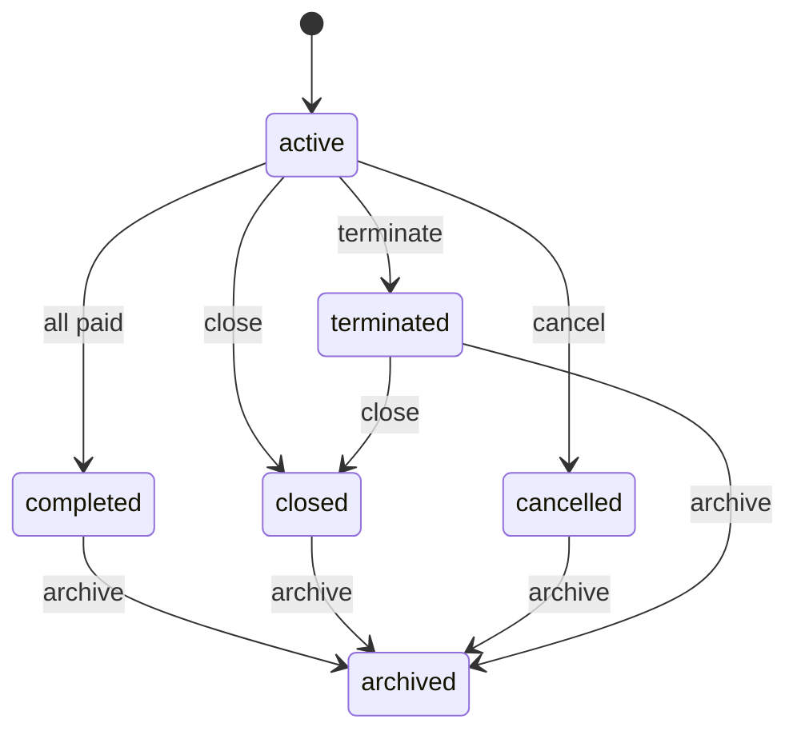

# IFP-TASK-059: Domain — Sale Lifecycle Transitions

## Metadata

| فیلد | مقدار |
|------|--------|
| Phase | 04 — Contract Enterprise |
| Epic | Epic-02-Contract-Lifecycle |
| ID | IFP-TASK-059 |
| Priority | P0 |
| Depends on | IFP-TASK-055, Phase 1 TASK-065 |
| Blocks | IFP-060, IFP-061, IFP-062, IFP-063 |
| Estimated | 8h |

---

## هدف

گسترش entity `Sale` در `packages/domain/installments/` با متدهای transition برای وضعیت‌های Enterprise و قوانین domain — zero framework imports.

---

## معیار پذیرش

- [ ] `SaleEntity` methods: `terminate()`, `close()`, `archive()`, `canExtend()`, `canCopy()`, `canEditFinancials()`
- [ ] Transition matrix مطابق state-machines.md (enterprise extension)
- [ ] `terminate`: only from `ACTIVE` — may have unpaid installments
- [ ] `close`: from `ACTIVE` or `TERMINATED` — optional waive remaining (permission)
- [ ] `archive`: from `CLOSED`, `COMPLETED`, `CANCELLED`, `TERMINATED`
- [ ] `ACTIVE` → `COMPLETED` unchanged (all installments paid/waived)
- [ ] `cancel()` MVP behavior preserved — only if zero paid installments
- [ ] Unit tests for every allowed/forbidden transition
- [ ] Domain events: `SaleTerminated`, `SaleClosed`, `SaleArchived`

---

## مشخصات فنی

### Transition Matrix

| From | To | Method | Preconditions |
|------|-----|--------|---------------|
| active | terminated | `terminate(reason)` | not archived |
| active | cancelled | `cancel(reason)` | zero paid installments |
| active | completed | system | all installments terminal |
| active | closed | `close(reason)` | permission `installments.sale.close` |
| terminated | closed | `close(reason)` | — |
| completed | archived | `archive(reason)` | — |
| closed | archived | `archive(reason)` | — |
| cancelled | archived | `archive(reason)` | — |
| terminated | archived | `archive(reason)` | — |
| archived | * | — | **forbidden** (restore = unarchive use case) |
| completed | * | — | forbidden except archive |
| cancelled | * | — | forbidden except archive |

### Entity method signature

```typescript
class SaleEntity {
  terminate(actorId: string, reason: string, effectiveDate?: Date): DomainResult<void>;
  close(actorId: string, reason: string, options?: { waiveRemaining: boolean }): DomainResult<void>;
  archive(actorId: string, reason: string): DomainResult<void>;
  unarchive(actorId: string): DomainResult<void>; // tenant owner / admin
  canEditFinancials(): boolean; // active only, no paid installments
}
```

---

## فایل‌ها

| عمل | مسیر |
|-----|------|
| Update | `packages/domain/installments/sale.entity.ts` |
| Create | `packages/domain/installments/sale.entity.spec.ts` |
| Update | `docs/03-modules/installments/state-machines.md` |
| Create | `packages/domain/installments/events/sale-lifecycle.events.ts` |

---

## مراحل پیاده‌سازی

1. Extend SaleStatus type in domain
2. Implement transition methods with invariant checks
3. Emit domain events
4. Unit tests: matrix coverage
5. Update state-machines.md mermaid diagram
6. Document interaction with soft delete (separate concern)

---

## Edge Cases & Errors

| سناریو | Code | رفتار |
|--------|------|--------|
| terminate when archived | `SALE_ARCHIVED_READONLY` | reject |
| cancel with paid installment | `SALE_HAS_PAID_INSTALLMENT` | reject |
| archive from active | `INVALID_STATUS_TRANSITION` | reject |
| unarchive without permission | — | RBAC in use case |

---

## تست

- [ ] Unit: active → terminated OK
- [ ] Unit: completed → terminated FAIL
- [ ] Unit: archive from closed OK
- [ ] Unit: archive from active FAIL
- [ ] Unit: canEditFinancials false when paid exists
- [ ] Unit: cancel with paid FAIL

---

## UX

N/A

---

## Flow



---

## Policy Alignment

- [ ] Domain pure — no Prisma/NestJS
- [ ] SOFT-DELETE-POLICY — transitions not delete
- [ ] ADR-008 — state in entity methods only

---

## مراجع

- `docs/03-modules/installments/state-machines.md`
- Phase 1 `TASK-065-domain-sale-entity.md`
- IFP-TASK-055

---

## Self-Review Score

| محور | سقف | امتیاز |
|------|-----|--------|
| Metadata | 10 | 10 |
| Completeness | 25 | 25 |
| Policy | 25 | 25 |
| Executability | 25 | 25 |
| Alignment | 15 | 15 |
| **جمع** | **100** | **100** |
