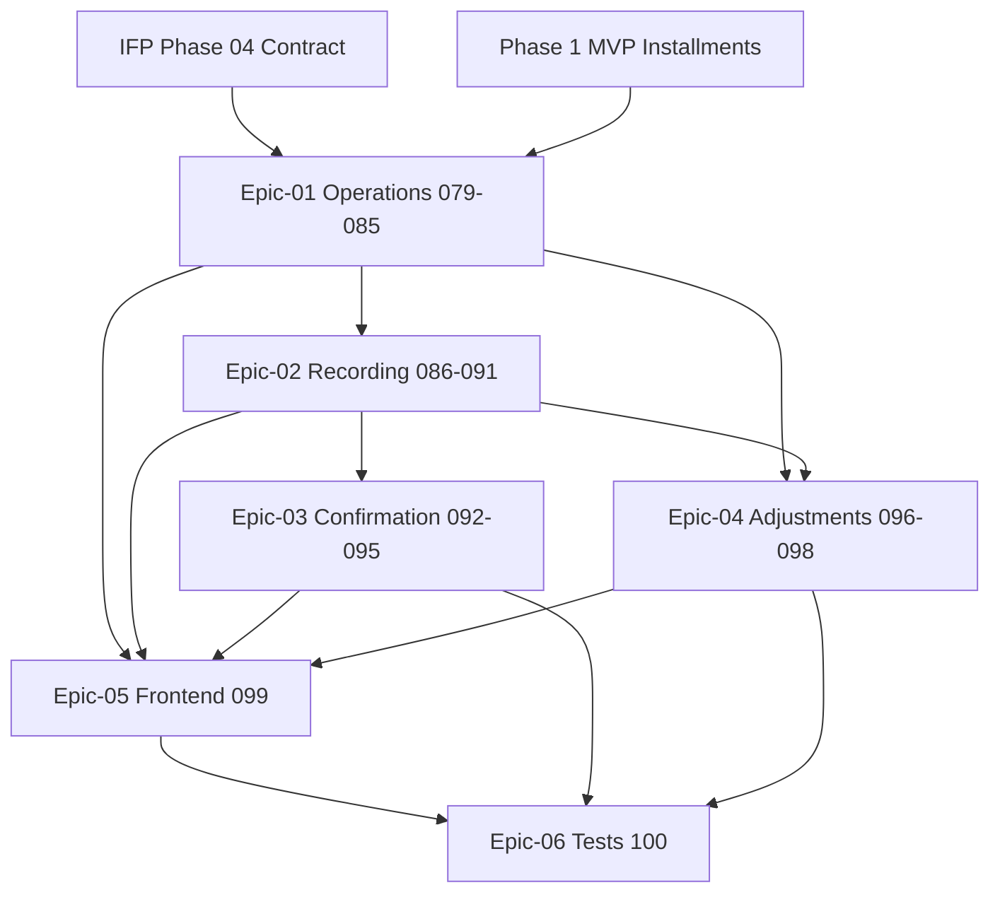

# Phase 05 — Installments Advanced

> **وضعیت:** Approved — v1.0  
> **نسخه:** 1.0 — 1405/04/10  
> **تسک‌ها:** IFP-TASK-079 → IFP-TASK-100 (۲۲ تسک)  
> **منبع محصول:** [`installment-module-features.md` §۵](../../docs/01-product/installment-module-features.md)  
> **ADRهای مرتبط:** ADR-008, ADR-013, ADR-015, ADR-016

---

## هدف فاز

تکمیل **هسته اقساط Enterprise** فراتر از MVP Phase-1: عملیات پیشرفته روی اقساط (جابجایی، تعویق، تعجیل، بازتولید، ادغام/تقسیم)، ثبت پرداخت با تمام روش‌ها، تأیید/رد/ابطال پرداخت، رسید، تعدیلات (بخشودگی، جریمه، تخفیف)، و UI کامل اقساط با رنگ‌بندی وضعیت، یادداشت و پیوست.

---

## Exit Criteria (فاز کامل شد وقتی…)

- [ ] همه IFP-TASKهای **P0** (079–099) Done
- [ ] Vertical slice IFP-100 pass: عملیات قسط → ثبت پرداخت نقدی → تأیید → رسید → waive/penalty/discount
- [ ] هیچ `prisma.*.delete()` روی business models
- [ ] Audit روی waive، confirm/reject/void payment، penalty/discount
- [ ] self-review ≥ **95/100** روی همه task specs

---

## Epics

| Epic | مسیر | تسک‌ها | حوزه |
|------|------|--------|------|
| 01 | [Epic-01-Installment-Operations](./Epic-01-Installment-Operations/) | IFP-079→085 | جابجایی، تعویق، تعجیل، بازتولید، ادغام/تقسیم |
| 02 | [Epic-02-Payment-Recording](./Epic-02-Payment-Recording/) | IFP-086→091 | ثبت دستی، بانکی، آنلاین، POS، نقدی، چک، حواله، هزینه |
| 03 | [Epic-03-Payment-Confirmation](./Epic-03-Payment-Confirmation/) | IFP-092→095 | تأیید، رد، ابطال، چاپ/ارسال رسید |
| 04 | [Epic-04-Adjustments](./Epic-04-Adjustments/) | IFP-096→098 | بخشودگی، جریمه، تخفیف |
| 05 | [Epic-05-Installment-Frontend](./Epic-05-Installment-Frontend/) | IFP-099 | لیست، جزئیات، رنگ‌بندی، یادداشت، فایل |
| 06 | [Epic-06-Tests](./Epic-06-Tests/) | IFP-100 | تست یکپارچه فاز |

---

## ترتیب اجرا (dependency graph)

**ترتیب پیشنهادی:**

1. Epic-01 (079 domain → 080–085 use cases + API)
2. Epic-02 (086 contracts → 087–091 recording)
3. Epic-03 + Epic-04 (موازی پس از Epic-02)
4. Epic-05 Frontend
5. Epic-06 Tests

---

## وابستگی به فاز قبل

| فاز | نیاز |
|-----|------|
| Phase-0 Foundation | Auth، RBAC، audit، soft-delete extension |
| Phase-1 MVP | Sale/Installment CRUD، PaymentAttempt پایه، list installments |
| IFP Phase-04 | قرارداد Enterprise، تنظیمات جریمه/تخفیف |

---

## قوانین

- [`PHASE_EPIC_TASK_AUTHORING_RULES.md`](../../docs/09-development/PHASE_EPIC_TASK_AUTHORING_RULES.md)
- [`EXCELLENCE-STANDARDS.md`](../../docs/09-development/EXCELLENCE-STANDARDS.md)
- [`SOFT-DELETE-POLICY.md`](../../docs/09-development/SOFT-DELETE-POLICY.md)
- [`state-machines.md`](../../docs/03-modules/installments/state-machines.md)

---

*آخرین به‌روزرسانی: 1405/04/10*
