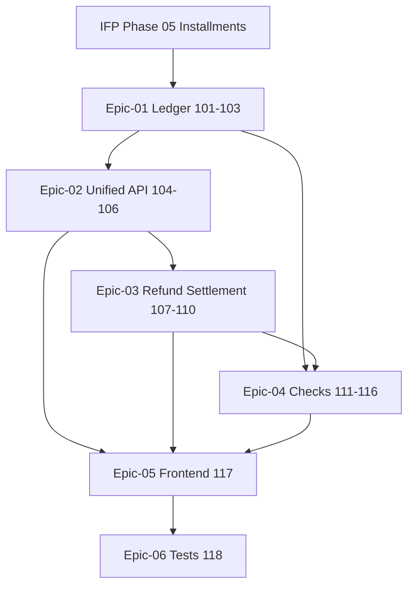

# Phase 06 — Payments & Checks

> **وضعیت:** Approved — v1.0  
> **نسخه:** 1.0 — 1405/04/10  
> **تسک‌ها:** IFP-TASK-101 → IFP-TASK-118 (۱۸ تسک)  
> **منبع محصول:** [`installment-module-features.md` §۶ و §۷](../../docs/01-product/installment-module-features.md)  
> **ADRهای مرتبط:** ADR-008, ADR-013, ADR-015, ADR-016

---

## هدف فاز

پیاده‌سازی **دفتر پرداخت یکپارچه** (تمام تراکنش‌ها)، API واحد روش‌های پرداخت، استرداد/ابطال/تسویه/مغایرت‌گیری، و **چرخه کامل چک** (دریافتی، پرداختی، برگشتی، وصول، انتقال) به‌همراه UI پرداخت‌ها و چک‌ها.

---

## Exit Criteria (فاز کامل شد وقتی…)

- [ ] همه IFP-TASKهای **P0** (101–117) Done
- [ ] Vertical slice IFP-118 pass: ثبت پرداخت → ledger → استرداد → ثبت چک دریافتی → وصول → مغایرت
- [ ] PaymentLedger و Check با base fields + soft delete
- [ ] Audit روی refund، void ledger، settlement، check state changes
- [ ] self-review ≥ **95/100** روی همه task specs

---

## Epics

| Epic | مسیر | تسک‌ها | حوزه |
|------|------|--------|------|
| 01 | [Epic-01-Payment-Ledger](./Epic-01-Payment-Ledger/) | IFP-101→103 | Schema دفتر پرداخت + لیست تراکنش‌ها |
| 02 | [Epic-02-Payment-Methods-Unified](./Epic-02-Payment-Methods-Unified/) | IFP-104→106 | API یکپارچه روش‌های پرداخت |
| 03 | [Epic-03-Refund-Void-Settlement](./Epic-03-Refund-Void-Settlement/) | IFP-107→110 | استرداد، ابطال، تسویه، مغایرت |
| 04 | [Epic-04-Check-Management](./Epic-04-Check-Management/) | IFP-111→116 | چرخه کامل چک |
| 05 | [Epic-05-Payments-Frontend](./Epic-05-Payments-Frontend/) | IFP-117 | UI پرداخت‌ها و چک‌ها |
| 06 | [Epic-06-Tests](./Epic-06-Tests/) | IFP-118 | تست یکپارچه فاز |

---

## ترتیب اجرا (dependency graph)

**ترتیب پیشنهادی:**

1. Epic-01 Ledger schema + list
2. Epic-02 Unified payment API
3. Epic-03 Refund/void/settlement/reconciliation
4. Epic-04 Check lifecycle (موازی با Epic-03 پس از 103)
5. Epic-05 Frontend
6. Epic-06 Tests

---

## وابستگی به فاز قبل

| فاز | نیاز |
|-----|------|
| IFP Phase-05 | PaymentAttempt، confirm/void، recording use cases |
| Phase-1 MVP | PaymentAttempt schema، installment payment flow |

---

## قوانین

- [`PHASE_EPIC_TASK_AUTHORING_RULES.md`](../../docs/09-development/PHASE_EPIC_TASK_AUTHORING_RULES.md)
- [`EXCELLENCE-STANDARDS.md`](../../docs/09-development/EXCELLENCE-STANDARDS.md)
- [`SOFT-DELETE-POLICY.md`](../../docs/09-development/SOFT-DELETE-POLICY.md)

---

*آخرین به‌روزرسانی: 1405/04/10*
