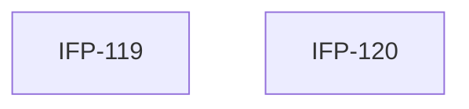

# Epic-01-Dashboard-KPI-Cards — Dashboard KPI Cards

> **Phase:** 07 — Dashboard, Reports & Calendar  
> **وضعیت:** Ready for implementation  
> **منبع محصول:** `docs/01-product/installment-module-features.md`

---

## هدف Epic

۱۵ متریک KPI داشبورد — aggregation use case + API با Redis cache.

---

## Tasks

| ID | فایل | عنوان | Depends | Priority |
|----|------|--------|---------|----------|
| 119 | [IFP-TASK-119-dashboard-kpi-aggregation.md](./IFP-TASK-119-dashboard-kpi-aggregation.md) | Use Case — Dashboard KPI Aggregation (۱۵ متریک) | IFP-TASK-118 | P0 |
| 120 | [IFP-TASK-120-dashboard-kpi-api-cache.md](./IFP-TASK-120-dashboard-kpi-api-cache.md) | API — Dashboard KPI + Redis Cache | IFP-TASK-119 | P0 |

---

## Dependency Graph

---

## Policy Notes

| موضوع | قانون |
|-------|--------|
| Money | مبالغ `bigint` ریال — response به صورت `string` |
| Cache | Redis TTL 5min — invalidate on financial events |
| Scope | فیلتر `branchId` از `X-Branch-Id` + `@ApplyDataScope()` — ADR-015 |

---

## مراجع

- `docs/01-product/installment-module-features.md §2`
