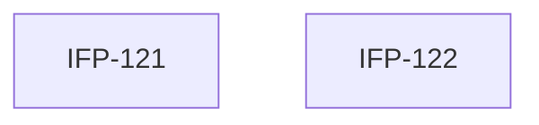

# Epic-02-Dashboard-Charts — Dashboard Charts

> **Phase:** 07 — Dashboard, Reports & Calendar  
> **وضعیت:** Ready for implementation  
> **منبع محصول:** `docs/01-product/installment-module-features.md`

---

## هدف Epic

۷ نمودار داشبورد با period selector و برچسب شمسی.

---

## Tasks

| ID | فایل | عنوان | Depends | Priority |
|----|------|--------|---------|----------|
| 121 | [IFP-TASK-121-dashboard-chart-data-services.md](./IFP-TASK-121-dashboard-chart-data-services.md) | Use Case — Dashboard Chart Data (۷ نمودار) | IFP-TASK-119 | P0 |
| 122 | [IFP-TASK-122-dashboard-chart-api.md](./IFP-TASK-122-dashboard-chart-api.md) | API — Dashboard Charts | IFP-TASK-121 | P0 |

---

## Dependency Graph

---

## Policy Notes

| موضوع | قانون |
|-------|--------|
| Period | 3/6/12 months default 6 |
| Labels | Jalali month names in response |

---

## مراجع

- `docs/01-product/installment-module-features.md §2`
