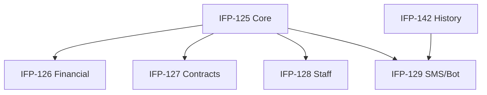

# Epic-04-Reports-Engine — Reports Engine

> **Phase:** 07 — Dashboard, Reports & Calendar  
> **وضعیت:** Ready for implementation  
> **منبع محصول:** `docs/01-product/installment-module-features.md`

---

## هدف Epic

موتور گزارش + ۱۰ نوع گزارش: مالی، اقساط، مشتریان، قراردادها، وصول، معوقات، کاربران، پرداخت‌ها، پیامک، ربات.

---

## Tasks

| ID | فایل | عنوان | Depends | Priority |
|----|------|--------|---------|----------|
| 125 | [IFP-TASK-125-report-engine-core.md](./IFP-TASK-125-report-engine-core.md) | Report Engine Core — Query Builder & Filters | IFP-TASK-118 | P0 |
| 126 | [IFP-TASK-126-reports-financial-installments-customers.md](./IFP-TASK-126-reports-financial-installments-customers.md) | Reports — Financial, Installments, Customers | IFP-TASK-125 | P0 |
| 127 | [IFP-TASK-127-reports-contracts-collection-overdue.md](./IFP-TASK-127-reports-contracts-collection-overdue.md) | Reports — Contracts, Collection, Overdue | IFP-TASK-125 | P0 |
| 128 | [IFP-TASK-128-reports-staff-performance-payments.md](./IFP-TASK-128-reports-staff-performance-payments.md) | Reports — Staff Performance & Payments | IFP-TASK-125 | P0 |
| 129 | [IFP-TASK-129-reports-sms-bot.md](./IFP-TASK-129-reports-sms-bot.md) | Reports — SMS & Bot | IFP-TASK-125, IFP-TASK-142 | P0 |

---

## Dependency Graph

---

## Policy Notes

| موضوع | قانون |
|-------|--------|
| Engine | Shared ReportFilter + cursor pagination |
| Permissions | installments.report.* per type |

---

## مراجع

- `docs/01-product/installment-module-features.md §10`
- `docs/03-modules/installments/REPORTS.md`
