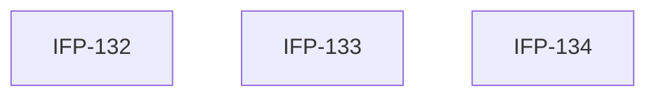

# Epic-06-Calendar — Calendar

> **Phase:** 07 — Dashboard, Reports & Calendar  
> **وضعیت:** Ready for implementation  
> **منبع محصول:** `docs/01-product/installment-module-features.md`

---

## هدف Epic

تقویم اقساط، قراردادها، پرداخت‌ها، تعطیلات، یادآورها.

---

## Tasks

| ID | فایل | عنوان | Depends | Priority |
|----|------|--------|---------|----------|
| 132 | [IFP-TASK-132-calendar-events-aggregation.md](./IFP-TASK-132-calendar-events-aggregation.md) | Calendar — Event Model & Aggregation | IFP-TASK-118 | P0 |
| 133 | [IFP-TASK-133-calendar-holidays-reminders.md](./IFP-TASK-133-calendar-holidays-reminders.md) | Calendar — Holidays & Reminders | IFP-TASK-132 | P0 |
| 134 | [IFP-TASK-134-calendar-api.md](./IFP-TASK-134-calendar-api.md) | API — Calendar Events, Holidays, Reminders | IFP-TASK-132, IFP-TASK-133 | P0 |

---

## Dependency Graph

---

## Policy Notes

| موضوع | قانون |
|-------|--------|
| Holidays | TenantHoliday soft delete |
| Range | Max 366 days per query |

---

## مراجع

- `docs/01-product/installment-module-features.md §11`
