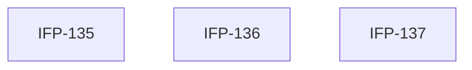

# Epic-07-Dashboard-Frontend — Dashboard Frontend Pages

> **Phase:** 07 — Dashboard, Reports & Calendar  
> **وضعیت:** Ready for implementation  
> **منبع محصول:** `docs/01-product/installment-module-features.md`

---

## هدف Epic

صفحات UI داشبورد، گزارشات، تقویم — RTL، Jalali، Excellence §7.

---

## Tasks

| ID | فایل | عنوان | Depends | Priority |
|----|------|--------|---------|----------|
| 135 | [IFP-TASK-135-frontend-dashboard-page.md](./IFP-TASK-135-frontend-dashboard-page.md) | Frontend — Dashboard Page (KPIs, Charts, Widgets) | IFP-TASK-120, IFP-TASK-122, IFP-TASK-124 | P0 |
| 136 | [IFP-TASK-136-frontend-reports-pages.md](./IFP-TASK-136-frontend-reports-pages.md) | Frontend — Reports Pages + Export UI | IFP-TASK-126, IFP-TASK-127, IFP-TASK-128, IFP-TASK-129, IFP-TASK-131 | P0 |
| 137 | [IFP-TASK-137-frontend-calendar-page.md](./IFP-TASK-137-frontend-calendar-page.md) | Frontend — Calendar Page | IFP-TASK-134 | P0 |

---

## Dependency Graph

---

## Policy Notes

| موضوع | قانون |
|-------|--------|
| UX | Excellence §5–7 mandatory |
| Default route | /dashboard after login |

---

## مراجع

- `docs/09-development/EXCELLENCE-STANDARDS.md`
