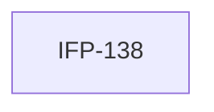

# Epic-08-Tests — Phase 07 Tests

> **Phase:** 07 — Dashboard, Reports & Calendar  
> **وضعیت:** Ready for implementation  
> **منبع محصول:** `docs/01-product/installment-module-features.md`

---

## هدف Epic

Integration + E2E tests فاز ۷.

---

## Tasks

| ID | فایل | عنوان | Depends | Priority |
|----|------|--------|---------|----------|
| 138 | [IFP-TASK-138-phase-07-integration-e2e-tests.md](./IFP-TASK-138-phase-07-integration-e2e-tests.md) | Tests — Phase 07 Dashboard, Reports, Calendar | IFP-TASK-135, IFP-TASK-136, IFP-TASK-137 | P0 |

---

## Dependency Graph

---

## Policy Notes

| موضوع | قانون |
|-------|--------|
| Cross-tenant | must fail |
| Financial | bigint regression |

---

## مراجع

- `docs/06-operations/testing-observability.md`
