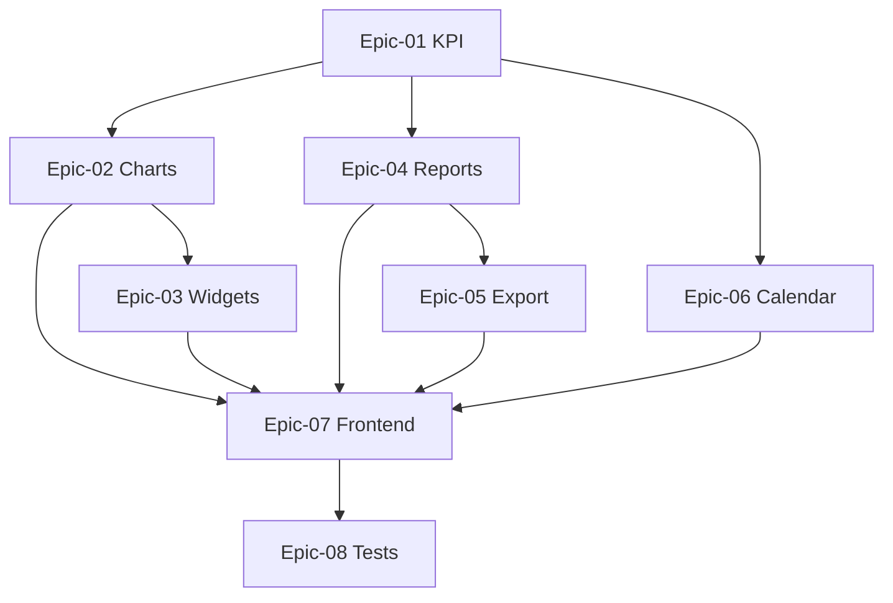

# Phase 07 — Dashboard, Reports & Calendar

> **وضعیت:** Approved — v1.0  
> **نسخه:** 1.0 — 1405/04/10  
> **ADRهای مرتبط:** ADR-007, ADR-013, ADR-015, ADR-016  
> **منبع محصول:** §۲ داشبورد، §۱۰ گزارش، §۱۱ تقویم  
> **Depends on:** IFP Phase 06 (IFP-118), Phase 1 reports baseline

---

## هدف فاز

Dashboard, Reports & Calendar — تکمیل Enterprise امکانات محصول برای §۲ داشبورد، §۱۰ گزارش، §۱۱ تقویم.

---

## Epics

| Epic | تسک‌ها | حوزه |
|------|--------|------|
| [Epic-01-Dashboard-KPI-Cards](./Epic-01-Dashboard-KPI-Cards/) | IFP-119→120 | ۱۵ KPI card |
| [Epic-02-Dashboard-Charts](./Epic-02-Dashboard-Charts/) | IFP-121→122 | ۷ نمودار |
| [Epic-03-Dashboard-Widgets](./Epic-03-Dashboard-Widgets/) | IFP-123→124 | ۷ ویجت |
| [Epic-04-Reports-Engine](./Epic-04-Reports-Engine/) | IFP-125→129 | ۱۰ نوع گزارش |
| [Epic-05-Reports-Export](./Epic-05-Reports-Export/) | IFP-130→131 | دوره‌ای + Pivot + Excel/PDF |
| [Epic-06-Calendar](./Epic-06-Calendar/) | IFP-132→134 | تقویم + تعطیلات + یادآور |
| [Epic-07-Dashboard-Frontend](./Epic-07-Dashboard-Frontend/) | IFP-135→137 | صفحات UI |
| [Epic-08-Tests](./Epic-08-Tests/) | IFP-138 | Integration + E2E |

**مجموع:** 20 تسک

---

## Exit Criteria

- [ ] همه IFP-TASK-119→138 P0 Done
- [ ] Dashboard 15 KPI + 7 charts + 7 widgets
- [ ] 10 report types + export excel/pdf
- [ ] Calendar Jalali with holidays
- [ ] E2E vertical slice pass
- [ ] self-review ≥ 95/100

---

## ترتیب اجرا

---

## مراجع

- `docs/01-product/installment-module-features.md`
- `docs/09-development/EXCELLENCE-STANDARDS.md`
- `docs/09-development/PHASE_EPIC_TASK_AUTHORING_RULES.md`
