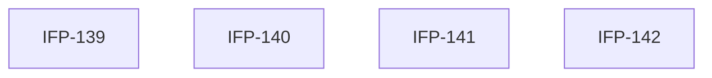

# Epic-01-Notification-Core — Notification Core

> **Phase:** 08 — Notifications & Automation  
> **وضعیت:** Ready for implementation  
> **منبع محصول:** `docs/01-product/installment-module-features.md`

---

## هدف Epic

هسته اعلان: in-app، email، push، templates، scheduling، bulk، auto، history.

---

## Tasks

| ID | فایل | عنوان | Depends | Priority |
|----|------|--------|---------|----------|
| 139 | [IFP-TASK-139-notification-core-domain-channels.md](./IFP-TASK-139-notification-core-domain-channels.md) | Domain — Notification Core & Channel Abstraction | IFP-TASK-138, TASK-130 | P0 |
| 140 | [IFP-TASK-140-notification-inapp-email-push.md](./IFP-TASK-140-notification-inapp-email-push.md) | Delivery — In-App, Email, Push | IFP-TASK-139 | P0 |
| 141 | [IFP-TASK-141-notification-templates-scheduling.md](./IFP-TASK-141-notification-templates-scheduling.md) | Templates & Scheduling | IFP-TASK-139 | P0 |
| 142 | [IFP-TASK-142-notification-bulk-auto-history.md](./IFP-TASK-142-notification-bulk-auto-history.md) | Bulk Send, Auto Notifications & History API | IFP-TASK-140, IFP-TASK-141 | P0 |

---

## Dependency Graph

---

## Policy Notes

| موضوع | قانون |
|-------|--------|
| Log | NotificationLog append-only |
| Idempotency | sha256 key per send |

---

## مراجع

- `docs/01-product/installment-module-features.md §8`
- `docs/05-channels/notifications.md`
