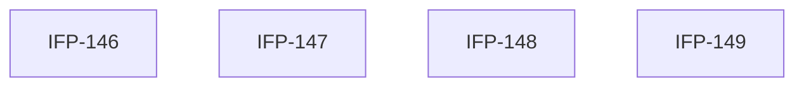

# Epic-03-Bale-Admin-UI — Bale Admin UI

> **Phase:** 08 — Notifications & Automation  
> **وضعیت:** Ready for implementation  
> **منبع محصول:** `docs/01-product/installment-module-features.md`

---

## هدف Epic

مدیریت ربات بله: اتصال، منو، دکمه، قالب، broadcast، کاربران.

---

## Tasks

| ID | فایل | عنوان | Depends | Priority |
|----|------|--------|---------|----------|
| 146 | [IFP-TASK-146-bale-admin-connect-token-status.md](./IFP-TASK-146-bale-admin-connect-token-status.md) | Bale Admin — Connect, Token & Status | IFP-TASK-138, TASK-124 | P0 |
| 147 | [IFP-TASK-147-bale-admin-menus-buttons.md](./IFP-TASK-147-bale-admin-menus-buttons.md) | Bale Admin — Menus & Buttons | IFP-TASK-146 | P0 |
| 148 | [IFP-TASK-148-bale-admin-templates-broadcast.md](./IFP-TASK-148-bale-admin-templates-broadcast.md) | Bale Admin — Templates & Broadcast | IFP-TASK-146 | P0 |
| 149 | [IFP-TASK-149-bale-admin-users.md](./IFP-TASK-149-bale-admin-users.md) | Bale Admin — Bot Users Management | IFP-TASK-146 | P0 |

---

## Dependency Graph

---

## Policy Notes

| موضوع | قانون |
|-------|--------|
| Phase 4 | extends BaleConnection from Phase 4 |
| Secrets | token encrypted at rest |

---

## مراجع

- `docs/01-product/installment-module-features.md §16`
- `Phases/Phase-4-Bale-Marketing/`
