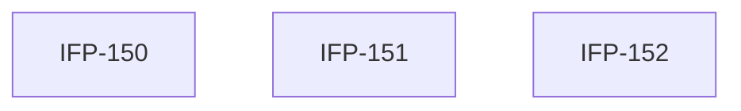

# Epic-04-Automation-Engine — Automation Engine

> **Phase:** 08 — Notifications & Automation  
> **وضعیت:** Ready for implementation  
> **منبع محصول:** `docs/01-product/installment-module-features.md`

---

## هدف Epic

قوانین، workflow، trigger، action، زمان‌بندی، سناریوها.

---

## Tasks

| ID | فایل | عنوان | Depends | Priority |
|----|------|--------|---------|----------|
| 150 | [IFP-TASK-150-automation-rules-triggers.md](./IFP-TASK-150-automation-rules-triggers.md) | Automation — Rules & Trigger Engine | IFP-TASK-142 | P0 |
| 151 | [IFP-TASK-151-automation-workflow-actions.md](./IFP-TASK-151-automation-workflow-actions.md) | Automation — Workflow & Actions | IFP-TASK-150 | P0 |
| 152 | [IFP-TASK-152-automation-scenarios-schedule.md](./IFP-TASK-152-automation-scenarios-schedule.md) | Automation — Scenarios & Schedule API | IFP-TASK-150, IFP-TASK-151 | P0 |

---

## Dependency Graph

---

## Policy Notes

| موضوع | قانون |
|-------|--------|
| Execution log | append-only |
| Dry-run | test without side effects |

---

## مراجع

- `docs/01-product/installment-module-features.md §9`
