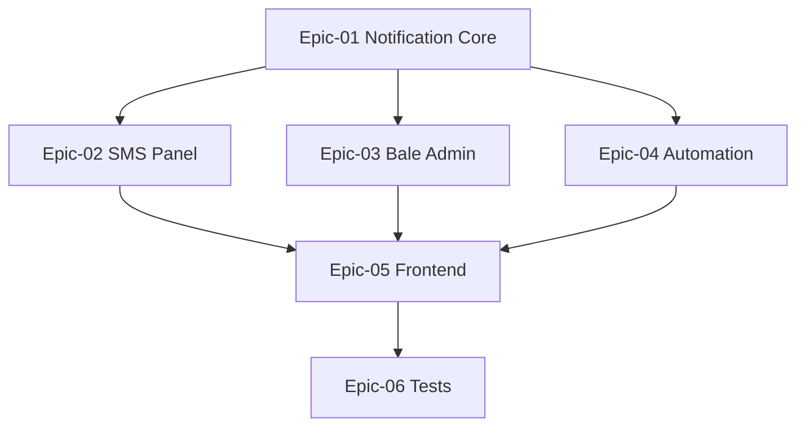

# Phase 08 — Notifications & Automation

> **وضعیت:** Approved — v1.0  
> **نسخه:** 1.0 — 1405/04/10  
> **ADRهای مرتبط:** ADR-007, ADR-013, ADR-015, ADR-016  
> **منبع محصول:** §۸ اعلان، §۹ اتوماسیون، §۱۶ بله، §۱۷ پیامک  
> **Depends on:** IFP Phase 07 (IFP-138), Phase 4 Bale (TASK-124→130)

---

## هدف فاز

Notifications & Automation — تکمیل Enterprise امکانات محصول برای §۸ اعلان، §۹ اتوماسیون، §۱۶ بله، §۱۷ پیامک.

---

## Epics

| Epic | تسک‌ها | حوزه |
|------|--------|------|
| [Epic-01-Notification-Core](./Epic-01-Notification-Core/) | IFP-139→142 | هسته اعلان |
| [Epic-02-SMS-Panel](./Epic-02-SMS-Panel/) | IFP-143→145 | پنل پیامک |
| [Epic-03-Bale-Admin-UI](./Epic-03-Bale-Admin-UI/) | IFP-146→149 | مدیریت ربات بله |
| [Epic-04-Automation-Engine](./Epic-04-Automation-Engine/) | IFP-150→152 | موتور اتوماسیون |
| [Epic-05-Notification-Frontend](./Epic-05-Notification-Frontend/) | IFP-153→155 | UI اعلان/SMS/بله/اتوماسیون |
| [Epic-06-Tests](./Epic-06-Tests/) | IFP-156 | Integration + E2E |

**مجموع:** 18 تسک

---

## Exit Criteria

- [ ] همه IFP-TASK-139→156 P0 Done
- [ ] In-app + email + push + SMS + Bale channels
- [ ] Templates, scheduling, bulk, auto, history
- [ ] Automation rules + workflow + scenarios
- [ ] Bale admin connect/menus/broadcast/users
- [ ] E2E notifications vertical slice
- [ ] self-review ≥ 95/100

---

## ترتیب اجرا

---

## مراجع

- `docs/01-product/installment-module-features.md`
- `docs/09-development/EXCELLENCE-STANDARDS.md`
- `docs/09-development/PHASE_EPIC_TASK_AUTHORING_RULES.md`
