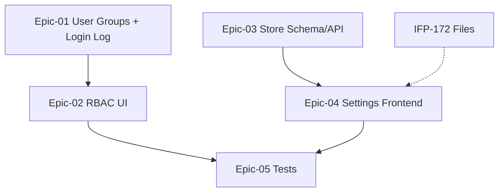

# Phase 09 — کاربران و تنظیمات فروشگاه

> **وضعیت:** Approved — v1.0  
> **نسخه:** 1.0 — 1405/04/10  
> **تسک‌ها:** IFP-157→171  
> **حوزه محصول:** §۱۳ کاربران، §۱۴ تنظیمات فروشگاه  
> **قوانین:** [`PHASE_EPIC_TASK_AUTHORING_RULES.md`](../docs/09-development/PHASE_EPIC_TASK_AUTHORING_RULES.md)

---

## هدف فاز

تکمیل Enterprise مدیریت کاربران (گروه‌ها، لاگ ورود)، RBAC UI (نقش‌ها، مجوزها، override)، و تنظیمات فروشگاه (پروفایل، مالی، درگاه، مالیات، ساعت کاری) مطابق §۱۳ و §۱۴ محصول.

---

## Exit Criteria (فاز کامل شد وقتی...)

- [ ] همه تسک‌های **P0** Done
- [ ] Vertical slice تست فاز pass
- [ ] self-review ≥ 95 روی همه task specs
- [ ] TRACEABILITY: bullets محصول § مربوطه پوشش داده شده
- [ ] بدون `prisma.*.delete()` روی business models

---

## Epics

| Epic | مسیر | عنوان | Tasks |
|------|------|--------|-------|
| Epic-01 | [Epic-01-User-Management-Extended](./Epic-01-User-Management-Extended/) | مدیریت کاربران توسعه‌یافته | 4 |
| Epic-02 | [Epic-02-RBAC-UI](./Epic-02-RBAC-UI/) | RBAC UI — نقش‌ها، مجوزها، Override | 5 |
| Epic-03 | [Epic-03-Store-Settings](./Epic-03-Store-Settings/) | تنظیمات فروشگاه — Schema & API | 4 |
| Epic-04 | [Epic-04-Settings-Frontend](./Epic-04-Settings-Frontend/) | فرانت‌اند تنظیمات فروشگاه | 1 |
| Epic-05 | [Epic-05-Phase09-Tests](./Epic-05-Phase09-Tests/) | تست‌های Phase 09 | 1 |

---

## ترتیب اجرا (dependency graph)

### ترتیب پیشنهادی

- IFP-157: Prisma — StaffGroup و StaffGroupMember (مدیریت کاربران توسعه‌یافته)
- IFP-158: Use Case + API — Staff Groups CRUD (مدیریت کاربران توسعه‌یافته)
- IFP-159: Prisma — StaffLoginLog (append-only) (مدیریت کاربران توسعه‌یافته)
- IFP-160: Use Case + API — Staff Login Log List (مدیریت کاربران توسعه‌یافته)
- IFP-161: Use Case — Tenant Roles CRUD (RBAC UI — نقش‌ها، مجوزها، Override)
- IFP-162: Use Case — Staff Permission Overrides (RBAC UI — نقش‌ها، مجوزها، Override)
- IFP-163: API Controller + Contracts — RBAC (RBAC UI — نقش‌ها، مجوزها، Override)
- IFP-164: Frontend — Roles & Permissions UI (RBAC UI — نقش‌ها، مجوزها، Override)
- IFP-165: Frontend — Staff Groups & Login Log (RBAC UI — نقش‌ها، مجوزها، Override)
- IFP-166: Settings Schema — Store Profile (seller, logo, contact) (تنظیمات فروشگاه — Schema & API)
- IFP-167: Settings Schema — Financial, Gateway, Tax, Business Hours (تنظیمات فروشگاه — Schema & API)
- IFP-169: Contracts — Store Settings Zod Schemas (تنظیمات فروشگاه — Schema & API)
- IFP-168: Use Case + API — Store Settings (تنظیمات فروشگاه — Schema & API)
- IFP-170: Frontend — Store Settings Pages (فرانت‌اند تنظیمات فروشگاه)
- IFP-171: Phase 09 — Integration & Vertical Slice Tests (تست‌های Phase 09)

---

## وابستگی به فاز قبل

- IFP Phase 01 (Auth/Security)، IFP Phase 02 (CrossCutting UI)، Phase 0/1 (Staff/RBAC پایه)

---

## قوانین

- [`PHASE_EPIC_TASK_AUTHORING_RULES.md`](../docs/09-development/PHASE_EPIC_TASK_AUTHORING_RULES.md)
- [`EXCELLENCE-STANDARDS.md`](../docs/09-development/EXCELLENCE-STANDARDS.md)
- [`SOFT-DELETE-POLICY.md`](../docs/09-development/SOFT-DELETE-POLICY.md)
