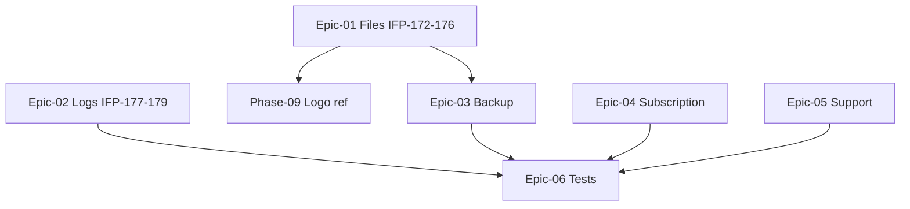

# Phase 10 — فایل، لاگ، بکاپ، اشتراک، پشتیبانی

> **وضعیت:** Approved — v1.0  
> **نسخه:** 1.0 — 1405/04/10  
> **تسک‌ها:** IFP-172→187  
> **حوزه محصول:** §۱۲، §۱۹، §۲۱، §۲۲، §۲۳  
> **قوانین:** [`PHASE_EPIC_TASK_AUTHORING_RULES.md`](../docs/09-development/PHASE_EPIC_TASK_AUTHORING_RULES.md)

---

## هدف فاز

پیاده‌سازی §۱۲ فایل‌ها، §۱۹ لاگ سیستم، §۲۱ بکاپ، §۲۲ اشتراک، §۲۳ پشتیبانی — سرویس‌های پلتفرم Enterprise.

---

## Exit Criteria (فاز کامل شد وقتی...)

- [ ] همه تسک‌های **P0** Done
- [ ] Vertical slice تست فاز pass
- [ ] self-review ≥ 95 روی همه task specs
- [ ] TRACEABILITY: bullets محصول § مربوطه پوشش داده شده
- [ ] بدون `prisma.*.delete()` روی business models

---

## Epics

| Epic | مسیر | عنوان | Tasks |
|------|------|--------|-------|
| Epic-01 | [Epic-01-File-Management](./Epic-01-File-Management/) | مدیریت فایل | 5 |
| Epic-02 | [Epic-02-System-Logs](./Epic-02-System-Logs/) | لاگ سیستم | 3 |
| Epic-03 | [Epic-03-Backup-Restore](./Epic-03-Backup-Restore/) | نسخه پشتیبان | 2 |
| Epic-04 | [Epic-04-Subscription-Billing](./Epic-04-Subscription-Billing/) | اشتراک و صورتحساب | 3 |
| Epic-05 | [Epic-05-Support](./Epic-05-Support/) | پشتیبانی | 2 |
| Epic-06 | [Epic-06-Phase10-Tests](./Epic-06-Phase10-Tests/) | تست‌های Phase 10 | 1 |

---

## ترتیب اجرا (dependency graph)

### ترتیب پیشنهادی

- IFP-172: Prisma — FileAsset & FileCategory (مدیریت فایل)
- IFP-173: Infrastructure — File Storage Service (S3/local) (مدیریت فایل)
- IFP-174: Use Case — File CRUD, Categories, Search (مدیریت فایل)
- IFP-175: API + Contracts — Files (مدیریت فایل)
- IFP-176: Frontend — File Management UI (مدیریت فایل)
- IFP-177: Infrastructure — System Logs Pipeline (لاگ سیستم)
- IFP-178: API — System Logs Viewer (لاگ سیستم)
- IFP-179: Frontend — System Logs Viewer (لاگ سیستم)
- IFP-180: Use Case + Scheduler — Backup & Restore (نسخه پشتیبان)
- IFP-181: API + Frontend — Backup & Restore UI (نسخه پشتیبان)
- IFP-182: Domain — Subscription Plan & Feature Caps (اشتراک و صورتحساب)
- IFP-183: Use Case + API — Subscription Billing (اشتراک و صورتحساب)
- IFP-184: Frontend — Subscription & Billing UI (اشتراک و صورتحساب)
- IFP-185: Prisma — SupportTicket, FAQ, SupportArticle (پشتیبانی)
- IFP-186: Use Case + API — Support Tickets, Chat, FAQ (پشتیبانی)
- IFP-187: Phase 10 — Integration & Vertical Slice Tests (تست‌های Phase 10)

---

## وابستگی به فاز قبل

- IFP Phase 02، Phase 0 tenant/plan infrastructure

---

## قوانین

- [`PHASE_EPIC_TASK_AUTHORING_RULES.md`](../docs/09-development/PHASE_EPIC_TASK_AUTHORING_RULES.md)
- [`EXCELLENCE-STANDARDS.md`](../docs/09-development/EXCELLENCE-STANDARDS.md)
- [`SOFT-DELETE-POLICY.md`](../docs/09-development/SOFT-DELETE-POLICY.md)
