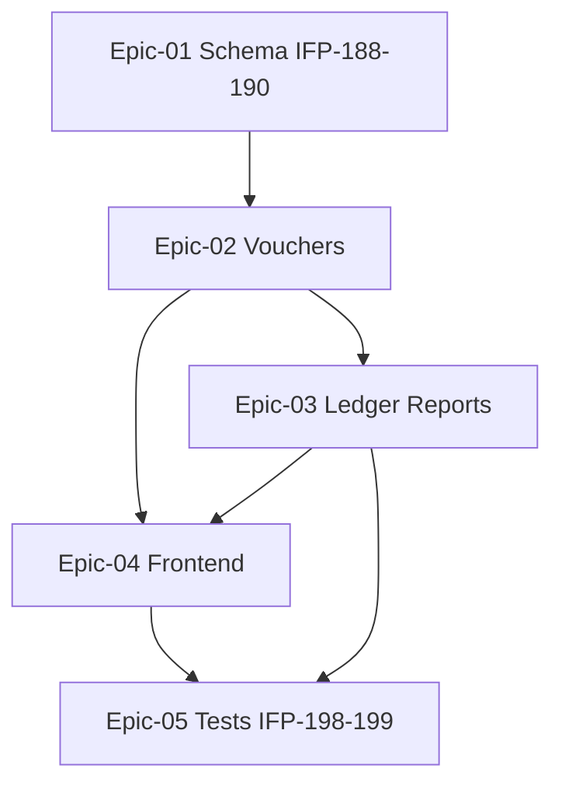

# Phase 11 — حسابداری حرفه‌ای

> **وضعیت:** Approved — v1.0  
> **نسخه:** 1.0 — 1405/04/10  
> **تسک‌ها:** IFP-188→199  
> **حوزه محصول:** §۱۸  
> **قوانین:** [`PHASE_EPIC_TASK_AUTHORING_RULES.md`](../docs/09-development/PHASE_EPIC_TASK_AUTHORING_RULES.md)

---

## هدف فاز

§۱۸ حسابداری: صندوق، بانک، اسناد دریافت/پرداخت، دفتر کل، تراز، سود و زیان.

---

## Exit Criteria (فاز کامل شد وقتی...)

- [ ] همه تسک‌های **P0** Done
- [ ] Vertical slice تست فاز pass
- [ ] self-review ≥ 95 روی همه task specs
- [ ] TRACEABILITY: bullets محصول § مربوطه پوشش داده شده
- [ ] بدون `prisma.*.delete()` روی business models

---

## Epics

| Epic | مسیر | عنوان | Tasks |
|------|------|--------|-------|
| Epic-01 | [Epic-01-Accounting-Schema](./Epic-01-Accounting-Schema/) | اسکیمای حسابداری | 3 |
| Epic-02 | [Epic-02-Receipt-Payment-Documents](./Epic-02-Receipt-Payment-Documents/) | اسناد دریافت و پرداخت | 2 |
| Epic-03 | [Epic-03-General-Ledger-Reports](./Epic-03-General-Ledger-Reports/) | دفتر کل و گزارش‌های مالی | 2 |
| Epic-04 | [Epic-04-Accounting-Frontend](./Epic-04-Accounting-Frontend/) | فرانت‌اند حسابداری | 3 |
| Epic-05 | [Epic-05-Phase11-Tests](./Epic-05-Phase11-Tests/) | تست‌های Phase 11 | 2 |

---

## ترتیب اجرا (dependency graph)

### ترتیب پیشنهادی

- IFP-188: Prisma — Chart of Accounts, Cash & Bank (اسکیمای حسابداری)
- IFP-189: Prisma — JournalEntry & JournalLine (اسکیمای حسابداری)
- IFP-190: Domain — Accounting Invariants & Rules (اسکیمای حسابداری)
- IFP-191: Use Case — Receipt & Payment Vouchers (اسناد دریافت و پرداخت)
- IFP-192: API + Contracts — Accounting Vouchers (اسناد دریافت و پرداخت)
- IFP-193: Use Case — General Ledger Queries (دفتر کل و گزارش‌های مالی)
- IFP-194: Use Case — Balance Sheet & Profit/Loss (دفتر کل و گزارش‌های مالی)
- IFP-195: Frontend — Chart of Accounts UI (فرانت‌اند حسابداری)
- IFP-196: Frontend — Vouchers & Journal UI (فرانت‌اند حسابداری)
- IFP-197: Frontend — Balance Sheet & P&L Reports (فرانت‌اند حسابداری)
- IFP-198: Accounting — Integration Tests (تست‌های Phase 11)
- IFP-199: Phase 11 — Vertical Slice E2E Tests (تست‌های Phase 11)

---

## وابستگی به فاز قبل

- IFP Phase 05–06 (اقساط/پرداخت)، Phase 09 settings

---

## قوانین

- [`PHASE_EPIC_TASK_AUTHORING_RULES.md`](../docs/09-development/PHASE_EPIC_TASK_AUTHORING_RULES.md)
- [`EXCELLENCE-STANDARDS.md`](../docs/09-development/EXCELLENCE-STANDARDS.md)
- [`SOFT-DELETE-POLICY.md`](../docs/09-development/SOFT-DELETE-POLICY.md)
