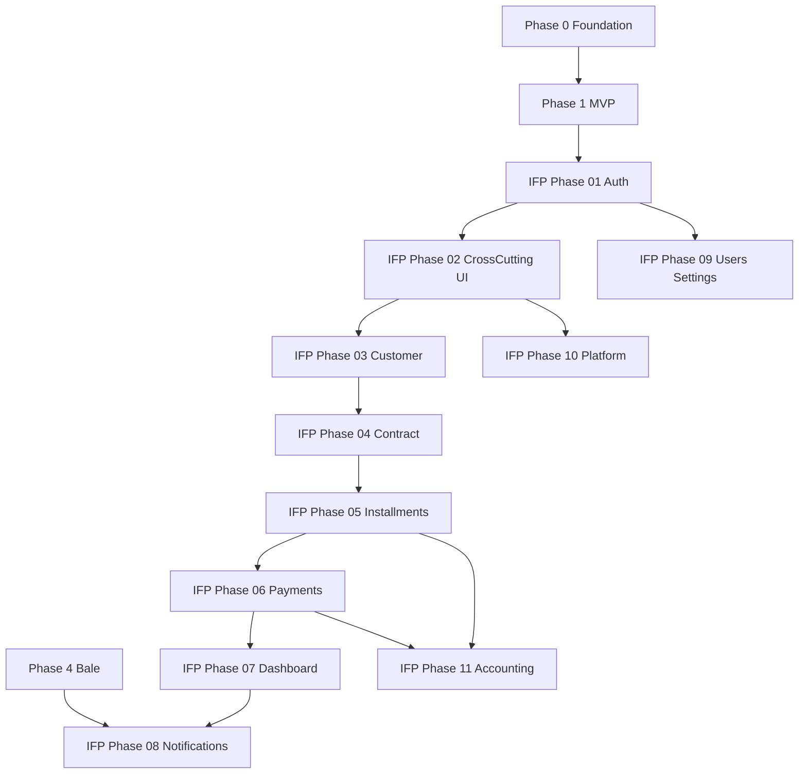

# InstallmentFeaturePhases — فازبندی کامل امکانات

> **وضعیت:** Approved — v1.0  
> **نسخه:** 1.0 — 1405/04/10  
> **ADRهای مرتبط:** ADR-001, ADR-002, ADR-004, ADR-007, ADR-013, ADR-015, ADR-016, ADR-017  
> **منبع محصول:** [`docs/01-product/installment-module-features.md`](../docs/01-product/installment-module-features.md)  
> **قوانین:** [`PHASE_EPIC_TASK_AUTHORING_RULES.md`](../docs/09-development/PHASE_EPIC_TASK_AUTHORING_RULES.md) · [`DOCUMENTATION_AUTHORING_RULES.md`](../docs/09-development/DOCUMENTATION_AUTHORING_RULES.md)

---

## هدف

فازبندی **اجرایی و کامل** تمام امکانات فهرست‌شده در سند محصول (۲۳ حوزه + قابلیت‌های cross-cutting) برای رسیدن به سامانه Enterprise مدیریت اقساط. این پوشه **مکمل** [`Phases/`](../Phases/) است — فازهای ۰/۱/۴ پایه را پوشش می‌دهند؛ اینجا **gap analysis** و **تکمیل Enterprise** تا ۱۰۰٪.

---

## رابطه با Phases موجود

| لایه | مسیر | محتوا |
|------|------|--------|
| Foundation | `Phases/Phase-0-Foundation/` | TASK-001→059 — infra، auth پایه، tenant |
| MVP Seller Panel | `Phases/Phase-1-Seller-Panel/` | TASK-060→123 — CRUD پایه مشتری/فروش/اقساط |
| Bale + Marketing | `Phases/Phase-4-Bale-Marketing/` | TASK-124→174 — ربات بله، یادآور |
| **Enterprise Features** | **`InstallmentFeaturePhases/`** | **IFP-TASK-001→199 — تکمیل ۹۵٪→۱۰۰٪** |

**ترتیب اجرا پیشنهادی:**

```
Phase 0 ✅ → Phase 1 (MVP) → Phase 4 (Bale) → InstallmentFeaturePhases (01→11) → Phase 3 (PWA)
```

---

## فازها (۱۱ فاز — ۱۹۹ تسک)

| Phase | مسیر | تسک‌ها | حوزه محصول |
|-------|------|--------|------------|
| 01 | [Phase-01-Auth-Security](./Phase-01-Auth-Security/) | IFP-001→018 | §۱ ورود، §۲۰ امنیت |
| 02 | [Phase-02-CrossCutting-UI](./Phase-02-CrossCutting-UI/) | IFP-019→032 | قابلیت‌های عمومی UI |
| 03 | [Phase-03-Customer-Enterprise](./Phase-03-Customer-Enterprise/) | IFP-033→054 | §۳ مدیریت مشتریان |
| 04 | [Phase-04-Contract-Enterprise](./Phase-04-Contract-Enterprise/) | IFP-055→078 | §۴ قراردادها، §۱۵ تنظیمات اقساط |
| 05 | [Phase-05-Installments-Advanced](./Phase-05-Installments-Advanced/) | IFP-079→100 | §۵ مدیریت اقساط |
| 06 | [Phase-06-Payments-Checks](./Phase-06-Payments-Checks/) | IFP-101→118 | §۶ پرداخت‌ها، §۷ چک |
| 07 | [Phase-07-Dashboard-Reports-Calendar](./Phase-07-Dashboard-Reports-Calendar/) | IFP-119→138 | §۲ داشبورد، §۱۰ گزارش، §۱۱ تقویم |
| 08 | [Phase-08-Notifications-Automation](./Phase-08-Notifications-Automation/) | IFP-139→156 | §۸ اعلان، §۹ اتوماسیون، §۱۶ بله، §۱۷ پیامک |
| 09 | [Phase-09-Users-Settings](./Phase-09-Users-Settings/) | IFP-157→171 | §۱۳ کاربران، §۱۴ تنظیمات فروشگاه |
| 10 | [Phase-10-Files-Platform-Services](./Phase-10-Files-Platform-Services/) | IFP-172→187 | §۱۲ فایل، §۱۹ لاگ، §۲۱ بکاپ، §۲۲ اشتراک، §۲۳ پشتیبانی |
| 11 | [Phase-11-Accounting-Pro](./Phase-11-Accounting-Pro/) | IFP-188→199 | §۱۸ حسابداری حرفه‌ای |

**مجموع:** ۱۹۹ تسک (`IFP-TASK-001` → `IFP-TASK-199`)

---

## Dependency Graph (فازها)



---

## ساختار پوشه

```
InstallmentFeaturePhases/
├── README.md                          # این فایل
├── FEATURE-ANALYSIS.md                # تحلیل کامل ۲۳ حوزه + cross-cutting
├── TRACEABILITY-MATRIX.md             # نگاشت feature → phase → epic → task
├── Phase-01-Auth-Security/
│   ├── README.md
│   └── Epic-NN-Name/
│       ├── README.md
│       └── IFP-TASK-NNN-kebab-slug.md
└── ...
```

---

## نام‌گذاری Task

| Item | Convention |
|------|------------|
| Task ID | `IFP-TASK-{NNN}` — سه رقم، sequential در **کل** InstallmentFeaturePhases |
| Task file | `IFP-TASK-{NNN}-{kebab-slug}.md` |
| Phase folder | `Phase-{NN}-{PascalCase}` |
| Epic folder | `Epic-{NN}-{PascalCase}` |

---

## Exit Criteria (کل InstallmentFeaturePhases)

- [ ] همه IFP-TASKهای **P0** Done
- [ ] Vertical slice: **ورود Enterprise → مشتری کامل → قرارداد → اقساط پیشرفته → پرداخت → داشبورد → گزارش → اعلان**
- [ ] هیچ `prisma.*.delete()` روی business models
- [ ] TRACEABILITY-MATRIX: ۱۰۰٪ bulletهای `installment-module-features.md` پوشش داده شده
- [ ] self-review ≥ **95/100** روی همه task specs
- [ ] `docs/README.md` لینک به این پوشه

---

## مراجع

| موضوع | سند |
|--------|-----|
| تحلیل فیچرها | [FEATURE-ANALYSIS.md](./FEATURE-ANALYSIS.md) |
| نگاشت traceability | [TRACEABILITY-MATRIX.md](./TRACEABILITY-MATRIX.md) |
| Domain | [domain.md](../docs/03-modules/installments/domain.md) |
| Business Rules | [BUSINESS-RULES.md](../docs/03-modules/installments/BUSINESS-RULES.md) |
| Staff Flows | [STAFF-FLOWS.md](../docs/03-modules/installments/STAFF-FLOWS.md) |
| Template Task | [TASK-TEMPLATE.md](../docs/09-development/TASK-TEMPLATE.md) |

---

*آخرین به‌روزرسانی: 1405/04/10*