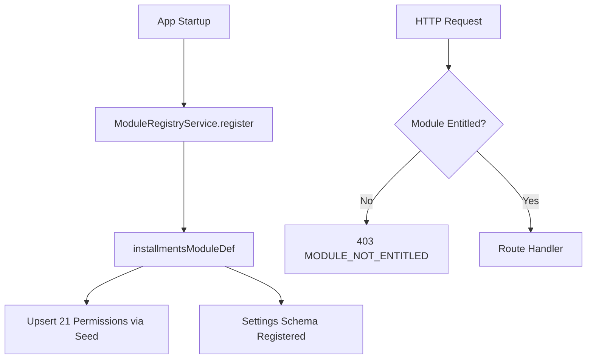

# TASK-060: Installments Module Registration (Production)

## Metadata

| فیلد | مقدار |
|------|--------|
| Phase | 1 |
| Epic | Epic-01-Installments-Module-Setup |
| ID | TASK-060 |
| Priority | P0 |
| Depends on | TASK-054, TASK-059 |
| Blocks | TASK-061, TASK-070, TASK-098 |
| Estimated | 4h |

---

## هدف

ارتقای `modules/installments` از skeleton Phase 0 (TASK-059) به ماژول production: permissions رسمی از `rbac.md`، `HivorkModule` کامل، seed integration، settings schema اولیه، و namespace API — تا Epic-02 تا Epic-09 روی foundation یکپارچه build کنند.

---

## معیار پذیرش

- [ ] `INSTALLMENTS_PERMISSIONS` **100%** هم‌تراز با `docs/02-architecture/rbac.md` § Installments (۲۱ permission)
- [ ] `installmentsModuleDef` با `code`, `name`, `version: '1.0.0'`, `permissions[]`, `register(app)` production
- [ ] Seed (TASK-028 pattern) همه permissions را از module export می‌خواند — duplicate key ندارد
- [ ] `settings.schema.ts` با keys اولیه installments (stub valid Zod — تکمیل در TASK-070)
- [ ] `@RequireModule('installments')` روی stub route تست pass می‌کند
- [ ] Skeleton permissions اضافی TASK-059 (مثل `sale.list`, `sale.void`) **حذف** یا migrate به rbac.md رسمی
- [ ] `apps/api` در startup module را register می‌کند بدون error
- [ ] Type export: `InstallmentsPermission` برای type-safe guards

---

## مشخصات فنی

### Permissions (منبع: rbac.md — authoritative)

```typescript
// modules/installments/src/installments.permissions.ts
export const INSTALLMENTS_PERMISSIONS = [
  'installments.sale.view',
  'installments.sale.create',
  'installments.sale.update',
  'installments.sale.cancel',
  'installments.installment.view',
  'installments.installment.waive',
  'installments.payment.view',
  'installments.payment.confirm',
  'installments.payment.reject',
  'installments.payment.report',
  'installments.customer.view',
  'installments.customer.create',
  'installments.customer.update',
  'installments.customer.import',
  'installments.reminder.configure',
  'installments.reminder.view_log',
  'installments.report.dashboard',
  'installments.report.overdue',
  'installments.report.export',
] as const;

export type InstallmentsPermission = (typeof INSTALLMENTS_PERMISSIONS)[number];
```

### HivorkModule Interface

```typescript
// packages/module-core — existing from Phase 0
export interface HivorkModule {
  code: string;
  name: string;
  version: string;
  permissions: Array<{ key: string; description: string }>;
  register(app: INestApplication): void | Promise<void>;
}
```

### Production Module Definition

```typescript
// modules/installments/src/installments.module.ts
import type { HivorkModule } from '@hivork/module-core';
import { INSTALLMENTS_PERMISSIONS } from './installments.permissions';
import { installmentsSettingsSchema } from './settings.schema';

const PERMISSION_DESCRIPTIONS: Record<InstallmentsPermission, string> = {
  'installments.sale.view': 'مشاهده جزئیات فروش',
  'installments.sale.create': 'ثبت فروش قسطی',
  'installments.sale.update': 'ویرایش فروش (محدود — فاز بعد)',
  'installments.sale.cancel': 'لغو فروش',
  'installments.installment.view': 'مشاهده اقساط',
  'installments.installment.waive': 'بخشودگی قسط',
  'installments.payment.view': 'مشاهده گزارش‌های پرداخت',
  'installments.payment.confirm': 'تأیید پرداخت',
  'installments.payment.reject': 'رد پرداخت',
  'installments.payment.report': 'ثبت گزارش پرداخت (staff)',
  'installments.customer.view': 'مشاهده مشتریان',
  'installments.customer.create': 'ثبت مشتری',
  'installments.customer.update': 'ویرایش مشتری',
  'installments.customer.import': 'ورود Excel مشتری',
  'installments.reminder.configure': 'تنظیم یادآور',
  'installments.reminder.view_log': 'مشاهده لاگ یادآور',
  'installments.report.dashboard': 'داشبورد گزارش',
  'installments.report.overdue': 'گزارش معوقات',
  'installments.report.export': 'خروجی Excel/PDF',
};

export const installmentsModuleDef: HivorkModule = {
  code: 'installments',
  name: 'مدیریت اقساط',
  version: '1.0.0',
  permissions: INSTALLMENTS_PERMISSIONS.map((key) => ({
    key,
    description: PERMISSION_DESCRIPTIONS[key],
  })),
  register(_app) {
    // Epic-09: InstallmentsModule.registerRoutes(_app)
  },
};

export { installmentsSettingsSchema };
```

### Settings Schema (stub — valid keys)

```typescript
// modules/installments/src/settings.schema.ts
import { z } from 'zod';

export const installmentsSettingsSchema = z.object({
  reminder_days_before: z.array(z.number().int().min(0).max(30)).default([3, 1]),
  reminder_on_due_date: z.boolean().default(true),
  reminder_time: z.string().regex(/^\d{2}:\d{2}$/).default('09:00'),
  overdue_escalation_days: z.array(z.number().int().min(1).max(90)).default([1, 3, 7]),
  default_installment_count: z.number().int().min(1).max(120).default(12),
  allow_customer_self_report_payment: z.boolean().default(true),
  require_seller_payment_confirmation: z.boolean().default(true),
  notify_seller_on_customer_payment_report: z.boolean().default(true),
  default_reminder_channels: z
    .array(z.enum(['telegram', 'bale', 'sms']))
    .default(['telegram']),
  default_interval_days: z.number().int().min(1).max(365).default(30),
});

export type InstallmentsSettings = z.infer<typeof installmentsSettingsSchema>;
```

### Seed Integration

```typescript
// prisma/seed.ts — pattern
import { INSTALLMENTS_PERMISSIONS } from '@hivork/module-installments';

for (const key of INSTALLMENTS_PERMISSIONS) {
  await prisma.permission.upsert({
    where: { key },
    create: { key, module: 'installments', description: key },
    update: { module: 'installments' },
  });
}
```

### Template Role Matrix (owner/manager/cashier)

| Permission | owner | manager | cashier |
|------------|-------|---------|---------|
| installments.sale.create | ✅ | ✅ | ✅ |
| installments.sale.cancel | ✅ | ✅ | ❌ |
| installments.report.export | ✅ | ✅ | ❌ |
| installments.customer.import | ✅ | ✅ | ❌ |
| installments.reminder.configure | ✅ | ✅ | ❌ |

---

## فایل‌ها

| عمل | مسیر |
|-----|------|
| Update | `modules/installments/src/installments.permissions.ts` |
| Update | `modules/installments/src/installments.module.ts` |
| Update | `modules/installments/src/settings.schema.ts` |
| Update | `modules/installments/src/index.ts` — re-export |
| Update | `prisma/seed.ts` — sync permissions from module |
| Update | `apps/api/src/app.module.ts` — register v1.0.0 |

---

## مراحل پیاده‌سازی

1. مقایسه `INSTALLMENTS_PERMISSIONS` فعلی (TASK-059) با `rbac.md` — حذف keys غیررسمی
2. اضافه کردن `PERMISSION_DESCRIPTIONS` فارسی
3. bump `version` به `1.0.0`
4. پیاده‌سازی `installmentsSettingsSchema` با defaults از api-contracts
5. به‌روزرسانی seed برای upsert ۲۱ permission
6. به‌روزرسانی template role seeds (owner/manager/cashier matrix)
7. تست `@RequireModule('installments')` با tenant دارای plan installments
8. مستند migration note: permissions حذف‌شده از skeleton در seed cleanup

---

## Edge Cases & Errors

| سناریو | HTTP / Code | رفتار |
|--------|-------------|--------|
| Tenant بدون plan installments | 403 `MODULE_NOT_ENTITLED` | ModuleEntitlementGuard deny |
| Permission key در DB ولی نه در module export | — | seed drift — CI check permissions sync |
| Duplicate register در hot reload | — | idempotent register در ModuleRegistryService |
| Skeleton permission `sale.void` در role قدیمی | — | migration seed: remap یا remove از RolePermission |
| Module register throws | — | app startup fail fast با log structured |

---

## تست

- [ ] Unit: `INSTALLMENTS_PERMISSIONS.length === 21`
- [ ] Unit: every key matches regex `^installments\.[a-z_]+\.[a-z_]+$`
- [ ] Integration: seed → count permissions where module=installments === 21
- [ ] Integration: `@RequireModule('installments')` — entitled tenant 200, non-entitled 403
- [ ] Integration: owner role has `installments.sale.create`; cashier lacks `installments.sale.cancel`

---

## UX

N/A — backend module registration task.

---

## Flow



---

## Policy Alignment

- [ ] EXCELLENCE-STANDARDS §3 — permission naming `{module}.{resource}.{action}`
- [ ] SOFT-DELETE-POLICY — N/A (no business entities)
- [ ] ADR-002 — installments as module 1
- [ ] DEVELOPMENT_RULES — `@RequireModule('installments')` on all module endpoints

---

## مراجع

- `Phases/Phase-0-Foundation/Epic-03-Packages-Skeleton/TASK-059-modules-installments-skeleton.md`
- `docs/02-architecture/rbac.md` § Installments Module Permissions
- `docs/02-architecture/modules.md`
- `docs/02-architecture/api-contracts.md` — settings response

---

## Self-Review Score

| محور | سقف | امتیاز | یادداشت |
|------|-----|--------|---------|
| Metadata | 10 | 10 | Depends, Blocks, Estimate ✓ |
| Completeness | 25 | 25 | 21 permissions، schema، seed pattern ✓ |
| Policy | 25 | 25 | rbac.md authoritative، ADR-002 ✓ |
| Executability | 25 | 24 | Edge cases + 5 tests ✓ |
| Alignment | 15 | 15 | Sync TASK-059 upgrade path ✓ |
| **جمع** | **100** | **99** | ≥95 required ✓ |
