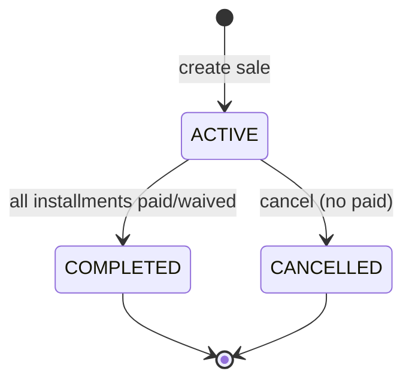

# TASK-061: Prisma Schema — Sale

## Metadata

| فیلد | مقدار |
|------|--------|
| Phase | 1 |
| Epic | Epic-02-Installments-Database |
| ID | TASK-061 |
| Priority | P0 |
| Depends on | TASK-060, TASK-018, TASK-023 |
| Blocks | TASK-062, TASK-065 |
| Estimated | 4h |

---

## هدف

تعریف مدل Prisma `Sale` — aggregate root فروش قسطی — با فیلدهای EXCELLENCE §8، `branchId NOT NULL`، status enum، فیلدهای cancellation، و indexes برای queryهای tenant/branch/report.

---

## معیار پذیرش

- [ ] مدل `Sale` با تمام base fields (EXCELLENCE §2.1)
- [ ] فیلدهای domain: `tenantId`, `branchId` (NOT NULL), `tenantCustomerId`, `createdByStaffId`, `title`, `totalAmountRial`, `downPaymentRial`, `installmentCount`, `firstDueDate`, `intervalDays`, `contractDate`
- [ ] Enum `SaleStatus`: `ACTIVE`, `COMPLETED`, `CANCELLED`
- [ ] Cancellation: `cancelledAt`, `cancelledById`, `cancelReason`
- [ ] `version Int` — financial entity optimistic locking
- [ ] Indexes: `(tenantId, status)`, `(tenantId, branchId)`, `(tenantId, tenantCustomerId)`, `(tenantId, createdAt)`
- [ ] `onDelete: Restrict` روی همه FKs
- [ ] **لغو فروش = status transition** — نه delete؛ soft delete فقط اگر **هیچ** installment با status `PAID` وجود نداشته باشد (SOFT-DELETE-POLICY §5)
- [ ] `pnpm prisma validate` pass

---

## مشخصات فنی

### Enums

```prisma
enum SaleStatus {
  ACTIVE
  COMPLETED
  CANCELLED

  @@map("sale_status")
}
```

### Schema

```prisma
model Sale {
  id                 String     @id @default(uuid()) @db.Uuid
  tenantId           String     @map("tenant_id") @db.Uuid
  branchId           String     @map("branch_id") @db.Uuid
  tenantCustomerId   String     @map("tenant_customer_id") @db.Uuid
  createdByStaffId   String     @map("created_by_staff_id") @db.Uuid
  title              String?
  description        String?
  invoiceNumber      String?    @map("invoice_number")
  totalAmountRial    BigInt     @map("total_amount_rial")
  downPaymentRial    BigInt     @default(0) @map("down_payment_rial")
  discountRial       BigInt?    @map("discount_rial")
  taxRial            BigInt?    @map("tax_rial")
  installmentCount   Int        @map("installment_count")
  firstDueDate       DateTime   @map("first_due_date") @db.Timestamptz
  intervalDays       Int        @default(30) @map("interval_days")
  contractDate       DateTime   @map("contract_date") @db.Date
  status             SaleStatus @default(ACTIVE)
  cancelledAt        DateTime?  @map("cancelled_at") @db.Timestamptz
  cancelledById      String?    @map("cancelled_by_id") @db.Uuid
  cancelReason       String?    @map("cancel_reason")
  createdAt          DateTime   @default(now()) @map("created_at") @db.Timestamptz
  updatedAt          DateTime   @updatedAt @map("updated_at") @db.Timestamptz
  createdById        String?    @map("created_by_id") @db.Uuid
  updatedById        String?    @map("updated_by_id") @db.Uuid
  deletedAt          DateTime?  @map("deleted_at") @db.Timestamptz
  deletedById        String?    @map("deleted_by_id") @db.Uuid
  deleteReason       String?    @map("delete_reason")
  version            Int        @default(1)
  metadata           Json?      @db.JsonB

  tenant         Tenant         @relation(fields: [tenantId], references: [id], onDelete: Restrict)
  branch         Branch         @relation(fields: [branchId], references: [id], onDelete: Restrict)
  tenantCustomer TenantCustomer @relation(fields: [tenantCustomerId], references: [id], onDelete: Restrict)
  createdByStaff Staff          @relation("SaleCreatedBy", fields: [createdByStaffId], references: [id], onDelete: Restrict)
  cancelledBy    Staff?         @relation("SaleCancelledBy", fields: [cancelledById], references: [id], onDelete: Restrict)
  installments   Installment[]

  @@index([tenantId, status])
  @@index([tenantId, branchId])
  @@index([tenantId, tenantCustomerId])
  @@index([tenantId, createdAt])
  @@index([tenantId, deletedAt])
  @@map("sales")
}
```

### Soft Delete Policy — Sale

| عمل | رفتار |
|-----|--------|
| **Cancel** (عادی) | `status = CANCELLED` + `cancelledAt/By/Reason` — record visible in history |
| **Soft delete** (admin/recycle) | فقط اگر **zero** installments با `status = PAID` — `deletedAt` set + audit |
| **Restore** | `core.data.restore` یا tenant owner — clear `deletedAt` |
| Paid installments exist | soft delete **reject** — `SALE_HAS_PAID_INSTALLMENT` |

> Sale **هرگز** hard delete نمی‌شود (ADR-013).

### Validation Rules (use case — documented here)

- BR-001: `totalAmountRial > 0n`
- BR-002: `0n <= downPaymentRial <= totalAmountRial`
- BR-003: `1 <= installmentCount <= 120`
- BR-008: `branchId` belongs to same `tenantId`; staff has branch access

---

## فایل‌ها

| عمل | مسیر |
|-----|------|
| Update | `prisma/schema.prisma` — model Sale + enum SaleStatus |
| Update | `prisma/schema.prisma` — relation on Branch, TenantCustomer, Staff |
| Create | `packages/infrastructure/persistence/sale.repository.ts` — TASK-072 |

---

## مراحل پیاده‌سازی

1. اضافه کردن enum `SaleStatus`
2. اضافه کردن model `Sale` با BigInt amounts
3. FK relations با `onDelete: Restrict`
4. Staff relation aliases (`SaleCreatedBy`, `SaleCancelledBy`)
5. Indexes per acceptance criteria
6. `pnpm prisma validate`
7. مستندسازی soft delete rule در repository interface comment

---

## Edge Cases & Errors

| سناریو | HTTP / Code | رفتار |
|--------|-------------|--------|
| `branchId` tenant دیگر | 422 `BRANCH_TENANT_MISMATCH` | FK + use case validation |
| Soft delete با paid installment | 409 `SALE_HAS_PAID_INSTALLMENT` | domain reject |
| Cancel already cancelled | 409 `SALE_ALREADY_CANCELLED` | status check |
| Cancel completed sale | 409 `SALE_ALREADY_COMPLETED` | status check |
| Query list default | — | `deletedAt: null` via Prisma extension |
| Soft-deleted sale get by id | 404 | no existence leak |

---

## تست

- [ ] Integration: create Sale with valid FKs → success
- [ ] Integration: invalid branchId → FK or validation fail
- [ ] Integration: soft delete active sale (no paid installments) → not in list
- [ ] Integration: soft delete with paid installment → 409
- [ ] Unit: schema — totalAmountRial is BigInt in generated types

---

## UX

N/A — database schema task.

---

## Flow



---

## Policy Alignment

- [ ] EXCELLENCE-STANDARDS §2.1 — base fields کامل
- [ ] EXCELLENCE-STANDARDS §8 — Sale fields (title, amounts, branchId, contractDate, …)
- [ ] SOFT-DELETE-POLICY §5 — cancel ≠ delete؛ soft delete only without paid
- [ ] ADR-007 — BigInt Rial
- [ ] ADR-013 — Restrict FKs، no hard delete
- [ ] ADR-015 — branchId NOT NULL + index

---

## مراجع

- `docs/03-modules/installments/domain.md` § Sale
- `docs/03-modules/installments/state-machines.md` § Sale Status
- `docs/09-development/SOFT-DELETE-POLICY.md` §5
- `Phases/Phase-0-Foundation/Epic-04-Database/TASK-023-prisma-tenant-customer.md`

---

## Self-Review Score

| محور | سقف | امتیاز | یادdاشت |
|------|-----|--------|---------|
| Metadata | 10 | 10 | ✓ |
| Completeness | 25 | 25 | Full schema، indexes، policy ✓ |
| Policy | 25 | 25 | Soft delete rules explicit ✓ |
| Executability | 25 | 25 | Edge cases، tests ✓ |
| Alignment | 15 | 15 | domain.md + EXCELLENCE §8 ✓ |
| **جمع** | **100** | **100** | ≥95 required ✓ |
