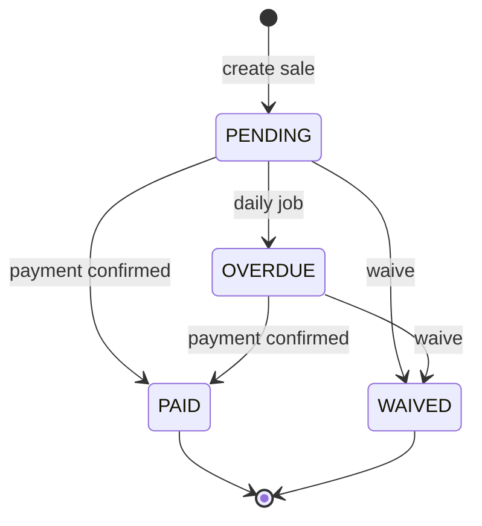

# TASK-062: Prisma Schema — Installment

## Metadata

| فیلد | مقدار |
|------|--------|
| Phase | 1 |
| Epic | Epic-02-Installments-Database |
| ID | TASK-062 |
| Priority | P0 |
| Depends on | TASK-061 |
| Blocks | TASK-063, TASK-066 |
| Estimated | 3h |

---

## هدف

تعریف مدل Prisma `Installment` — child entity فروش — با denormalized `tenantId` برای query گزارش، status enum، فیلدهای paid/waived، و **سیاست append-only**: هیچ delete (soft یا hard) — فقط تغییر status.

---

## معیار پذیرش

- [ ] مدل `Installment` با base fields (EXCELLENCE §2.1) — فیلدهای soft delete در schema برای consistency
- [ ] فیلدها: `saleId`, `tenantId`, `sequenceNumber`, `dueDate`, `amountRial`, `status`
- [ ] Paid: `paidAt`, `confirmedByStaffId`
- [ ] Waived: `waivedByStaffId`, `waiveReason`
- [ ] Enum `InstallmentStatus`: `PENDING`, `PAID`, `OVERDUE`, `WAIVED`
- [ ] Unique: `(saleId, sequenceNumber)`
- [ ] Index: `(tenantId, status, dueDate)` — reports/dashboard
- [ ] Index: `(tenantId, saleId)`
- [ ] `onDelete: Restrict` روی `saleId`
- [ ] Repository/use case: **NO delete** — `INSTALLMENT_CANNOT_DELETE` (BR-016)
- [ ] `pnpm prisma validate` pass

---

## مشخصات فنی

### Enums

```prisma
enum InstallmentStatus {
  PENDING
  PAID
  OVERDUE
  WAIVED

  @@map("installment_status")
}
```

### Schema

```prisma
model Installment {
  id                  String             @id @default(uuid()) @db.Uuid
  saleId              String             @map("sale_id") @db.Uuid
  tenantId            String             @map("tenant_id") @db.Uuid
  sequenceNumber      Int                @map("sequence_number")
  dueDate             DateTime           @map("due_date") @db.Timestamptz
  amountRial          BigInt             @map("amount_rial")
  status              InstallmentStatus  @default(PENDING)
  paidAt              DateTime?          @map("paid_at") @db.Timestamptz
  confirmedByStaffId  String?            @map("confirmed_by_staff_id") @db.Uuid
  waivedByStaffId     String?            @map("waived_by_staff_id") @db.Uuid
  waiveReason         String?            @map("waive_reason")
  createdAt           DateTime           @default(now()) @map("created_at") @db.Timestamptz
  updatedAt           DateTime           @updatedAt @map("updated_at") @db.Timestamptz
  createdById         String?            @map("created_by_id") @db.Uuid
  updatedById         String?            @map("updated_by_id") @db.Uuid
  deletedAt           DateTime?          @map("deleted_at") @db.Timestamptz
  deletedById         String?            @map("deleted_by_id") @db.Uuid
  deleteReason        String?            @map("delete_reason")
  version             Int                @default(1)
  metadata            Json?              @db.JsonB

  sale              Sale              @relation(fields: [saleId], references: [id], onDelete: Restrict)
  tenant            Tenant            @relation(fields: [tenantId], references: [id], onDelete: Restrict)
  confirmedByStaff  Staff?            @relation("InstallmentConfirmedBy", fields: [confirmedByStaffId], references: [id], onDelete: Restrict)
  waivedByStaff     Staff?            @relation("InstallmentWaivedBy", fields: [waivedByStaffId], references: [id], onDelete: Restrict)
  paymentAttempts   PaymentAttempt[]

  @@unique([saleId, sequenceNumber])
  @@index([tenantId, status, dueDate])
  @@index([tenantId, saleId])
  @@index([tenantId, deletedAt])
  @@map("installments")
}
```

### Delete Policy (CRITICAL)

```
❌ prisma.installment.delete()     — FORBIDDEN (CI grep)
❌ softDelete(installment)         — FORBIDDEN in application code
✅ status transitions only         — pending|overdue → paid|waived
✅ paid/waived                     — TERMINAL — immutable forever
```

> فیلدهای `deletedAt` در schema برای EXCELLENCE consistency وجود دارند — **Prisma extension و repository باید soft delete را برای Installment block کنند** (throw `INSTALLMENT_CANNOT_DELETE`).

### Due Date Generation (reference for TASK-065)

```typescript
// dueDate[i] = firstDueDate + (i * intervalDays) days — UTC storage
// sequenceNumber: 1-based
for (let i = 0; i < installmentCount; i++) {
  dueDate = addDays(firstDueDate, i * intervalDays);
}
```

---

## فایل‌ها

| عمل | مسیر |
|-----|------|
| Update | `prisma/schema.prisma` — Installment + enum |
| Update | `packages/infrastructure/persistence/prisma-soft-delete.extension.ts` — block Installment delete |
| Create | `packages/infrastructure/persistence/installment.repository.ts` — TASK-072 |

---

## مراحل پیاده‌سازی

1. اضافه کردن enum `InstallmentStatus`
2. اضافه کردن model `Installment` با relations
3. Unique constraint `(saleId, sequenceNumber)`
4. Report indexes
5. Prisma extension: intercept delete on `Installment` → throw
6. `pnpm prisma validate`

---

## Edge Cases & Errors

| سناریو | HTTP / Code | رفتار |
|--------|-------------|--------|
| Delete installment (any status) | 409 `INSTALLMENT_CANNOT_DELETE` | repository throws |
| Duplicate sequence on same sale | — | DB unique violation |
| `tenantId` mismatch with sale | — | use case validates sale.tenantId === installment.tenantId on create |
| Zero-amount installment (BR-004) | — | allowed — `amountRial = 0n` |
| Paid installment update | 409 `INSTALLMENT_ALREADY_PAID` | domain reject |

---

## تست

- [ ] Integration: create N installments for sale — unique sequence
- [ ] Integration: attempt prisma delete → extension throws / CI grep fail
- [ ] Integration: query `(tenantId, status, dueDate)` index used (explain optional)
- [ ] Unit: InstallmentStatus enum covers all state-machines states

---

## UX

N/A — database schema task.

---

## Flow



---

## Policy Alignment

- [ ] EXCELLENCE-STANDARDS §2.1 — base fields
- [ ] SOFT-DELETE-POLICY §5 — Installment never deleted؛ paid terminal
- [ ] ADR-013 — append-only financial history
- [ ] ADR-007 — BigInt amountRial

---

## مراجع

- `docs/03-modules/installments/domain.md` § Installment
- `docs/03-modules/installments/state-machines.md`
- `docs/03-modules/installments/BUSINESS-RULES.md` — BR-015, BR-016
- `docs/09-development/ERROR-CODES.md` — `INSTALLMENT_CANNOT_DELETE`

---

## Self-Review Score

| محور | سقف | امتیاز | یادداشت |
|------|-----|--------|---------|
| Metadata | 10 | 10 | ✓ |
| Completeness | 25 | 25 | Full schema، unique، indexes ✓ |
| Policy | 25 | 25 | NO delete explicit + extension ✓ |
| Executability | 25 | 25 | Edge cases، tests ✓ |
| Alignment | 15 | 15 | state-machines sync ✓ |
| **جمع** | **100** | **100** | ≥95 required ✓ |
