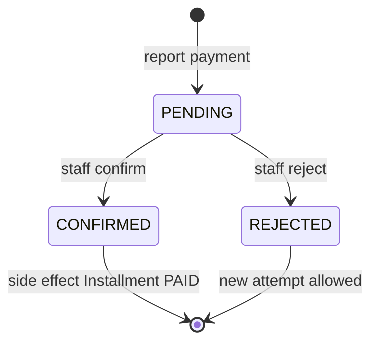

# TASK-063: Prisma Schema — PaymentAttempt

## Metadata

| فیلد | مقدار |
|------|--------|
| Phase | 1 |
| Epic | Epic-02-Installments-Database |
| ID | TASK-063 |
| Priority | P0 |
| Depends on | TASK-062 |
| Blocks | TASK-064, TASK-067 |
| Estimated | 3h |

---

## هدف

تعریف مدل Prisma `PaymentAttempt` — گزارش/تلاش پرداخت — با reporter type، status workflow، evidence optional، و پشتیبانی idempotency برای POSTهای مالی.

---

## معیار پذیرش

- [ ] مدل `PaymentAttempt` با base fields
- [ ] فیلدها: `installmentId`, `tenantId`, `reportedByType`, `reportedById`, `amountRial`, `status`
- [ ] Enum `ReportedByType`: `CUSTOMER`, `STAFF`
- [ ] Enum `PaymentAttemptStatus`: `PENDING`, `CONFIRMED`, `REJECTED`
- [ ] Optional: `evidenceFileId`, `note`, `confirmedByStaffId`, `rejectedReason`
- [ ] Idempotency: unique `(tenantId, idempotencyKey)` where key not null
- [ ] Index: `(tenantId, installmentId, status)` — pending lookup
- [ ] Index: `(tenantId, status, createdAt)`
- [ ] `onDelete: Restrict` روی FKs
- [ ] `pnpm prisma validate` pass

---

## مشخصات فنی

### Enums

```prisma
enum ReportedByType {
  CUSTOMER
  STAFF

  @@map("reported_by_type")
}

enum PaymentAttemptStatus {
  PENDING
  CONFIRMED
  REJECTED

  @@map("payment_attempt_status")
}
```

### Schema

```prisma
model PaymentAttempt {
  id                  String               @id @default(uuid()) @db.Uuid
  installmentId       String               @map("installment_id") @db.Uuid
  tenantId            String               @map("tenant_id") @db.Uuid
  reportedByType      ReportedByType       @map("reported_by_type")
  reportedById        String               @map("reported_by_id") @db.Uuid
  amountRial          BigInt               @map("amount_rial")
  status              PaymentAttemptStatus @default(PENDING)
  evidenceFileId      String?              @map("evidence_file_id") @db.Uuid
  note                String?
  confirmedByStaffId  String?              @map("confirmed_by_staff_id") @db.Uuid
  rejectedReason      String?              @map("rejected_reason")
  idempotencyKey      String?              @map("idempotency_key") @db.Uuid
  confirmedAt         DateTime?            @map("confirmed_at") @db.Timestamptz
  rejectedAt          DateTime?            @map("rejected_at") @db.Timestamptz
  createdAt           DateTime             @default(now()) @map("created_at") @db.Timestamptz
  updatedAt           DateTime             @updatedAt @map("updated_at") @db.Timestamptz
  createdById         String?              @map("created_by_id") @db.Uuid
  updatedById         String?              @map("updated_by_id") @db.Uuid
  deletedAt           DateTime?            @map("deleted_at") @db.Timestamptz
  deletedById         String?              @map("deleted_by_id") @db.Uuid
  deleteReason        String?              @map("delete_reason")
  version             Int                  @default(1)
  metadata            Json?                @db.JsonB

  installment       Installment @relation(fields: [installmentId], references: [id], onDelete: Restrict)
  tenant            Tenant      @relation(fields: [tenantId], references: [id], onDelete: Restrict)
  confirmedByStaff  Staff?      @relation("PaymentConfirmedBy", fields: [confirmedByStaffId], references: [id], onDelete: Restrict)

  @@unique([tenantId, idempotencyKey])
  @@index([tenantId, installmentId, status])
  @@index([tenantId, status, createdAt])
  @@index([tenantId, deletedAt])
  @@map("payment_attempts")
}
```

### Idempotency Pattern

```typescript
// POST /payments/report — Header: Idempotency-Key: uuid
const existing = await repo.findByIdempotencyKey(tenantId, idempotencyKey);
if (existing) {
  if (existing.requestHash !== hash(body)) throw IDEMPOTENCY_CONFLICT;
  return existing; // 201 with same body
}
```

### Business Rules Reference

- BR-023: partial/over payment amounts allowed at report — informational
- One `PENDING` per installment at a time → `PAYMENT_PENDING_EXISTS`
- Confirm triggers Installment → PAID (state-machines.md)

---

## فایل‌ها

| عمل | مسیر |
|-----|------|
| Update | `prisma/schema.prisma` — PaymentAttempt + enums |
| Create | `packages/infrastructure/persistence/payment-attempt.repository.ts` — Phase 3 |

---

## مراحل پیاده‌سازی

1. Add enums `ReportedByType`, `PaymentAttemptStatus`
2. Add model with idempotency unique constraint
3. FK relations Restrict
4. Indexes for pending payment queries
5. `pnpm prisma validate`

---

## Edge Cases & Errors

| سناریو | HTTP / Code | رفتار |
|--------|-------------|--------|
| Second pending on same installment | 409 `PAYMENT_PENDING_EXISTS` | use case check |
| Idempotency same key different body | 409 `IDEMPOTENCY_CONFLICT` | hash mismatch |
| Idempotency replay same key+body | 201 | return existing |
| Confirm already confirmed | 409 `PAYMENT_ALREADY_CONFIRMED` | domain |
| Report on paid installment | 409 `INSTALLMENT_ALREADY_PAID` | domain |
| Cross-tenant installmentId | 404 `INSTALLMENT_NOT_FOUND` | tenant filter |

---

## تست

- [ ] Integration: create PaymentAttempt PENDING
- [ ] Integration: duplicate idempotency key same payload → same record
- [ ] Integration: duplicate idempotency key different payload → 409
- [ ] Integration: two PENDING same installment → 409
- [ ] Unit: amountRial BigInt in generated types

---

## UX

N/A — database schema task.

---

## Flow



---

## Policy Alignment

- [ ] EXCELLENCE-STANDARDS §2.1 — base fields
- [ ] SOFT-DELETE-POLICY — soft delete fields present؛ business records retained
- [ ] ADR-008 — report ≠ confirm
- [ ] ADR-013 — Restrict FKs

---

## مراجع

- `docs/03-modules/installments/domain.md` § PaymentAttempt
- `docs/03-modules/installments/state-machines.md` § PaymentAttempt
- `docs/02-architecture/api-contracts.md` — POST /payments/report

---

## Self-Review Score

| محور | سقف | امتیاز | یادداشت |
|------|-----|--------|---------|
| Metadata | 10 | 10 | ✓ |
| Completeness | 25 | 25 | Full schema، idempotency ✓ |
| Policy | 25 | 25 | ADR-008، Restrict ✓ |
| Executability | 25 | 25 | Edge cases، tests ✓ |
| Alignment | 15 | 15 | api-contracts sync ✓ |
| **جمع** | **100** | **100** | ≥95 required ✓ |
