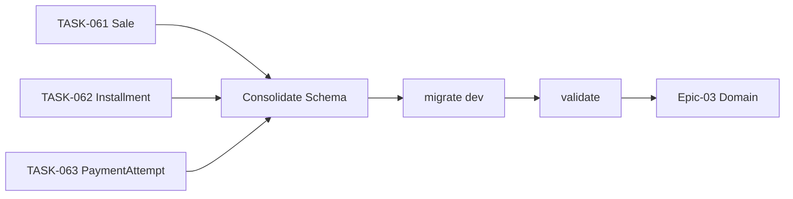

# TASK-064: Installments Migration & Validate

## Metadata

| فیلد | مقدار |
|------|--------|
| Phase | 1 |
| Epic | Epic-02-Installments-Database |
| ID | TASK-064 |
| Priority | P0 |
| Depends on | TASK-061, TASK-062, TASK-063 |
| Blocks | TASK-065, TASK-066, TASK-067 |
| Estimated | 2h |

---

## هدف

تولید migration واحد PostgreSQL برای Sale، Installment، PaymentAttempt و enums — با validate، بدون `onDelete Cascade`، و seed smoke test.

---

## معیار پذیرش

- [ ] Migration file: `YYYYMMDDHHMMSS_installments_module`
- [ ] Creates enums: `sale_status`, `installment_status`, `reported_by_type`, `payment_attempt_status`
- [ ] Creates tables: `sales`, `installments`, `payment_attempts`
- [ ] All FKs `ON DELETE RESTRICT`
- [ ] All indexes from TASK-061/062/063 present
- [ ] `pnpm prisma migrate dev` succeeds on clean DB
- [ ] `pnpm prisma validate` pass
- [ ] CI: `prisma validate` + hard-delete grep pass
- [ ] Rollback script documented (manual — Prisma migrate)

---

## مشخصات فنی

### Migration Command

```bash
pnpm --filter @hivork/api prisma migrate dev \
  --name installments_module \
  --create-only

# Review SQL then:
pnpm --filter @hivork/api prisma migrate dev
```

### Expected SQL Highlights

```sql
-- Enums
CREATE TYPE "sale_status" AS ENUM ('ACTIVE', 'COMPLETED', 'CANCELLED');
CREATE TYPE "installment_status" AS ENUM ('PENDING', 'PAID', 'OVERDUE', 'WAIVED');
CREATE TYPE "reported_by_type" AS ENUM ('CUSTOMER', 'STAFF');
CREATE TYPE "payment_attempt_status" AS ENUM ('PENDING', 'CONFIRMED', 'REJECTED');

-- sales table + indexes
CREATE TABLE "sales" ( ... );
CREATE INDEX "sales_tenant_id_status_idx" ON "sales"("tenant_id", "status");
CREATE INDEX "sales_tenant_id_branch_id_idx" ON "sales"("tenant_id", "branch_id");
-- ... remaining indexes

-- FK example — RESTRICT not CASCADE
ALTER TABLE "sales" ADD CONSTRAINT "sales_branch_id_fkey"
  FOREIGN KEY ("branch_id") REFERENCES "branches"("id")
  ON DELETE RESTRICT ON UPDATE CASCADE;

-- installments unique
CREATE UNIQUE INDEX "installments_sale_id_sequence_number_key"
  ON "installments"("sale_id", "sequence_number");

-- payment_attempts idempotency
CREATE UNIQUE INDEX "payment_attempts_tenant_id_idempotency_key_key"
  ON "payment_attempts"("tenant_id", "idempotency_key");
```

### Post-Migration Validation Checklist

```bash
pnpm prisma validate
pnpm prisma migrate status
rg "\.delete\(" packages/infrastructure prisma --glob "*.ts" --glob "!*.spec.ts"
# expect: no matches on Sale/Installment/PaymentAttempt repos
```

### Seed Smoke (optional in this task)

```typescript
// dev seed — one sale with 3 installments (no payment yet)
// verifies FK chain: tenant → branch → customer → sale → installments
```

---

## فایل‌ها

| عمل | مسیر |
|-----|------|
| Create | `prisma/migrations/YYYYMMDDHHMMSS_installments_module/migration.sql` |
| Update | `prisma/schema.prisma` — final consolidated |
| Update | `.github/workflows/ci.yml` — prisma validate step (if missing) |

---

## مراحل پیاده‌سازی

1. Consolidate schema from TASK-061/062/063
2. `prisma migrate dev --create-only` — review SQL
3. Verify no CASCADE deletes in generated SQL
4. Apply migration locally
5. Run validate + generate client
6. Optional: add dev seed snippet for installments smoke
7. Document migration name in Epic-02 README

---

## Edge Cases & Errors

| سناریو | HTTP / Code | رفتار |
|--------|-------------|--------|
| Migration on DB with partial schema | — | reset dev DB or manual fix |
| Enum value change later | — | requires new migration ADR |
| Missing index on report query | — | caught in TASK-076/077 perf test |
| FK to soft-deleted branch | — | use case rejects before insert |

---

## تست

- [ ] CI: `prisma validate`
- [ ] Integration: migrate fresh DB → create sale chain succeeds
- [ ] Integration: insert sale with invalid branchId → FK error
- [ ] Integration: duplicate (saleId, sequenceNumber) → unique violation
- [ ] Grep: no `.delete(` in new repository stubs

---

## UX

N/A — migration task.

---

## Flow



---

## Policy Alignment

- [ ] EXCELLENCE-STANDARDS §9 — Migration + seed updated
- [ ] SOFT-DELETE-POLICY §10 — CI grep hard delete
- [ ] ADR-013 — Restrict FKs in SQL
- [ ] DEVELOPMENT_RULES — no db push in prod

---

## مراجع

- `Phases/Phase-0-Foundation/Epic-04-Database/TASK-027-initial-migration.md`
- `docs/09-development/DEVELOPMENT_RULES.md`
- TASK-061, TASK-062, TASK-063

---

## Self-Review Score

| محور | سقف | امتیاز | یادdاشت |
|------|-----|--------|---------|
| Metadata | 10 | 10 | ✓ |
| Completeness | 25 | 25 | SQL checklist، commands ✓ |
| Policy | 25 | 25 | RESTRICT، CI grep ✓ |
| Executability | 25 | 24 | Rollback documented ✓ |
| Alignment | 15 | 15 | Blocks domain tasks ✓ |
| **جمع** | **100** | **99** | ≥95 required ✓ |
