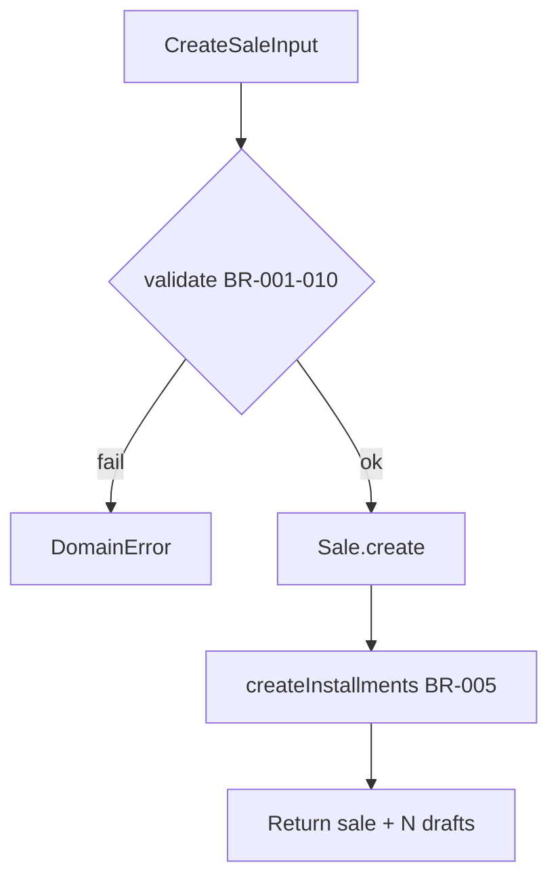

# TASK-065: Domain Entity — Sale

## Metadata

| فیلد | مقدار |
|------|--------|
| Phase | 1 |
| Epic | Epic-03-Installments-Domain |
| ID | TASK-065 |
| Priority | P0 |
| Depends on | TASK-064 |
| Blocks | TASK-068, TASK-072, TASK-073, TASK-074 |
| Estimated | 6h |

---

## هدف

Entity pure TypeScript `Sale` با factory `create()`/`reconstitute()`، الگوریتم BR-005 برای تولید اقساط، متدهای `cancel()` و `markCompleted()`، و domain errors — بدون وابستگی به Prisma/NestJS.

---

## معیار پذیرش

- [ ] `Sale` class در `packages/domain/installments/sale.entity.ts`
- [ ] `create()` validates BR-001 تا BR-010
- [ ] `createInstallments()` implements BR-005 BigInt algorithm
- [ ] `cancel(reason, staffId)` — BR-011, BR-012, BR-013
- [ ] `markCompleted()` when all installments terminal
- [ ] `reconstitute()` from persistence props
- [ ] Domain errors با codes از ERROR-CODES.md
- [ ] Zero imports from `@prisma/client`, `@nestjs/*`
- [ ] Unit tests: sum invariant، cancel rules، zero down payment

---

## مشخصات فنی

### Types

```typescript
// packages/domain/installments/sale.types.ts
export enum SaleStatus {
  ACTIVE = 'ACTIVE',
  COMPLETED = 'COMPLETED',
  CANCELLED = 'CANCELLED',
}

export interface SaleProps {
  id: string;
  tenantId: string;
  branchId: string;
  tenantCustomerId: string;
  createdByStaffId: string;
  title: string | null;
  description: string | null;
  invoiceNumber: string | null;
  totalAmountRial: bigint;
  downPaymentRial: bigint;
  discountRial: bigint | null;
  taxRial: bigint | null;
  installmentCount: number;
  firstDueDate: Date;
  intervalDays: number;
  contractDate: Date;
  status: SaleStatus;
  cancelledAt: Date | null;
  cancelledById: string | null;
  cancelReason: string | null;
  version: number;
  metadata: Record<string, unknown> | null;
  createdAt: Date;
  updatedAt: Date;
}

export interface CreateSaleInput {
  tenantId: string;
  branchId: string;
  tenantCustomerId: string;
  createdByStaffId: string;
  title?: string;
  totalAmountRial: bigint;
  downPaymentRial: bigint;
  installmentCount: number;
  firstDueDate: Date;
  intervalDays: number;
  contractDate: Date;
}
```

### Entity Class (signatures)

```typescript
// packages/domain/installments/sale.entity.ts
export class Sale {
  private constructor(private props: SaleProps) {}

  static create(input: CreateSaleInput): { sale: Sale; installments: InstallmentDraft[] } {
    Sale.validateCreate(input);
    const id = crypto.randomUUID();
    const sale = new Sale({ ...props, id, status: SaleStatus.ACTIVE });
    const installments = sale.createInstallments();
    return { sale, installments };
  }

  static reconstitute(props: SaleProps): Sale {
    return new Sale(props);
  }

  cancel(reason: string, staffId: string, installments: InstallmentSnapshot[]): void;
  markCompleted(): void;
  canSoftDelete(installments: InstallmentSnapshot[]): boolean;

  get id(): string;
  get status(): SaleStatus;
  // ... getters

  private static validateCreate(input: CreateSaleInput): void;
  createInstallments(): InstallmentDraft[];
  toProps(): SaleProps;
}
```

### BR-005 Algorithm (createInstallments)

```typescript
createInstallments(): InstallmentDraft[] {
  const { totalAmountRial, downPaymentRial, installmentCount, firstDueDate, intervalDays, tenantId } = this.props;
  const remaining = totalAmountRial - downPaymentRial; // BR-002
  const count = BigInt(installmentCount);
  const base = remaining / count;
  const remainder = remaining % count;

  const drafts: InstallmentDraft[] = [];
  for (let i = 0; i < installmentCount; i++) {
    const amountRial = base + (BigInt(i) < remainder ? 1n : 0n);
    const dueDate = addUtcDays(firstDueDate, i * intervalDays);
    drafts.push({
      saleId: this.props.id,
      tenantId,
      sequenceNumber: i + 1,
      dueDate,
      amountRial,
      status: InstallmentStatus.PENDING,
    });
  }

  // Invariant check
  const sum = drafts.reduce((acc, d) => acc + d.amountRial, 0n);
  if (sum + downPaymentRial !== totalAmountRial) {
    throw new DomainError('INSTALLMENT_SUM_MISMATCH');
  }
  return drafts;
}
```

### Validation (create)

```typescript
private static validateCreate(input: CreateSaleInput): void {
  if (input.totalAmountRial <= 0n) throw new DomainError('AMOUNT_MUST_BE_POSITIVE'); // BR-001
  if (input.downPaymentRial < 0n || input.downPaymentRial > input.totalAmountRial)
    throw new DomainError('AMOUNT_EXCEEDS_TOTAL'); // BR-002
  if (input.installmentCount < 1 || input.installmentCount > 120)
    throw new DomainError('INSTALLMENT_COUNT_INVALID'); // BR-003
  if (input.firstDueDate <= startOfUtcDay(new Date()))
    throw new DomainError('DUE_DATE_IN_PAST'); // BR-006
  if (input.intervalDays < 1 || input.intervalDays > 365)
    throw new DomainError('INTERVAL_INVALID'); // BR-007
}
```

### Cancel Method

```typescript
cancel(reason: string, staffId: string, installments: InstallmentSnapshot[]): void {
  if (this.props.status === SaleStatus.CANCELLED)
    throw new DomainError('SALE_ALREADY_CANCELLED'); // BR-011
  if (this.props.status === SaleStatus.COMPLETED)
    throw new DomainError('SALE_ALREADY_COMPLETED');
  if (installments.some(i => i.status === InstallmentStatus.PAID))
    throw new DomainError('SALE_HAS_PAID_INSTALLMENT'); // BR-012
  // BR-013: overdue/waived OK
  this.props.status = SaleStatus.CANCELLED;
  this.props.cancelledAt = new Date();
  this.props.cancelledById = staffId;
  this.props.cancelReason = reason;
}
```

---

## فایل‌ها

| عمل | مسیر |
|-----|------|
| Create | `packages/domain/src/installments/sale.entity.ts` |
| Create | `packages/domain/src/installments/sale.types.ts` |
| Create | `packages/domain/src/installments/installment.types.ts` — shared drafts |
| Create | `packages/domain/src/installments/errors.ts` |
| Create | `packages/domain/src/installments/__tests__/sale.entity.spec.ts` |

---

## مراحل پیاده‌سازی

1. Define types and `DomainError` with ERROR-CODES
2. Implement `validateCreate` (BR-001–BR-010)
3. Implement `create()` + `createInstallments()` (BR-005)
4. Implement `cancel()` + `markCompleted()`
5. Implement `reconstitute()` + getters + `toProps()`
6. Unit tests for all invariants
7. Export from `packages/domain/src/installments/index.ts`

---

## Edge Cases & Errors

| سناریو | HTTP / Code | رفتار |
|--------|-------------|--------|
| totalAmountRial = 0 | 400 `AMOUNT_MUST_BE_POSITIVE` | validateCreate |
| downPayment > total | 400 `AMOUNT_EXCEEDS_TOTAL` | validateCreate |
| count = 0 or 121 | 400 `INSTALLMENT_COUNT_INVALID` | validateCreate |
| remaining = 0 (full prepay) | — | 1 installment amountRial=0 (BR-004) |
| Cancel with paid installment | 409 `SALE_HAS_PAID_INSTALLMENT` | cancel() |
| Cancel with only waived/overdue | — | allowed (BR-013) |

---

## تست

- [ ] Unit: `Sale.createInstallments_sum_equals_total` — 10M/3 installments
- [ ] Unit: `Sale.createInstallments_full_prepay_zero_installment` — BR-004
- [ ] Unit: `Sale.createInstallments_remainder_distribution` — first N get +1
- [ ] Unit: `Sale.cancel_rejects_when_paid_exists`
- [ ] Unit: `Sale.cancel_allows_when_only_waived_overdue`
- [ ] Unit: `Sale.validateCreate_rejects_past_due_date`
- [ ] Unit: `Sale.markCompleted_when_all_terminal`

---

## UX

N/A — domain entity task.

---

## Flow



---

## Policy Alignment

- [ ] EXCELLENCE-STANDARDS §3 — domain logic in packages/domain
- [ ] SOFT-DELETE-POLICY — cancel primary؛ canSoftDelete helper
- [ ] ADR-007 — bigint only
- [ ] ADR-013 — no delete in domain
- [ ] ADR-015 — branchId required in input

---

## مراجع

- `docs/03-modules/installments/BUSINESS-RULES.md` — BR-001 to BR-014, BR-018
- `docs/03-modules/installments/state-machines.md` § Sale
- `docs/09-development/ERROR-CODES.md`

---

## Self-Review Score

| محور | سقف | امتیاز | یادداشت |
|------|-----|--------|---------|
| Metadata | 10 | 10 | ✓ |
| Completeness | 25 | 25 | Full algorithm، methods ✓ |
| Policy | 25 | 25 | BR refs، bigint ✓ |
| Executability | 25 | 25 | 7 unit tests named ✓ |
| Alignment | 15 | 15 | state-machines sync ✓ |
| **جمع** | **100** | **100** | ≥95 required ✓ |
