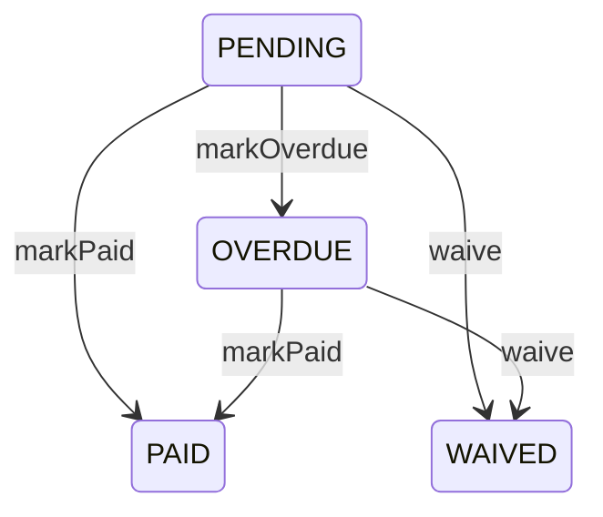

# TASK-066: Domain Entity — Installment

## Metadata

| فیلد | مقدار |
|------|--------|
| Phase | 1 |
| Epic | Epic-03-Installments-Domain |
| ID | TASK-066 |
| Priority | P0 |
| Depends on | TASK-064 |
| Blocks | TASK-067, TASK-069, TASK-075 |
| Estimated | 5h |

---

## هدف

Entity pure TypeScript `Installment` با state transition methods مطابق `state-machines.md` — `markOverdue()`, `markPaid()`, `waive()` — terminal immutability، و **ممنوعیت هرگونه delete**.

---

## معیار پذیرش

- [ ] `Installment` class در `packages/domain/installments/installment.entity.ts`
- [ ] `create()` / `reconstitute()` factories
- [ ] Transitions: pending→overdue, pending|overdue→paid, pending|overdue→waived
- [ ] Terminal: paid/waived reject further transitions (BR-016)
- [ ] `assertCanDelete()` always throws `INSTALLMENT_CANNOT_DELETE`
- [ ] Paid requires `paidAt` + `confirmedByStaffId` (BR-017)
- [ ] Waived requires `waivedByStaffId` + reason + audit hook point
- [ ] Unit tests for every transition + forbidden paths

---

## مشخصات فنی

### Types

```typescript
export enum InstallmentStatus {
  PENDING = 'PENDING',
  PAID = 'PAID',
  OVERDUE = 'OVERDUE',
  WAIVED = 'WAIVED',
}

export interface InstallmentProps {
  id: string;
  saleId: string;
  tenantId: string;
  sequenceNumber: number;
  dueDate: Date;
  amountRial: bigint;
  status: InstallmentStatus;
  paidAt: Date | null;
  confirmedByStaffId: string | null;
  waivedByStaffId: string | null;
  waiveReason: string | null;
  version: number;
  metadata: Record<string, unknown> | null;
  createdAt: Date;
  updatedAt: Date;
}
```

### Entity Methods

```typescript
export class Installment {
  static create(draft: InstallmentDraft): Installment;
  static reconstitute(props: InstallmentProps): Installment;

  markOverdue(): void;  // pending → overdue (BR-015)
  markPaid(confirmedByStaffId: string, paidAt?: Date): void;
  waive(staffId: string, reason: string): void;

  assertCanDelete(): never; // always INSTALLMENT_CANNOT_DELETE

  isTerminal(): boolean;
  canTransitionTo(target: InstallmentStatus): boolean;

  get id(): string;
  get status(): InstallmentStatus;
  toProps(): InstallmentProps;
}
```

### Transition Implementation

```typescript
markOverdue(): void {
  if (this.props.status !== InstallmentStatus.PENDING)
    throw new DomainError('INSTALLMENT_STATUS_INVALID');
  this.props.status = InstallmentStatus.OVERDUE;
}

markPaid(confirmedByStaffId: string, paidAt: Date = new Date()): void {
  if (this.props.status === InstallmentStatus.PAID)
    throw new DomainError('INSTALLMENT_ALREADY_PAID');
  if (this.props.status === InstallmentStatus.WAIVED)
    throw new DomainError('INSTALLMENT_ALREADY_WAIVED');
  if (this.props.status !== InstallmentStatus.PENDING &&
      this.props.status !== InstallmentStatus.OVERDUE)
    throw new DomainError('INSTALLMENT_STATUS_INVALID');
  this.props.status = InstallmentStatus.PAID;
  this.props.paidAt = paidAt;
  this.props.confirmedByStaffId = confirmedByStaffId;
}

waive(staffId: string, reason: string): void {
  if (this.isTerminal())
    throw new DomainError(
      this.props.status === InstallmentStatus.PAID
        ? 'INSTALLMENT_ALREADY_PAID'
        : 'INSTALLMENT_ALREADY_WAIVED'
    );
  if (!reason?.trim()) throw new DomainError('WAIVE_REASON_REQUIRED');
  this.props.status = InstallmentStatus.WAIVED;
  this.props.waivedByStaffId = staffId;
  this.props.waiveReason = reason.trim();
}

assertCanDelete(): never {
  throw new DomainError('INSTALLMENT_CANNOT_DELETE');
}
```

### Transition Matrix (reference)

| From | To | Method |
|------|-----|--------|
| PENDING | OVERDUE | markOverdue |
| PENDING | PAID | markPaid |
| OVERDUE | PAID | markPaid |
| PENDING | WAIVED | waive |
| OVERDUE | WAIVED | waive |
| PAID | * | forbidden |
| WAIVED | * | forbidden |

---

## فایل‌ها

| عمل | مسیر |
|-----|------|
| Create | `packages/domain/src/installments/installment.entity.ts` |
| Update | `packages/domain/src/installments/installment.types.ts` |
| Create | `packages/domain/src/installments/__tests__/installment.entity.spec.ts` |

---

## مراحل پیاده‌سازی

1. Define `InstallmentProps` and enum
2. Implement `create` / `reconstitute`
3. Implement transition methods with guards
4. Implement `assertCanDelete` (always throw)
5. Implement `isTerminal` / `canTransitionTo`
6. Unit tests — full matrix
7. Export from installments index

---

## Edge Cases & Errors

| سناریو | HTTP / Code | رفتار |
|--------|-------------|--------|
| markPaid on paid | 409 `INSTALLMENT_ALREADY_PAID` | throw |
| markPaid on waived | 409 `INSTALLMENT_ALREADY_WAIVED` | throw |
| markOverdue on overdue | 409 `INSTALLMENT_STATUS_INVALID` | throw |
| waive without reason | 400 `WAIVE_REASON_REQUIRED` | throw |
| delete attempt | 409 `INSTALLMENT_CANNOT_DELETE` | assertCanDelete |
| Confirm overdue installment | — | allowed → paid (BR-026) |

---

## تست

- [ ] Unit: `Installment.markOverdue_from_pending`
- [ ] Unit: `Installment.markPaid_from_pending_and_overdue`
- [ ] Unit: `Installment.waive_from_pending_and_overdue`
- [ ] Unit: `Installment.markPaid_rejects_when_already_paid`
- [ ] Unit: `Installment.markPaid_rejects_when_waived`
- [ ] Unit: `Installment.assertCanDelete_always_throws`
- [ ] Unit: `Installment.isTerminal_paid_and_waived`

---

## UX

N/A — domain entity task.

---

## Flow



---

## Policy Alignment

- [ ] EXCELLENCE-STANDARDS §3 — pure domain
- [ ] SOFT-DELETE-POLICY §5 — never delete installment
- [ ] ADR-013 — append-only status
- [ ] ADR-008 — paid requires confirmation metadata

---

## مراجع

- `docs/03-modules/installments/state-machines.md` § Installment
- `docs/03-modules/installments/BUSINESS-RULES.md` — BR-015, BR-016, BR-017, BR-026
- `docs/09-development/ERROR-CODES.md`

---

## Self-Review Score

| محور | سقف | امتیاز | یادdاشت |
|------|-----|--------|---------|
| Metadata | 10 | 10 | ✓ |
| Completeness | 25 | 25 | All transitions ✓ |
| Policy | 25 | 25 | NO delete explicit ✓ |
| Executability | 25 | 25 | 7 tests ✓ |
| Alignment | 15 | 15 | state-machines ✓ |
| **جمع** | **100** | **100** | ≥95 required ✓ |
