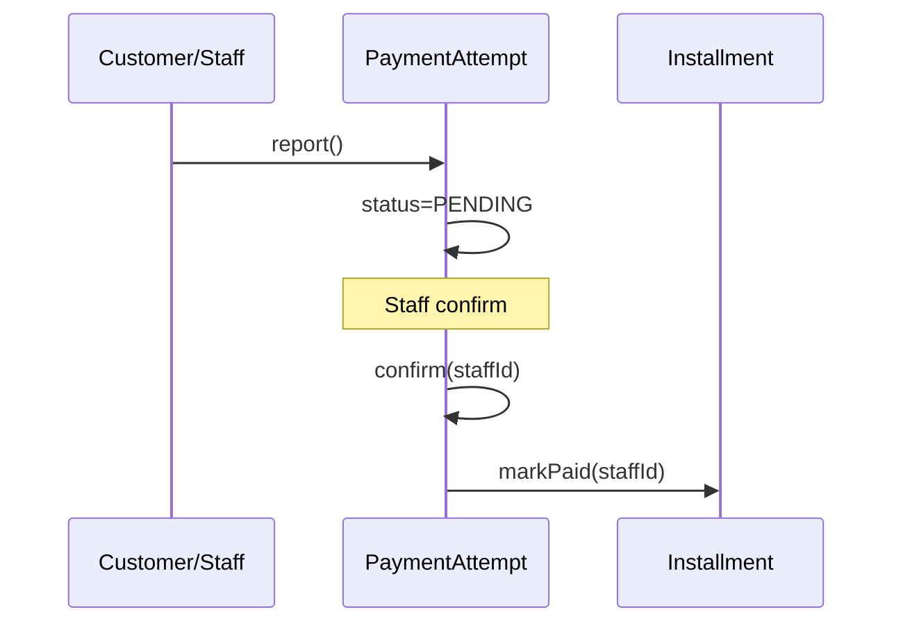

# TASK-067: Domain Entity — PaymentAttempt

## Metadata

| فیلد | مقدار |
|------|--------|
| Phase | 1 |
| Epic | Epic-03-Installments-Domain |
| ID | TASK-067 |
| Priority | P0 |
| Depends on | TASK-064, TASK-066 |
| Blocks | TASK-069 |
| Estimated | 4h |

---

## هدف

Entity pure TypeScript `PaymentAttempt` برای workflow گزارش/تأیید/رد پرداخت — با transitions pending→confirmed|rejected، side-effect hook به Installment.markPaid، و idempotency identity.

---

## معیار پذیرش

- [ ] `PaymentAttempt` class در `packages/domain/installments/payment-attempt.entity.ts`
- [ ] `report()` factory — creates PENDING
- [ ] `confirm(staffId)` — PENDING→CONFIRMED only
- [ ] `reject(staffId, reason)` — PENDING→REJECTED only
- [ ] Terminal: confirmed/rejected immutable
- [ ] Validates installment not already paid at report time
- [ ] `reconstitute()` from props
- [ ] Unit tests for transitions + BR-023 amount flexibility

---

## مشخصات فنی

### Types

```typescript
export enum ReportedByType {
  CUSTOMER = 'CUSTOMER',
  STAFF = 'STAFF',
}

export enum PaymentAttemptStatus {
  PENDING = 'PENDING',
  CONFIRMED = 'CONFIRMED',
  REJECTED = 'REJECTED',
}

export interface PaymentAttemptProps {
  id: string;
  installmentId: string;
  tenantId: string;
  reportedByType: ReportedByType;
  reportedById: string;
  amountRial: bigint;
  status: PaymentAttemptStatus;
  evidenceFileId: string | null;
  note: string | null;
  confirmedByStaffId: string | null;
  rejectedReason: string | null;
  idempotencyKey: string | null;
  confirmedAt: Date | null;
  rejectedAt: Date | null;
  version: number;
  metadata: Record<string, unknown> | null;
  createdAt: Date;
  updatedAt: Date;
}

export interface ReportPaymentInput {
  installmentId: string;
  tenantId: string;
  reportedByType: ReportedByType;
  reportedById: string;
  amountRial: bigint;
  note?: string;
  evidenceFileId?: string;
  idempotencyKey?: string;
}
```

### Entity Methods

```typescript
export class PaymentAttempt {
  static report(input: ReportPaymentInput, installmentStatus: InstallmentStatus): PaymentAttempt {
    if (installmentStatus === InstallmentStatus.PAID)
      throw new DomainError('INSTALLMENT_ALREADY_PAID');
    if (input.amountRial <= 0n)
      throw new DomainError('AMOUNT_MUST_BE_POSITIVE');
    // BR-023: amount may differ from installment.amountRial — no mismatch error at report
    return new PaymentAttempt({ ...props, status: PENDING });
  }

  static reconstitute(props: PaymentAttemptProps): PaymentAttempt;

  confirm(staffId: string): void {
    if (this.props.status === PaymentAttemptStatus.CONFIRMED)
      throw new DomainError('PAYMENT_ALREADY_CONFIRMED');
    if (this.props.status === PaymentAttemptStatus.REJECTED)
      throw new DomainError('PAYMENT_ALREADY_REJECTED');
    this.props.status = PaymentAttemptStatus.CONFIRMED;
    this.props.confirmedByStaffId = staffId;
    this.props.confirmedAt = new Date();
  }

  reject(staffId: string, reason: string): void {
    if (this.props.status !== PaymentAttemptStatus.PENDING)
      throw new DomainError('PAYMENT_ALREADY_CONFIRMED'); // or REJECTED variant
    if (!reason?.trim()) throw new DomainError('REJECT_REASON_REQUIRED');
    this.props.status = PaymentAttemptStatus.REJECTED;
    this.props.rejectedReason = reason.trim();
    this.props.rejectedAt = new Date();
    this.props.confirmedByStaffId = staffId; // rejectedBy — map in persistence
  }

  isPending(): boolean;
  isTerminal(): boolean;
  toProps(): PaymentAttemptProps;
}
```

### Auto-Confirm (setting — use case applies)

```typescript
// Domain stays explicit — use case calls confirm() immediately when:
// settings.require_seller_payment_confirmation === false
// && reportedByType === STAFF
```

### Side Effect (use case orchestration)

```
PaymentAttempt.confirm()
  → Installment.markPaid(confirmedByStaffId)
  → Sale.markCompleted() if all terminal
  → Outbox: PaymentConfirmed
```

---

## فایل‌ها

| عمل | مسیر |
|-----|------|
| Create | `packages/domain/src/installments/payment-attempt.entity.ts` |
| Create | `packages/domain/src/installments/payment-attempt.types.ts` |
| Create | `packages/domain/src/installments/__tests__/payment-attempt.entity.spec.ts` |

---

## مراحل پیاده‌سازی

1. Define types and enums
2. Implement `report()` with installment status guard
3. Implement `confirm()` / `reject()`
4. Implement `reconstitute()` + getters
5. Unit tests
6. Export from index

---

## Edge Cases & Errors

| سناریو | HTTP / Code | رفتار |
|--------|-------------|--------|
| Report on paid installment | 409 `INSTALLMENT_ALREADY_PAID` | report() |
| Report amount 0 | 400 `AMOUNT_MUST_BE_POSITIVE` | report() |
| Report amount > installment | — | allowed BR-023 |
| Report amount < installment | — | allowed BR-023 |
| Confirm twice | 409 `PAYMENT_ALREADY_CONFIRMED` | confirm() |
| Reject confirmed | 409 `PAYMENT_ALREADY_CONFIRMED` | reject() |
| Reject without reason | 400 `REJECT_REASON_REQUIRED` | reject() |

---

## تست

- [ ] Unit: `PaymentAttempt.report_creates_pending`
- [ ] Unit: `PaymentAttempt.report_rejects_paid_installment`
- [ ] Unit: `PaymentAttempt.report_allows_partial_amount` — BR-023
- [ ] Unit: `PaymentAttempt.confirm_from_pending`
- [ ] Unit: `PaymentAttempt.confirm_rejects_when_confirmed`
- [ ] Unit: `PaymentAttempt.reject_from_pending`
- [ ] Unit: `PaymentAttempt.reject_requires_reason`

---

## UX

N/A — domain entity task.

---

## Flow



---

## Policy Alignment

- [ ] EXCELLENCE-STANDARDS §3 — domain purity
- [ ] SOFT-DELETE-POLICY — financial record retained
- [ ] ADR-008 — report ≠ payment
- [ ] ADR-013 — no delete

---

## مراجع

- `docs/03-modules/installments/state-machines.md` § PaymentAttempt
- `docs/03-modules/installments/BUSINESS-RULES.md` — BR-023, BR-024
- `docs/09-development/ERROR-CODES.md`

---

## Self-Review Score

| محور | سقف | امتیاز | یادdاشت |
|------|-----|--------|---------|
| Metadata | 10 | 10 | ✓ |
| Completeness | 25 | 25 | Full methods ✓ |
| Policy | 25 | 25 | ADR-008 ✓ |
| Executability | 25 | 25 | 7 tests ✓ |
| Alignment | 15 | 14 | Phase 3 confirm UC deferred ✓ |
| **جمع** | **100** | **99** | ≥95 required ✓ |
