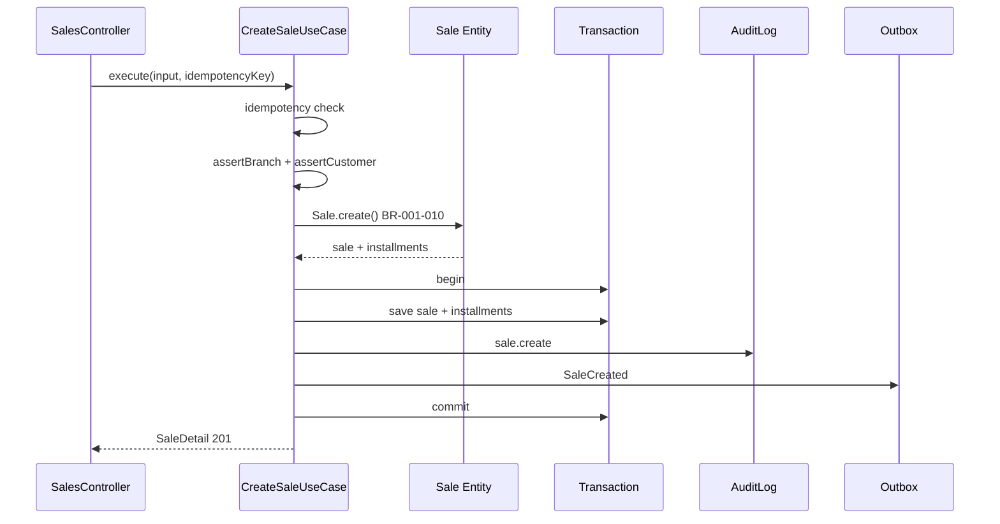

# TASK-072: Use Case — CreateSale

## Metadata

| فیلد | مقدار |
|------|--------|
| Phase | 1 |
| Epic | Epic-05-Installments-Use-Cases |
| ID | TASK-072 |
| Priority | P0 |
| Depends on | TASK-065, TASK-066, TASK-068, TASK-047, TASK-049, TASK-058 |
| Blocks | TASK-073, TASK-074, TASK-075, TASK-080, TASK-120 |
| Estimated | 10h |

---

## هدف

`CreateSaleUseCase` — ایجاد فروش قسطی با اعمال **BR-001 تا BR-010** در domain، persist اتمی Sale + N Installments در یک transaction، audit `sale.create`، outbox event `SaleCreated`، و idempotency via `Idempotency-Key`. نقطه مرکزی فاز ۱ — تمام invariantهای مالی قبل از commit تأیید می‌شوند.

---

## معیار پذیرش

- [ ] `CreateSaleUseCase.execute()` در `packages/application/installments/sales/`
- [ ] Domain `Sale.create()` validates BR-001–BR-010 (delegate to TASK-065)
- [ ] BR-001: `totalAmountRial > 0` → `AMOUNT_INVALID`
- [ ] BR-002: `downPaymentRial ≤ totalAmountRial` → `AMOUNT_EXCEEDS_TOTAL`
- [ ] BR-003: `1 ≤ installmentCount ≤ 120` → `INSTALLMENT_COUNT_INVALID`
- [ ] BR-004: remaining = total − down؛ zero remaining → single zero installment
- [ ] BR-005: installment amounts via domain algorithm — sum invariant
- [ ] BR-006: `firstDueDate` in future (Tehran start-of-day vs UTC) → `DUE_DATE_IN_PAST`
- [ ] BR-007: `1 ≤ intervalDays ≤ 365` → `INTERVAL_INVALID`
- [ ] BR-008: `branchId` exists + `canAccessBranch(staff)` → `BRANCH_NOT_ALLOWED`
- [ ] BR-009: `tenantCustomerId` active in tenant → `CUSTOMER_NOT_FOUND`
- [ ] BR-010: initial status `active`
- [ ] Single DB transaction: Sale insert + Installment[] insert + AuditLog + OutboxEvent + IdempotencyRecord
- [ ] Idempotency-Key: duplicate same payload → return cached sale; different payload → `IDEMPOTENCY_CONFLICT`
- [ ] Plan limit check: max active sales → `TENANT_PLAN_LIMIT_EXCEEDED`
- [ ] Permission: `installments.sale.create` (enforced at controller — UC receives validated context)
- [ ] Data scope: `sellerId = actorId` when scope=own; branch must be in assigned set
- [ ] Return `SaleDetail` with installments array
- [ ] Integration test with real PG (TASK-120)

---

## مشخصات فنی

### Input

```typescript
export type CreateSaleInput = {
  tenantId: string;
  actorId: string;
  idempotencyKey: string;
  tenantCustomerId: string;
  branchId: string;
  title?: string;
  description?: string;
  invoiceNumber?: string;
  totalAmountRial: bigint;
  downPaymentRial: bigint;
  discountRial?: bigint;
  taxRial?: bigint;
  installmentCount: number;
  firstDueDate: Date;
  contractDate: Date;
  intervalDays: number;
  staffContext: DataScopeStaffContext;
  ip?: string;
  userAgent?: string;
};
```

### Business Rules Mapping

| Rule | Where enforced | Error code |
|------|----------------|------------|
| BR-001 | Domain `validateCreate` | `AMOUNT_INVALID` |
| BR-002 | Domain `validateCreate` | `AMOUNT_EXCEEDS_TOTAL` |
| BR-003 | Domain `validateCreate` | `INSTALLMENT_COUNT_INVALID` |
| BR-004 | Domain `createInstallments` | — |
| BR-005 | Domain `createInstallments` | `INSTALLMENT_SUM_MISMATCH` (internal) |
| BR-006 | UC + domain | `DUE_DATE_IN_PAST` |
| BR-007 | Domain `validateCreate` | `INTERVAL_INVALID` |
| BR-008 | UC `assertBranchAccess` | `BRANCH_NOT_ALLOWED` |
| BR-009 | UC `assertCustomerExists` | `CUSTOMER_NOT_FOUND` |
| BR-010 | Domain `Sale.create` status | — |

### Transaction Flow

```typescript
async execute(input: CreateSaleInput): Promise<SaleDetail> {
  // 1. Idempotency lookup (tenantId + key) — outside or inside tx per ADR
  const cached = await this.idempotency.find(input.tenantId, input.idempotencyKey);
  if (cached) return cached.response;

  return this.unitOfWork.transaction(async (tx) => {
    // 2. BR-008: branch access
    await this.assertBranchAccess(input.tenantId, input.branchId, input.staffContext);
    // 3. BR-009: customer exists, not soft-deleted
    await this.assertCustomerExists(input.tenantId, input.tenantCustomerId);
    // 4. Plan limits
    await this.planLimits.assertCanCreateSale(input.tenantId);
    // 5. Load default intervalDays from settings if not provided (optional)
    // 6. Domain: Sale.create() → { sale, installments }
    const { sale, installments } = Sale.create({ ... });
    // 7. Persist sale + installments (version=1)
    await this.saleRepo.save(sale, tx);
    await this.installmentRepo.saveMany(installments, tx);
    // 8. Audit
    await this.audit.log({
      action: 'sale.create',
      entity: 'Sale',
      entityId: sale.id,
      tenantId: input.tenantId,
      actorId: input.actorId,
      newValue: { saleId: sale.id, totalAmountRial: sale.totalAmountRial.toString(), installmentCount: input.installmentCount },
      ip: input.ip,
    }, tx);
    // 9. Outbox
    await this.outbox.publish({
      type: 'SaleCreated',
      aggregateId: sale.id,
      tenantId: input.tenantId,
      payload: { saleId: sale.id, tenantCustomerId: input.tenantCustomerId, branchId: input.branchId },
    }, tx);
    // 10. Idempotency record
    const detail = await this.mapper.toDetail(sale, installments);
    await this.idempotency.store(input.tenantId, input.idempotencyKey, detail, tx);
    return detail;
  });
}
```

### Outbox Event Payload

```json
{
  "type": "SaleCreated",
  "aggregateId": "sale-uuid",
  "tenantId": "tenant-uuid",
  "payload": {
    "saleId": "uuid",
    "tenantCustomerId": "uuid",
    "branchId": "uuid",
    "totalAmountRial": "25000000",
    "installmentCount": 10
  }
}
```

### Audit Record

```json
{
  "action": "sale.create",
  "entity": "Sale",
  "entityId": "uuid",
  "tenantId": "uuid",
  "actorId": "staff-uuid",
  "newValue": {
    "saleId": "uuid",
    "tenantCustomerId": "uuid",
    "branchId": "uuid",
    "totalAmountRial": "25000000",
    "installmentCount": 10
  }
}
```

---

## فایل‌ها

| عمل | مسیر |
|-----|------|
| Create | `packages/application/src/installments/sales/create-sale.use-case.ts` |
| Create | `packages/application/src/installments/sales/create-sale.use-case.spec.ts` |
| Create | `packages/application/src/installments/sales/create-sale.integration.spec.ts` |
| Update | `packages/application/src/ports/sale.repository.port.ts` |
| Update | `packages/application/src/ports/installment.repository.port.ts` |
| Update | `packages/infrastructure/persistence/sale.repository.ts` |
| Update | `packages/infrastructure/persistence/installment.repository.ts` |

---

## مراحل پیاده‌سازی

1. Define `CreateSaleInput` + port methods `save` / `saveMany`
2. Implement `assertBranchAccess` (ADR-015) and `assertCustomerExists` (BR-009)
3. Implement plan limit check
4. Wire domain `Sale.create()` — map DTO bigint fields
5. Implement transaction with audit + outbox + idempotency
6. Mapper to `SaleDetail` contract shape
7. Unit tests with mock repos (happy + each BR error)
8. Integration test: create → DB rows + audit + outbox row

---

## Edge Cases & Errors

| سناریو | HTTP | Code | رفتار |
|--------|------|------|--------|
| Customer soft-deleted | 404 | `CUSTOMER_NOT_FOUND` | BR-009 |
| Customer other tenant | 404 | `CUSTOMER_NOT_FOUND` | tenantId filter |
| Branch not assigned | 403 | `BRANCH_NOT_ALLOWED` | BR-008 |
| firstDueDate today (Tehran) | 400 | `DUE_DATE_IN_PAST` | BR-006 |
| Full prepay (down=total) | 201 | — | BR-004 single zero installment |
| Duplicate idempotency key | 201 | — | return cached |
| Same key different body | 409 | `IDEMPOTENCY_CONFLICT` | reject |
| Plan sale limit | 403 | `TENANT_PLAN_LIMIT_EXCEEDED` | before domain |
| Transaction rollback on outbox fail | 500 | — | no partial sale |

---

## تست

- [ ] Unit: happy path — sale + N installments returned
- [ ] Unit: BR-002 down > total → `AMOUNT_EXCEEDS_TOTAL`
- [ ] Unit: BR-003 count=0 → `INSTALLMENT_COUNT_INVALID`
- [ ] Unit: BR-006 past due date → `DUE_DATE_IN_PAST`
- [ ] Unit: BR-008 branch denied → `BRANCH_NOT_ALLOWED`
- [ ] Unit: BR-009 customer missing → `CUSTOMER_NOT_FOUND`
- [ ] Unit: BR-005 sum invariant via domain (10M/3)
- [ ] Unit: idempotency duplicate returns same id
- [ ] Integration: transaction commits sale + installments + audit + outbox
- [ ] Integration: rollback — no orphan installments on failure

---

## UX

N/A — backend use case. Frontend: TASK-110.

---

## Flow



---

## Policy Alignment

- [ ] EXCELLENCE-STANDARDS §3 — transaction، audit، validation، plan limits
- [ ] EXCELLENCE-STANDARDS §8 — Sale + Installment fields persisted
- [ ] SOFT-DELETE-POLICY — no hard delete؛ customer must not be deleted
- [ ] ADR-007 — bigint Rial only
- [ ] ADR-013 — soft delete only on business entities
- [ ] ADR-015 — branch scope enforced
- [ ] BUSINESS-RULES BR-001 to BR-010 — explicit mapping above

---

## مراجع

- `docs/03-modules/installments/BUSINESS-RULES.md` — BR-001 to BR-010
- `docs/03-modules/installments/state-machines.md` § Sale
- `docs/02-architecture/api-contracts.md` § POST sales
- `docs/06-operations/security-and-audit.md`
- `docs/02-architecture/data-flow.md` — outbox pattern
- `Phases/Phase-1-Seller-Panel/Epic-03-Installments-Domain/TASK-065-domain-sale-entity.md`

---

## Self-Review Score

| محور | سقف | امتیاز | یادداشت |
|------|-----|--------|---------|
| Metadata | 10 | 10 | ✓ |
| Completeness | 25 | 25 | BR table، transaction، audit، outbox، idempotency |
| Policy | 25 | 25 | All BR-001–010، ADRs |
| Executability | 25 | 25 | 10 tests، mermaid، edge table |
| Alignment | 15 | 15 | TASK-065، api-contracts |
| **جمع** | **100** | **100** | ≥95 ✅ |
