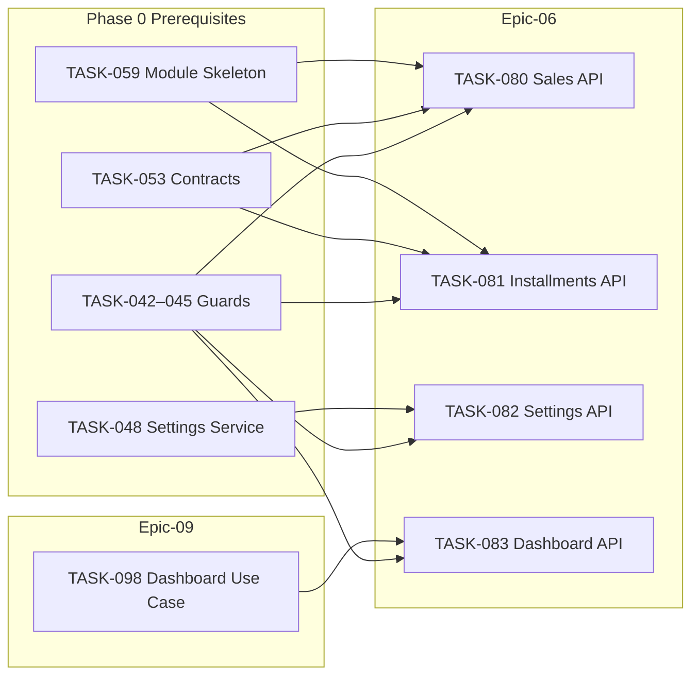

# Epic-06 — Installments API

> **Phase:** 1 — Installments  
> **وضعیت:** Ready for implementation  
> **ADR:** ADR-010, ADR-015, ADR-016

---

## هدف Epic

پیاده‌سازی لایه Presentation (NestJS Controllers) برای APIهای ماژول اقساط — فروش، اقساط، تنظیمات ماژول، و داشبورد — با guards کامل (`@RequireAuth`, `@RequireModule`, `@RequirePermission`, `@ApplyDataScope`). Controllers نازک؛ منطق در use caseهای `packages/application`.

---

## Tasks

| ID | فایل | عنوان | Depends | Priority |
|----|------|--------|---------|----------|
| 080 | [TASK-080-api-sales-controller.md](./TASK-080-api-sales-controller.md) | API — Sales Controller | TASK-042–045, TASK-053, TASK-059 | P0 |
| 081 | [TASK-081-api-installments-controller.md](./TASK-081-api-installments-controller.md) | API — Installments Controller | TASK-042–045, TASK-053, TASK-059 | P0 |
| 082 | [TASK-082-api-installments-settings.md](./TASK-082-api-installments-settings.md) | API — Installments Settings | TASK-048, TASK-042–045 | P0 |
| 083 | [TASK-083-api-reports-dashboard.md](./TASK-083-api-reports-dashboard.md) | API — Reports Dashboard | TASK-098, TASK-042–045 | P0 |

---

## Dependency Graph (داخلی Epic)

---

## Policy Notes

| موضوع | قانون |
|-------|--------|
| Soft delete | Controllers هرگز hard delete فراخوانی نمی‌کنند — فقط use case |
| Data scope | ADR-015 — `ALL` \| `BRANCH` \| `OWN` روی هر query list/detail |
| Money | `bigint` ریال — JSON به صورت `string` |
| Idempotency | `Idempotency-Key` اجباری روی `POST /sales` |
| Module | همه endpointها `@RequireModule('installments')` |
| Base path | Global prefix `api` + `@Controller('v1/sales')` → `/api/v1/sales` |

---

## مراجع

- `docs/02-architecture/api-contracts.md` §5
- `docs/02-architecture/rbac.md` § Installments
- `docs/03-modules/installments/STAFF-FLOWS.md` — SF-002, SF-003, SF-006, SF-009, SF-010
- `docs/09-development/ERROR-CODES.md`
