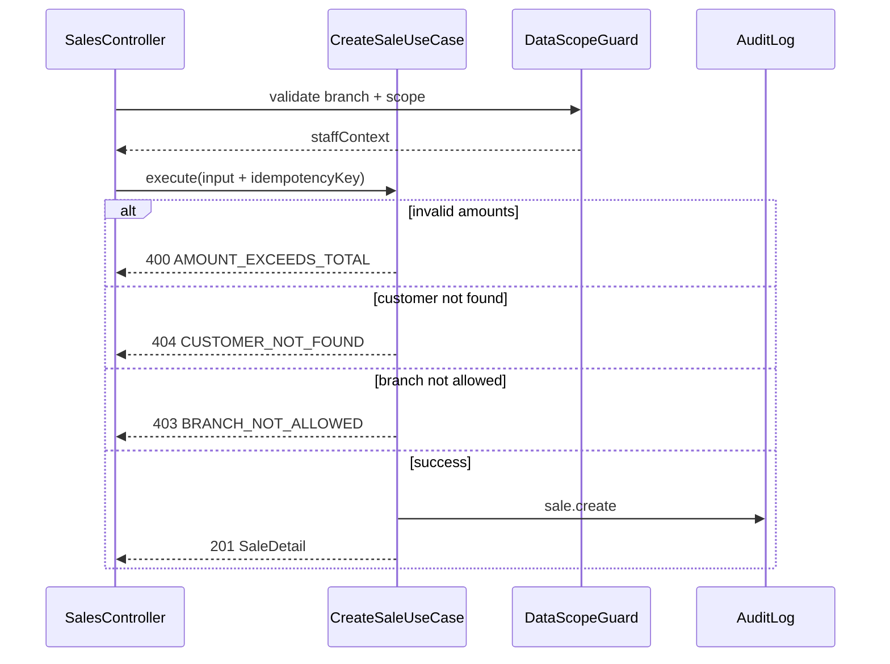

# TASK-080: API — Sales Controller

## Metadata

| فیلد | مقدار |
|------|--------|
| Phase | 1 |
| Epic | Epic-06-Installments-API |
| ID | TASK-080 |
| Priority | P0 |
| Depends on | TASK-042, TASK-043, TASK-044, TASK-045, TASK-053, TASK-059, TASK-058 |
| Blocks | — |
| Estimated | 8h |

---

## هدف

`SalesController` — wiring نازک NestJS برای CRUD فروش: ایجاد، لیست، جزئیات، لغو. منطق مالی در use caseهای `packages/application/installments/sales/`. همه endpointها guards کامل + data scope ADR-015.

---

## معیار پذیرش

- [ ] `POST /api/v1/sales` — permission `installments.sale.create` + `Idempotency-Key`
- [ ] `GET /api/v1/sales` — permission `installments.sale.view` + cursor pagination
- [ ] `GET /api/v1/sales/:id` — permission `installments.sale.view`
- [ ] `POST /api/v1/sales/:id/cancel` — permission `installments.sale.cancel`
- [ ] همه: `@RequireAuth()`, `@RequireModule('installments')`, `@ApplyDataScope()`
- [ ] Request/response validation با Zod از `packages/contracts/installments/`
- [ ] Controller بدون business logic — فقط delegate به use case
- [ ] Swagger/OpenAPI decorators برای هر endpoint
- [ ] Integration tests: allow + deny permission + cross-tenant fail

---

## مشخصات فنی

### Controller

```typescript
// apps/api/src/installments/sales/sales.controller.ts
@Controller('v1/sales')
@RequireAuth()
@RequireModule('installments')
export class SalesController {
  constructor(
    private readonly createSale: CreateSaleUseCase,
    private readonly listSales: ListSalesUseCase,
    private readonly getSale: GetSaleUseCase,
    private readonly cancelSale: CancelSaleUseCase,
  ) {}
}
```

> Global prefix `api` در `main.ts` → مسیر نهایی `/api/v1/sales`

### Data Scope (ADR-015)

| Scope | List | Get by ID | Create | Cancel |
|-------|------|-----------|--------|--------|
| `all` | همه شعب tenant | هر sale در tenant | هر branch مجاز staff | هر sale در scope |
| `branch` | `branchId IN assignedBranchIds` | sale.branchId ∈ assigned | `branchId` باید ∈ assigned | همان |
| `own` | `sellerId = actorId` | sale.sellerId = actorId | sellerId = actorId (auto) | همان |

Header اختیاری: `X-Branch-Id` — intersect با assigned branches برای فیلتر پیش‌فرض list.

---

### `POST /api/v1/sales`

| Item | Value |
|------|-------|
| Method | `POST` |
| Path | `/api/v1/sales` |
| Auth | Staff JWT (`actor: staff`) |
| Module | `installments` |
| Permission | `installments.sale.create` |
| Headers | `Authorization: Bearer <token>`, `Idempotency-Key: <uuid>` (required), `X-Branch-Id` (optional) |

**Request:**

```json
{
  "tenantCustomerId": "uuid",
  "branchId": "uuid",
  "title": "موبایل سامسونگ S23",
  "totalAmountRial": "25000000",
  "downPaymentRial": "5000000",
  "installmentCount": 10,
  "firstDueDate": "2025-02-01",
  "contractDate": "2025-01-15"
}
```

**Response 201:**

```json
{
  "data": {
    "id": "uuid",
    "tenantCustomerId": "uuid",
    "branchId": "uuid",
    "title": "موبایل سامسونگ S23",
    "totalAmountRial": "25000000",
    "downPaymentRial": "5000000",
    "installmentCount": 10,
    "status": "active",
    "installments": [
      {
        "id": "uuid",
        "sequenceNumber": 1,
        "dueDate": "2025-02-01T00:00:00.000Z",
        "amountRial": "2000000",
        "status": "pending"
      }
    ],
    "createdAt": "2025-01-15T10:30:00.000Z"
  },
  "meta": { "requestId": "uuid" }
}
```

**Audit:** `sale.create` — `{ saleId, tenantCustomerId, branchId, totalAmountRial, installmentCount }`

---

### `GET /api/v1/sales`

| Item | Value |
|------|-------|
| Permission | `installments.sale.view` |
| Query | `cursor`, `limit` (default 20, max 100), `sort` (default `createdAt:desc`), `status`, `branchId`, `search`, `from`, `to` |

**Response 200:**

```json
{
  "data": [
    {
      "id": "uuid",
      "tenantCustomerId": "uuid",
      "customer": { "id": "uuid", "phone": "09121234567", "name": "حسین احمدی" },
      "branchId": "uuid",
      "title": "موبایل سامسونگ S23",
      "totalAmountRial": "25000000",
      "status": "active",
      "installmentCount": 10,
      "paidCount": 2,
      "createdAt": "2025-01-15T10:30:00.000Z"
    }
  ],
  "meta": { "hasNext": true, "nextCursor": "eyJpZCI6InV1aWQifQ==", "total": 150 }
}
```

---

### `GET /api/v1/sales/:id`

| Item | Value |
|------|-------|
| Permission | `installments.sale.view` |

**Response 200:**

```json
{
  "data": {
    "id": "uuid",
    "customer": {
      "id": "uuid",
      "phone": "09121234567",
      "name": "حسین احمدی"
    },
    "branchId": "uuid",
    "title": "موبایل سامسونگ S23",
    "totalAmountRial": "25000000",
    "downPaymentRial": "5000000",
    "installmentCount": 10,
    "status": "active",
    "installments": [
      {
        "id": "uuid",
        "sequenceNumber": 1,
        "dueDate": "2025-02-01T00:00:00.000Z",
        "amountRial": "2000000",
        "status": "paid",
        "paidAt": "2025-02-02T10:00:00.000Z",
        "confirmedBy": "uuid"
      }
    ],
    "createdAt": "2025-01-15T10:30:00.000Z"
  },
  "meta": { "requestId": "uuid" }
}
```

---

### `POST /api/v1/sales/:id/cancel`

| Item | Value |
|------|-------|
| Permission | `installments.sale.cancel` |
| Headers | `Authorization` only (no idempotency) |

**Request:**

```json
{ "reason": "مشتری پشیمان شد" }
```

**Response 200:**

```json
{
  "data": { "status": "cancelled", "cancelledAt": "2025-01-16T08:00:00.000Z" },
  "meta": { "requestId": "uuid" }
}
```

**Audit:** `sale.cancel` — `{ saleId, reason }`

---

### Error Codes

| سناریو | HTTP | Code | مرجع |
|--------|------|------|------|
| مبلغ پیش‌پرداخت > کل | 400 | `AMOUNT_EXCEEDS_TOTAL` | ERROR-CODES §4 |
| تعداد اقساط نامعتبر | 400 | `INSTALLMENT_COUNT_INVALID` | ERROR-CODES §4 |
| مشتری یافت نشد | 404 | `CUSTOMER_NOT_FOUND` | ERROR-CODES §5 |
| فروش یافت نشد / خارج scope | 404 | `SALE_NOT_FOUND` | ERROR-CODES §5 |
| شعبه خارج از دسترس | 403 | `BRANCH_NOT_ALLOWED` | ERROR-CODES §3 |
| سقف پلن | 403 | `TENANT_PLAN_LIMIT_EXCEEDED` | ERROR-CODES §3 |
| Idempotency تکراری | 409 | `IDEMPOTENCY_CONFLICT` | ERROR-CODES §8 |
| فروش قبلاً لغو شده | 409 | `SALE_ALREADY_CANCELLED` | ERROR-CODES §5 |
| قسط paid دارد | 409 | `SALE_HAS_PAID_INSTALLMENT` | ERROR-CODES §5 |
| فروش خارج از branch scope | 403 | `SALE_BRANCH_MISMATCH` | ERROR-CODES §5 |
| مجوز ندارد | 403 | `PERMISSION_DENIED` | ERROR-CODES §3 |
| ماژول غیرفعال | 403 | `MODULE_NOT_ENABLED` | ERROR-CODES §3 |

---

## Flow — Create Sale



---

## فایل‌ها

| عمل | مسیر |
|-----|------|
| Create | `apps/api/src/installments/sales/sales.controller.ts` |
| Create | `apps/api/src/installments/sales/sales.module.ts` |
| Create | `apps/api/src/installments/sales/sales.controller.spec.ts` |
| Create | `apps/api/src/installments/sales/sales.integration.spec.ts` |
| Consume | `packages/application/src/installments/sales/create-sale.use-case.ts` |
| Consume | `packages/application/src/installments/sales/list-sales.use-case.ts` |
| Consume | `packages/application/src/installments/sales/get-sale.use-case.ts` |
| Consume | `packages/application/src/installments/sales/cancel-sale.use-case.ts` |
| Consume | `packages/contracts/src/installments/sale.schema.ts` |
| Update | `apps/api/src/app.module.ts` — register SalesModule |

---

## مراحل پیاده‌سازی

1. ایجاد `SalesModule` و register در `AppModule`
2. Decorators: `@RequirePermission` per method
3. `POST` — parse `Idempotency-Key` header، validate `CreateSaleSchema`
4. `GET` list — parse `ListSalesQuerySchema`، pass `staffContext` به use case
5. `GET :id` — UUID param validation
6. `POST :id/cancel` — validate `CancelSaleSchema` (reason min 3 chars)
7. Map `DomainError` → HTTP via global filter
8. Integration tests با Testcontainers PG

---

## Edge Cases & Errors

| سناریو | HTTP / Code | رفتار |
|--------|-------------|--------|
| Idempotency-Key missing on POST | 400 | `FIELD_REQUIRED` |
| Duplicate Idempotency-Key same body | 201 | return cached response |
| Duplicate Idempotency-Key different body | 409 | `IDEMPOTENCY_CONFLICT` |
| Sale soft-deleted | 404 | `SALE_NOT_FOUND` |
| Staff branch scope + wrong branchId in create | 403 | `BRANCH_NOT_ALLOWED` |
| Cross-tenant sale id | 404 | `SALE_NOT_FOUND` |
| Cancel without reason | 400 | `FIELD_REQUIRED` |
| Viewer role hits POST | 403 | `PERMISSION_DENIED` |

---

## تست

- [ ] Integration: create sale → 201 + installments array length = count
- [ ] Integration: create with paid down payment → amounts correct
- [ ] Integration: cancel active sale no paid installments → 200
- [ ] Integration: cancel with paid installment → 409 `SALE_HAS_PAID_INSTALLMENT`
- [ ] RBAC: cashier create allowed; viewer create denied
- [ ] RBAC: cross-tenant sale id → 404
- [ ] Data scope: branch staff list only own branches
- [ ] Data scope: own scope list only own sales
- [ ] Idempotency: duplicate key returns same sale id

---

## Policy Alignment

- [ ] EXCELLENCE-STANDARDS §3 (backend guards, audit, validation)
- [ ] EXCELLENCE-STANDARDS §8 Sale fields
- [ ] SOFT-DELETE-POLICY — no hard delete
- [ ] ADR-015 data scope
- [ ] ADR-016 API versioning `/api/v1`

---

## مراجع

- `docs/02-architecture/api-contracts.md` § POST/GET sales
- `docs/03-modules/installments/STAFF-FLOWS.md` — SF-002, SF-003, SF-006
- `docs/09-development/ERROR-CODES.md`
- `docs/08-decisions/adr-log.md` — ADR-015, ADR-016

---

## Self-Review Score

| محور | سقف | امتیاز | یادداشت |
|------|-----|--------|---------|
| Metadata | 10 | 10 | Depends, Blocks, Estimate |
| Completeness | 25 | 25 | Full API JSON, files, steps |
| Policy | 25 | 25 | Scope, audit, soft delete, ADR |
| Executability | 25 | 25 | Edge cases, tests, mermaid |
| Alignment | 15 | 15 | sync api-contracts.md |
| **جمع** | **100** | **100** | ≥95 ✅ |
