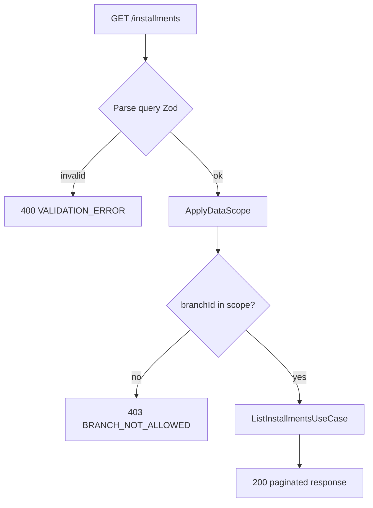

# TASK-081: API — Installments Controller

## Metadata

| فیلد | مقدار |
|------|--------|
| Phase | 1 |
| Epic | Epic-06-Installments-API |
| ID | TASK-081 |
| Priority | P0 |
| Depends on | TASK-042, TASK-043, TASK-044, TASK-045, TASK-053, TASK-059, TASK-080 |
| Blocks | — |
| Estimated | 5h |

---

## هدف

`InstallmentsController` — endpoint لیست اقساط با فیلترهای status، branch، بازه تاریخ، و cursor pagination. Controller نازک؛ query building در `ListInstallmentsUseCase`.

---

## معیار پذیرش

- [ ] `GET /api/v1/installments` — permission `installments.installment.view`
- [ ] فیلترها: `status`, `branchId`, `from`, `to`, `cursor`, `limit`, `sort`
- [ ] `@RequireAuth()`, `@RequireModule('installments')`, `@ApplyDataScope()`
- [ ] Response شامل nested `customer` و `saleId`
- [ ] `amountRial` به صورت string
- [ ] Integration test: filter combinations + data scope

---

## مشخصات فنی

### Controller

```typescript
// apps/api/src/installments/installments/installments.controller.ts
@Controller('v1/installments')
@RequireAuth()
@RequireModule('installments')
export class InstallmentsController {
  constructor(private readonly listInstallments: ListInstallmentsUseCase) {}
}
```

---

### `GET /api/v1/installments`

| Item | Value |
|------|-------|
| Method | `GET` |
| Path | `/api/v1/installments` |
| Auth | Staff JWT |
| Module | `installments` |
| Permission | `installments.installment.view` |
| Headers | `Authorization`, `X-Branch-Id` (optional — default filter) |

**Query Parameters:**

| Param | Type | Default | توضیح |
|-------|------|---------|--------|
| `status` | enum | — | `pending` \| `overdue` \| `paid` \| `waived` (comma-separated multi) |
| `branchId` | uuid | — | فیلتر شعبه (باید در scope باشد) |
| `from` | ISO date | — | `dueDate >= from` |
| `to` | ISO date | — | `dueDate <= to` |
| `cursor` | string | — | cursor pagination |
| `limit` | int | 20 | max 100 |
| `sort` | string | `dueDate:asc` | `dueDate`, `amountRial`, `sequenceNumber` |

**Response 200:**

```json
{
  "data": [
    {
      "id": "uuid",
      "saleId": "uuid",
      "customer": { "id": "uuid", "phone": "09121234567", "name": "حسین احمدی" },
      "branchId": "uuid",
      "sequenceNumber": 3,
      "dueDate": "2025-03-01T00:00:00.000Z",
      "amountRial": "2000000",
      "status": "overdue"
    }
  ],
  "meta": { "total": 23, "hasNext": true, "nextCursor": "eyJpZCI6InV1aWQifQ==" }
}
```

**Audit:** read-only — no audit log

---

### Data Scope (ADR-015)

| Scope | Filter Applied |
|-------|----------------|
| `all` | `tenantId` only |
| `branch` | `sale.branchId IN staff.assignedBranchIds` (یا active branch اگر header set) |
| `own` | `sale.sellerId = actorId` |

اگر `branchId` query ارسال شود و خارج از scope باشد → 403 `BRANCH_NOT_ALLOWED`.

---

### Error Codes

| سناریو | HTTP | Code |
|--------|------|------|
| status نامعتبر | 400 | `VALIDATION_ERROR` |
| from > to | 400 | `VALIDATION_ERROR` |
| branchId خارج scope | 403 | `BRANCH_NOT_ALLOWED` |
| مجوز ندارد | 403 | `PERMISSION_DENIED` |
| limit > 100 | 400 | `VALIDATION_ERROR` |

---

## Flow



---

## فایل‌ها

| عمل | مسیر |
|-----|------|
| Create | `apps/api/src/installments/installments/installments.controller.ts` |
| Create | `apps/api/src/installments/installments/installments.module.ts` |
| Create | `apps/api/src/installments/installments/installments.integration.spec.ts` |
| Consume | `packages/application/src/installments/list-installments.use-case.ts` |
| Create/Update | `packages/contracts/src/installments/installment.schema.ts` |
| Update | `apps/api/src/app.module.ts` |

---

## مراحل پیاده‌سازی

1. `ListInstallmentsQuerySchema` در contracts
2. Controller method با `@RequirePermission('installments.installment.view')`
3. Merge `X-Branch-Id` با query `branchId` (intersection)
4. Delegate به use case با `DataScopeStaffContext`
5. Map entity → `InstallmentListItemDto`
6. Integration tests: status filter, date range, scope

---

## Edge Cases & Errors

| سناریو | HTTP / Code | رفتار |
|--------|-------------|--------|
| Empty result | 200 | `data: []`, `hasNext: false` |
| Soft-deleted installment | — | excluded (`deletedAt: null`) |
| Soft-deleted sale | — | excluded via join |
| Invalid cursor | 400 | `VALIDATION_ERROR` |
| Multi-status `pending,overdue` | 200 | OR filter |
| Tenant suspended | 403 | `TENANT_SUSPENDED` on write N/A — read allowed |

---

## تست

- [ ] Integration: list overdue only
- [ ] Integration: date range from/to
- [ ] Integration: branch staff sees only assigned branches
- [ ] Integration: own scope sees only own sales' installments
- [ ] RBAC: viewer allowed; no permission → 403
- [ ] Pagination: hasNext true when limit+1 rows

---

## Policy Alignment

- [ ] EXCELLENCE-STANDARDS §3 list API (cursor, sort, filter)
- [ ] ADR-015 data scope on branchId
- [ ] SOFT-DELETE-POLICY — deleted installments invisible

---

## مراجع

- `docs/02-architecture/api-contracts.md` § GET installments
- `docs/03-modules/installments/REPORTS.md` §8 cursor pattern
- `docs/09-development/ERROR-CODES.md`

---

## Self-Review Score

| محور | سقف | امتیاز |
|------|-----|--------|
| Metadata | 10 | 10 |
| Completeness | 25 | 25 |
| Policy | 25 | 25 |
| Executability | 25 | 25 |
| Alignment | 15 | 15 |
| **جمع** | **100** | **100** |
