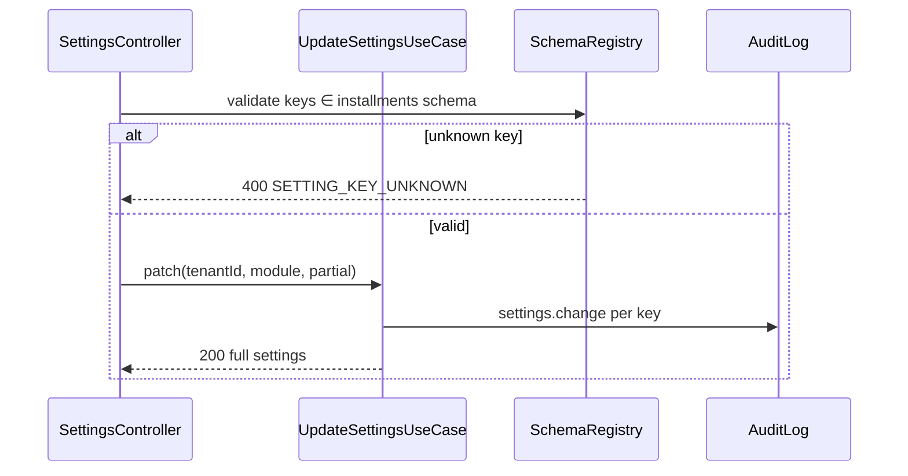

# TASK-082: API — Installments Settings

## Metadata

| فیلد | مقدار |
|------|--------|
| Phase | 1 |
| Epic | Epic-06-Installments-API |
| ID | TASK-082 |
| Priority | P0 |
| Depends on | TASK-048, TASK-042, TASK-043, TASK-044, TASK-045 |
| Blocks | — |
| Estimated | 4h |

---

## هدف

Expose تنظیمات ماژول اقساط از طریق `GET/PATCH /api/v1/settings?module=installments` — schema کامل یادآورها و رفتار پرداخت per `api-contracts.md` و SF-009. Delegate به `GetSettingsUseCase` / `UpdateSettingsUseCase` از TASK-048.

---

## معیار پذیرش

- [ ] `GET /api/v1/settings?module=installments` — permission `core.settings.view`
- [ ] `PATCH /api/v1/settings?module=installments` — permission `core.settings.edit`
- [ ] Schema keys مطابق api-contracts (نه stub Phase 0)
- [ ] Partial PATCH — فقط keys ارسال‌شده update
- [ ] Audit `settings.change` per key changed
- [ ] Validation against `installmentsSettingsSchema` extended

---

## مشخصات فنی

### Extended Settings Schema

```typescript
// modules/installments/src/settings.schema.ts
export const installmentsSettingsSchema = {
  reminder_days_before:        { type: 'number-array', min: 0, max: 30, default: [3, 1] },
  reminder_on_due_date:        { type: 'boolean', default: true },
  reminder_time:               { type: 'time', default: '09:00' },  // Asia/Tehran
  overdue_escalation_days:     { type: 'number-array', min: 1, max: 90, default: [1, 3, 7] },
  default_installment_count:   { type: 'number', min: 1, max: 120, default: 12 },
  allow_customer_self_report_payment:      { type: 'boolean', default: true },
  require_seller_payment_confirmation:   { type: 'boolean', default: true },
  notify_seller_on_customer_payment_report: { type: 'boolean', default: true },
  default_reminder_channels:   { type: 'enum-array', values: ['telegram', 'bale', 'sms'], default: ['telegram'] },
} as const;
```

---

### `GET /api/v1/settings?module=installments`

| Item | Value |
|------|-------|
| Method | `GET` |
| Path | `/api/v1/settings` |
| Query | `module=installments` |
| Auth | Staff JWT |
| Module | `installments` (entitlement check) |
| Permission | `core.settings.view` |
| Data Scope | N/A — tenant-wide settings |

**Response 200:**

```json
{
  "data": {
    "installments": {
      "reminder_days_before": [3, 1],
      "reminder_on_due_date": true,
      "reminder_time": "09:00",
      "overdue_escalation_days": [1, 3, 7],
      "default_installment_count": 12,
      "allow_customer_self_report_payment": true,
      "require_seller_payment_confirmation": true,
      "notify_seller_on_customer_payment_report": true,
      "default_reminder_channels": ["telegram"]
    }
  },
  "meta": { "requestId": "uuid" }
}
```

---

### `PATCH /api/v1/settings?module=installments`

| Item | Value |
|------|-------|
| Method | `PATCH` |
| Path | `/api/v1/settings` |
| Query | `module=installments` |
| Permission | `core.settings.edit` |
| Note | فقط owner/manager معمولاً این permission را دارند |

**Request (partial):**

```json
{
  "reminder_days_before": [5, 2, 1],
  "reminder_time": "10:00"
}
```

**Response 200:** full settings object (same as GET)

**Audit:** `settings.change` — `{ module: 'installments', keys: ['reminder_days_before', 'reminder_time'], oldValue, newValue }`

---

### Error Codes

| سناریو | HTTP | Code |
|--------|------|------|
| module نامعتبر | 400 | `SETTING_KEY_UNKNOWN` / `VALIDATION_ERROR` |
| key نامعتبر در body | 400 | `SETTING_KEY_UNKNOWN` |
| value نامعتبر | 400 | `SETTING_VALUE_INVALID` |
| ماژول غیرفعال | 403 | `MODULE_NOT_ENABLED` |
| مجوز ندارد | 403 | `PERMISSION_DENIED` |
| readonly platform key | 403 | `SETTING_READONLY` |

---

## Flow — PATCH Settings



---

## فایل‌ها

| عمل | مسیر |
|-----|------|
| Update | `modules/installments/src/settings.schema.ts` |
| Update | `apps/api/src/settings/settings.controller.ts` |
| Consume | `packages/application/src/settings/get-settings.use-case.ts` |
| Consume | `packages/application/src/settings/update-settings.use-case.ts` |
| Create/Update | `packages/contracts/src/core/settings.schema.ts` |
| Create | `apps/api/src/settings/settings.integration.spec.ts` |

---

## مراحل پیاده‌سازی

1. گسترش `installmentsSettingsSchema` — register در `SettingsSchemaRegistry`
2. اضافه کردن `PATCH` handler (اگر فقط PUT در Phase 0 بود)
3. `InstallmentsSettingsPatchSchema` — partial all keys optional
4. Wire `@RequireModule('installments')` on installments module settings routes
5. Integration test: get defaults, patch one key, audit logged

---

## Edge Cases & Errors

| سناریو | HTTP / Code | رفتار |
|--------|-------------|--------|
| Empty PATCH body | 400 | `VALIDATION_ERROR` |
| reminder_days_before empty array | 400 | `SETTING_VALUE_INVALID` |
| default_installment_count = 0 | 400 | `SETTING_VALUE_INVALID` |
| Invalid channel in enum-array | 400 | `SETTING_VALUE_INVALID` |
| Cashier hits PATCH | 403 | `PERMISSION_DENIED` |

---

## تست

- [ ] Integration: GET returns all keys with defaults
- [ ] Integration: PATCH partial → only changed keys in audit
- [ ] Integration: invalid key → 400
- [ ] RBAC: viewer GET ok; PATCH denied
- [ ] Unit: schema validation for each field type

---

## Policy Alignment

- [ ] EXCELLENCE-STANDARDS §3 settings schema-only
- [ ] ADR-008 settings vs invariants
- [ ] Audit on every change

---

## مراجع

- `docs/02-architecture/api-contracts.md` § settings
- `docs/03-modules/installments/STAFF-FLOWS.md` — SF-009
- `Phases/Phase-0-Foundation/Epic-08-Core-Services/TASK-048-service-settings.md`
- `docs/09-development/ERROR-CODES.md` § CORE settings

---

## Self-Review Score

| محور | سقف | امتیاز |
|------|-----|--------|
| Metadata | 10 | 10 |
| Completeness | 25 | 25 |
| Policy | 25 | 25 |
| Executability | 25 | 25 |
| Alignment | 15 | 15 |
| **جمع** | **100** | **100** |
