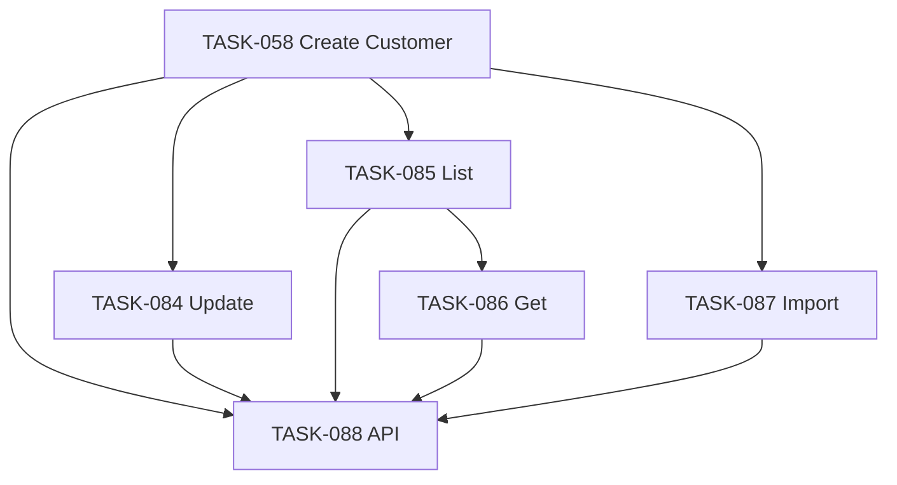

# Epic-07 — Customer Backend

> **Phase:** 1 — Installments  
> **وضعیت:** Ready for implementation  
> **ADR:** ADR-002, ADR-013, ADR-015, ADR-017

---

## هدف Epic

تکمیل backend مدیریت مشتری tenant: use caseهای Update، List، Get، Import Excel، و wiring کامل در `CustomersController`. `CreateTenantCustomer` در Phase 0 (TASK-058) پیاده شده — این Epic آن را گسترش می‌دهد بدون تکرار.

---

## Tasks

| ID | فایل | عنوان | Depends | Priority |
|----|------|--------|---------|----------|
| 084 | [TASK-084-usecase-update-tenant-customer.md](./TASK-084-usecase-update-tenant-customer.md) | Use Case — Update TenantCustomer | TASK-058, TASK-047, TASK-046 | P0 |
| 085 | [TASK-085-usecase-list-tenant-customers.md](./TASK-085-usecase-list-tenant-customers.md) | Use Case — List TenantCustomers | TASK-058, TASK-033, TASK-032 | P0 |
| 086 | [TASK-086-usecase-get-tenant-customer.md](./TASK-086-usecase-get-tenant-customer.md) | Use Case — Get TenantCustomer | TASK-085 | P0 |
| 087 | [TASK-087-usecase-import-customers-excel.md](./TASK-087-usecase-import-customers-excel.md) | Use Case — Import Customers Excel | TASK-058, TASK-047 | P0 |
| 088 | [TASK-088-api-customers-extended.md](./TASK-088-api-customers-extended.md) | API — Customers Controller Extended | TASK-058, TASK-084–087 | P0 |

---

## Dependency Graph (داخلی Epic)

---

## Policy Notes

| موضوع | قانون |
|-------|--------|
| GlobalCustomer | B2C profile — FK `userId` → `User`؛ phone روی User (ADR-017) |
| User | findOrCreateByPhone در create/import (TASK-058, 087) |
| Soft delete | restore در create (TASK-058)؛ update روی active link |
| Optimistic lock | `version` + 409 `OPTIMISTIC_LOCK_CONFLICT` در update |
| Import | max 5MB، row-level errors، idempotency، audit `customer.import` |
| Data scope | `defaultBranchId` و list فیلتر بر اساس ADR-015 |
| Plan limit | فقط create/import جدید — نه update |

---

## مراجع

- `Phases/Phase-0-Foundation/Epic-08-Core-Services/TASK-058-create-tenant-customer-use-case.md`
- `docs/02-architecture/api-contracts.md` § customers
- `docs/03-modules/installments/STAFF-FLOWS.md` — SF-007
- `docs/09-development/EXCELLENCE-STANDARDS.md` §8 GlobalCustomer/TenantCustomer
