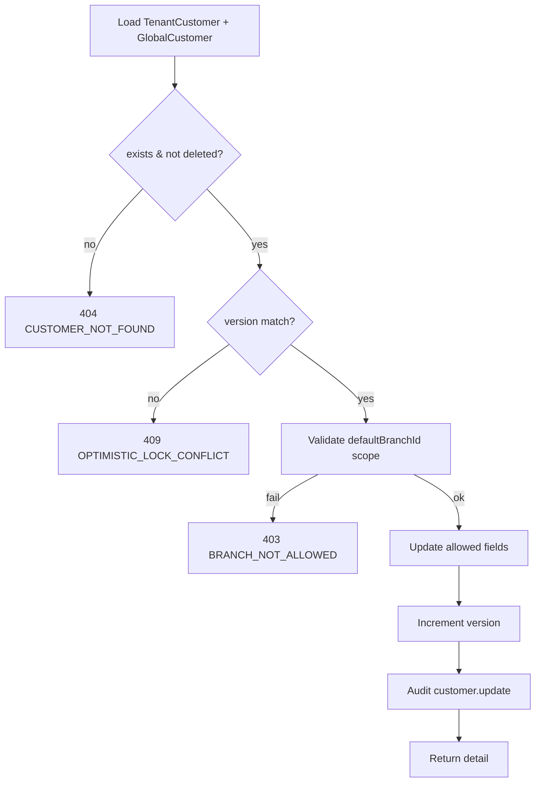

# TASK-084: Use Case — Update TenantCustomer

## Metadata

| فیلد | مقدار |
|------|--------|
| Phase | 1 |
| Epic | Epic-07-Customer-Backend |
| ID | TASK-084 |
| Priority | P0 |
| Depends on | TASK-058, TASK-047, TASK-046, TASK-045 |
| Blocks | TASK-088 |
| Estimated | 5h |

---

## هدف

`UpdateTenantCustomerUseCase` — به‌روزرسانی جزئی (partial) TenantCustomer link و فیلدهای GlobalCustomer مجاز. Optimistic locking با `version` → 409 conflict. Audit `customer.update`.

---

## معیار پذیرش

- [ ] Partial update — فقط فیلدهای ارسال‌شده تغییر
- [ ] `version` اجباری در input — mismatch → 409 `OPTIMISTIC_LOCK_CONFLICT`
- [ ] Phone **غیرقابل** تغییر (immutable) — تلاش → 400
- [ ] `defaultBranchId` validation + data scope
- [ ] `internalNotes` فقط staff با permission update
- [ ] Audit: `customer.update` با old/new diff
- [ ] Return full `TenantCustomerDetailRecord`

---

## Input

```typescript
export type UpdateTenantCustomerInput = {
  tenantId: string;
  actorId: string;
  tenantCustomerId: string;
  version: number;
  name?: string;
  email?: string;
  nationalId?: string;
  birthDate?: string;
  gender?: 'male' | 'female' | 'other' | 'unspecified';
  address?: string;
  localCode?: string;
  tags?: string[];
  notes?: string;
  internalNotes?: string;
  defaultBranchId?: string | null;
  preferredContactChannel?: 'telegram' | 'bale' | 'sms' | 'phone';
  marketingOptIn?: boolean;
  metadata?: Record<string, unknown>;
  staffContext: DataScopeStaffContext;
  ip?: string;
};
```

---

## Logic Flow



---

## Data Scope (ADR-015)

| Scope | Update allowed when |
|-------|---------------------|
| `all` | any customer in tenant |
| `branch` | `defaultBranchId ∈ assigned` OR customer has sales in assigned branches |
| `own` | customer has sale with `sellerId = actorId` |

خارج scope → 404 `CUSTOMER_NOT_FOUND` (IDOR prevention).

---

## Error Codes

| سناریو | HTTP | Code |
|--------|------|------|
| Customer not found / scope | 404 | `CUSTOMER_NOT_FOUND` |
| Version mismatch | 409 | `OPTIMISTIC_LOCK_CONFLICT` |
| Phone change attempted | 400 | `VALIDATION_ERROR` |
| Invalid branch | 400 | `BRANCH_NOT_FOUND` |
| Branch not in scope | 403 | `BRANCH_NOT_ALLOWED` |
| Soft-deleted customer | 404 | `RECORD_DELETED` |

---

## فایل‌ها

| عمل | مسیر |
|-----|------|
| Create | `packages/application/src/customers/update-tenant-customer.use-case.ts` |
| Create | `packages/application/src/customers/update-tenant-customer.use-case.spec.ts` |
| Update | `packages/application/src/ports/tenant-customer.repository.port.ts` |
| Create/Update | `packages/contracts/src/customers/update-tenant-customer.schema.ts` |

---

## مراحل پیاده‌سازی

1. `UpdateTenantCustomerSchema` با `version` required
2. Load with `tenantId` + `deletedAt: null`
3. Assert data scope access
4. Transaction: update GlobalCustomer (name, etc.) + TenantCustomer link fields
5. `version++` on TenantCustomer
6. Audit with changed fields only
7. Unit tests all edge cases

---

## Edge Cases & Errors

| سناریو | HTTP / Code | رفتار |
|--------|-------------|--------|
| Empty patch (no fields) | 400 | `VALIDATION_ERROR` |
| tags duplicate in array | 200 | dedupe |
| defaultBranchId null | 200 | clear default |
| Concurrent updates | 409 | first wins, second fails |

---

## تست

- [ ] Unit: happy path partial update + audit
- [ ] Unit: version conflict → 409
- [ ] Unit: phone in body ignored or rejected
- [ ] Unit: branch scope denied → 404
- [ ] Integration: update → get returns new values
- [ ] Integration: cross-tenant update → 404

---

## Policy Alignment

- [ ] EXCELLENCE-STANDARDS §8 all customer fields
- [ ] SOFT-DELETE-POLICY — no update on deleted
- [ ] ADR-002, ADR-015

---

## مراجع

- `Phases/Phase-0-Foundation/Epic-08-Core-Services/TASK-058-create-tenant-customer-use-case.md`
- `docs/09-development/ERROR-CODES.md` §8 OPTIMISTIC_LOCK_CONFLICT

---

## Self-Review Score

| محور | سقف | امتیاز |
|------|-----|--------|
| Metadata | 10 | 10 |
| Completeness | 25 | 25 |
| Policy | 25 | 25 |
| Executability | 25 | 25 |
| Alignment | 15 | 15 |
| **جمع** | **100** | **100** |
