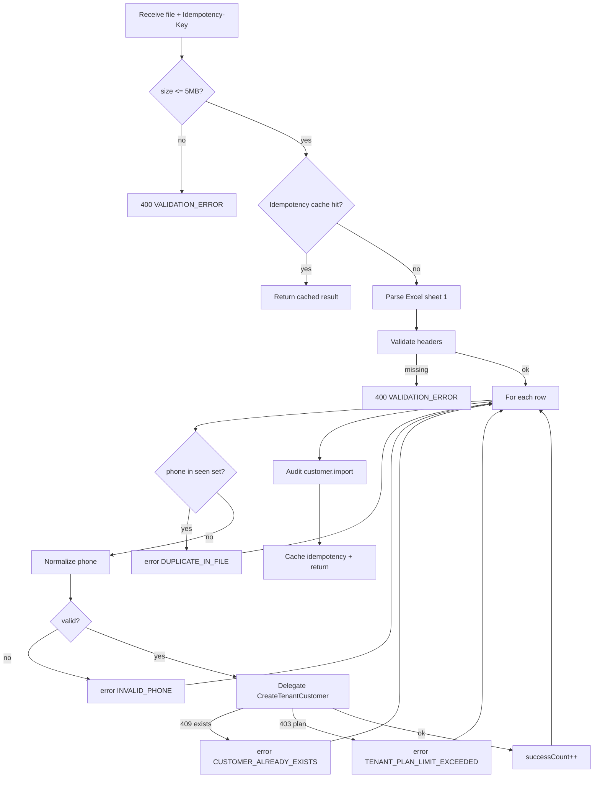

# TASK-087: Use Case — Import Customers Excel

## Metadata

| فیلد | مقدار |
|------|--------|
| Phase | 1 |
| Epic | Epic-07-Customer-Backend |
| ID | TASK-087 |
| Priority | P0 |
| Depends on | TASK-058, TASK-047, TASK-045 |
| Blocks | TASK-088 |
| Estimated | 8h |

---

## هدف

`ImportCustomersExcelUseCase` — آپلود Excel (.xlsx)، parse ستون‌های `phone`, `name`, `local_code`, `notes`، upsert per row via CreateTenantCustomer logic، row-level errors، idempotency، audit `customer.import`.

---

## معیار پذیرش

- [ ] Max file size **5MB** — exceed → 400
- [ ] Columns: `phone` (required), `name` (required), `local_code`, `notes`
- [ ] Row-level errors — import continues for valid rows
- [ ] Duplicate phone in file → skip later rows with `CUSTOMER_PHONE_DUPLICATE_IN_FILE`
- [ ] Idempotency-Key — same file re-upload returns cached result
- [ ] Plan limit checked per new customer (not restore)
- [ ] Audit: `customer.import` — `{ totalRows, successCount, errorCount, idempotencyKey }`
- [ ] Response per api-contracts

---

## API (wired in TASK-088)

| Item | Value |
|------|-------|
| Method | `POST` |
| Path | `/api/v1/customers/import` |
| Content-Type | `multipart/form-data` |
| Permission | `installments.customer.import` |
| Headers | `Idempotency-Key: <uuid>` (required) |

**Response 200:**

```json
{
  "data": {
    "totalRows": 50,
    "successCount": 47,
    "errorCount": 3,
    "errors": [
      { "row": 12, "phone": "0912xxx", "error": "INVALID_PHONE" },
      { "row": 23, "phone": "09300000001", "error": "CUSTOMER_ALREADY_EXISTS" },
      { "row": 45, "phone": null, "error": "FIELD_REQUIRED" }
    ]
  },
  "meta": { "requestId": "uuid" }
}
```

---

## Logic Flow



---

## Excel Template

| phone | name | local_code | notes |
|-------|------|------------|-------|
| 09121234567 | حسین احمدی | C-001 | VIP |
| 09351234567 | مریم رضایی | | |

Row 1 = header (case-insensitive match).

---

## Error Codes (per row + global)

| سناریو | HTTP | Code |
|--------|------|------|
| File > 5MB | 400 | `VALIDATION_ERROR` |
| Not xlsx | 400 | `VALIDATION_ERROR` |
| Missing headers | 400 | `VALIDATION_ERROR` |
| Row invalid phone | — | `INVALID_PHONE` in errors[] |
| Row duplicate in file | — | `CUSTOMER_PHONE_DUPLICATE_IN_FILE` |
| Row customer exists | — | `CUSTOMER_ALREADY_EXISTS` |
| Row plan limit | — | `TENANT_PLAN_LIMIT_EXCEEDED` |
| Partial failure | 200 | successCount + errors |
| All failed | 422 | `CUSTOMER_IMPORT_FAILED` |
| Idempotency conflict | 409 | `IDEMPOTENCY_CONFLICT` |

---

## فایل‌ها

| عمل | مسیر |
|-----|------|
| Create | `packages/application/src/customers/import-customers-excel.use-case.ts` |
| Create | `packages/application/src/customers/import-customers-excel.use-case.spec.ts` |
| Create | `packages/application/src/customers/excel/customer-import.parser.ts` |
| Create | `packages/infrastructure/src/storage/temp-file.service.ts` |
| Update | `packages/contracts/src/customers/import-customers.schema.ts` |

---

## مراحل پیاده‌سازی

1. Add `exceljs` dependency (if not present)
2. Parser: stream read, max rows 10000
3. Per-row: call internal `upsertCustomer` (shared with TASK-058)
4. Track phones in `Set` for in-file duplicate
5. Idempotency store result JSON in Redis 24h
6. Audit aggregate on completion
7. Unit tests with fixture xlsx files

---

## Edge Cases & Errors

| سناریو | HTTP / Code | رفتار |
|--------|-------------|--------|
| Empty file | 400 | VALIDATION_ERROR |
| 0 data rows | 200 | totalRows=0 |
| Mixed valid/invalid | 200 | partial success |
| Restore soft-deleted via import | 200 | counts as success (TASK-058 restore) |

---

## تست

- [ ] Unit: parser valid/invalid rows
- [ ] Unit: in-file duplicate detection
- [ ] Unit: 5MB limit
- [ ] Integration: import 10 rows → 10 customers in list
- [ ] Integration: idempotency same result
- [ ] Integration: plan limit mid-import stops new creates

---

## Policy Alignment

- [ ] EXCELLENCE-STANDARDS §3
- [ ] SOFT-DELETE restore via TASK-058 logic
- [ ] Audit customer.import
- [ ] ADR-015 — import not branch-scoped (tenant-wide); defaultBranchId from active branch optional

---

## مراجع

- `docs/02-architecture/api-contracts.md` § import
- `docs/03-modules/installments/STAFF-FLOWS.md` — SF-007.2
- `docs/09-development/ERROR-CODES.md` § CUSTOMER_IMPORT_FAILED

---

## Self-Review Score

| محور | سقف | امتیاز |
|------|-----|--------|
| Metadata | 10 | 10 |
| Completeness | 25 | 25 |
| Policy | 25 | 25 |
| Executability | 25 | 25 |
| Alignment | 15 | 15 |
| **جمع** | **100** | **100** |
