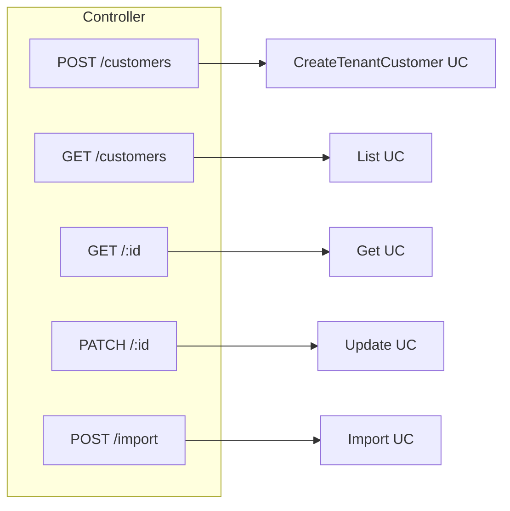

# TASK-088: API — Customers Controller Extended

## Metadata

| فیلد | مقدار |
|------|--------|
| Phase | 1 |
| Epic | Epic-07-Customer-Backend |
| ID | TASK-088 |
| Priority | P0 |
| Depends on | TASK-058, TASK-084, TASK-085, TASK-086, TASK-087, TASK-042–045, TASK-053 |
| Blocks | TASK-080 |
| Estimated | 6h |

---

## هدف

تکمیل `CustomersController` — wire همه routeهای مشتری: create (TASK-058)، list، get، update، import. Controller نازک با guards کامل.

---

## معیار پذیرش

- [ ] `POST /api/v1/customers` — `installments.customer.create` (existing TASK-058)
- [ ] `GET /api/v1/customers` — `installments.customer.view`
- [ ] `GET /api/v1/customers/:id` — `installments.customer.view`
- [ ] `PATCH /api/v1/customers/:id` — `installments.customer.update`
- [ ] `POST /api/v1/customers/import` — `installments.customer.import`
- [ ] همه: `@RequireModule('installments')`, `@ApplyDataScope()`
- [ ] Multipart handling for import
- [ ] RBAC integration tests all routes

---

## Endpoints Summary

### `POST /api/v1/customers`

| Item | Value |
|------|-------|
| Permission | `installments.customer.create` |
| Body | per TASK-058 / api-contracts |
| Response | 201 |

### `GET /api/v1/customers`

| Item | Value |
|------|-------|
| Permission | `installments.customer.view` |
| Query | `cursor`, `limit`, `sort`, `search`, `tags`, `defaultBranchId` |
| Delegate | `ListTenantCustomersUseCase` (TASK-085) |

### `GET /api/v1/customers/:id`

| Item | Value |
|------|-------|
| Permission | `installments.customer.view` |
| Query | `include=salesSummary` |
| Delegate | `GetTenantCustomerUseCase` (TASK-086) |

### `PATCH /api/v1/customers/:id`

| Item | Value |
|------|-------|
| Permission | `installments.customer.update` |
| Body | partial fields + `version` required |
| Delegate | `UpdateTenantCustomerUseCase` (TASK-084) |

**Request:**

```json
{
  "version": 2,
  "name": "حسین احمدی",
  "tags": ["vip", "loyal"],
  "localCode": "C-001"
}
```

**Response 200:** full customer detail

**Audit:** `customer.update`

### `POST /api/v1/customers/import`

| Item | Value |
|------|-------|
| Permission | `installments.customer.import` |
| Headers | `Idempotency-Key` required |
| Body | `file` field multipart |
| Delegate | `ImportCustomersExcelUseCase` (TASK-087) |

---

## Data Scope Summary (ADR-015)

| Endpoint | all | branch | own |
|----------|-----|--------|-----|
| POST create | ✅ | defaultBranch must ∈ assigned | defaultBranch + scope |
| GET list | all customers | filtered | filtered |
| GET :id | ✅ if in tenant | scope check | scope check |
| PATCH | ✅ | scope check | scope check |
| POST import | tenant-wide | tenant-wide | tenant-wide |

---

## Error Codes

| Endpoint | Key Errors |
|----------|------------|
| POST | `CUSTOMER_ALREADY_EXISTS`, `INVALID_PHONE`, `PLAN_LIMIT` |
| GET list | `VALIDATION_ERROR` |
| GET :id | `CUSTOMER_NOT_FOUND` |
| PATCH | `OPTIMISTIC_LOCK_CONFLICT`, `CUSTOMER_NOT_FOUND` |
| import | `CUSTOMER_IMPORT_FAILED`, `IDEMPOTENCY_CONFLICT` |

Full catalog: `docs/09-development/ERROR-CODES.md`

---

## Flow — Customer CRUD



---

## فایل‌ها

| عمل | مسیر |
|-----|------|
| Update | `apps/api/src/customers/customers.controller.ts` |
| Update | `apps/api/src/customers/customers.module.ts` |
| Create | `apps/api/src/customers/customers.integration.spec.ts` |
| Consume | All use cases TASK-058, 084–087 |
| Consume | `packages/contracts/src/customers/*.schema.ts` |

---

## مراحل پیاده‌سازی

1. Inject all use cases in controller
2. Add GET list, GET :id, PATCH, POST import routes
3. `FileInterceptor` for import with 5MB limit
4. Parse query params with Zod pipes
5. Ensure create route from TASK-058 unchanged
6. Full RBAC integration test suite

---

## Edge Cases & Errors

| سناریو | HTTP / Code | رفتار |
|--------|-------------|--------|
| PATCH without version | 400 | FIELD_REQUIRED |
| Import without file | 400 | FIELD_REQUIRED |
| GET deleted customer | 404 | RECORD_DELETED |
| Cashier hits import | 403 | PERMISSION_DENIED |

---

## تست

- [ ] Integration: full CRUD flow
- [ ] Integration: import + list shows new customers
- [ ] RBAC: each permission allow/deny
- [ ] Cross-tenant: all endpoints 404/403
- [ ] E2E: aligns with TASK-054 customer flow

---

## Policy Alignment

- [ ] EXCELLENCE-STANDARDS §3, §8
- [ ] SOFT-DELETE-POLICY
- [ ] ADR-002, ADR-015

---

## مراجع

- `docs/02-architecture/api-contracts.md` § customers
- `Phases/Phase-0-Foundation/Epic-08-Core-Services/TASK-058-create-tenant-customer-use-case.md`

---

## Self-Review Score

| محور | سقف | امتیاز |
|------|-----|--------|
| Metadata | 10 | 10 |
| Completeness | 25 | 25 |
| Policy | 25 | 25 |
| Executability | 25 | 25 |
| Alignment | 15 | 15 |
| **جمع** | **100** | **100** |
