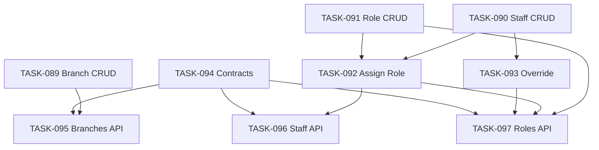

# Epic-08 — Core Admin

> **Phase:** 1 — Installments  
> **وضعیت:** Ready for implementation  
> **ADR:** ADR-004, ADR-009, ADR-013, ADR-015

---

## هدف Epic

CRUD کامل شعبه، کارمند، نقش، تخصیص نقش، و override مجوز — use case + contracts + API controllers. شعبه پیش‌فرض در ثبت tenant (TASK-057) ایجاد می‌شود؛ این Epic آن را **دوباره پیاده نمی‌کند**.

---

## Tasks

| ID | فایل | عنوان | Depends | Priority |
|----|------|--------|---------|----------|
| 089 | [TASK-089-usecase-branch-crud.md](./TASK-089-usecase-branch-crud.md) | Use Case — Branch CRUD | TASK-030, TASK-019, TASK-057, TASK-056, TASK-047 | P0 |
| 090 | [TASK-090-usecase-staff-crud.md](./TASK-090-usecase-staff-crud.md) | Use Case — Staff CRUD | TASK-031, TASK-020, TASK-021, TASK-047 | P0 |
| 091 | [TASK-091-usecase-role-crud.md](./TASK-091-usecase-role-crud.md) | Use Case — Role CRUD | TASK-034, TASK-021, TASK-047 | P0 |
| 092 | [TASK-092-usecase-assign-role-staff.md](./TASK-092-usecase-assign-role-staff.md) | Use Case — Assign Role to Staff | TASK-090, TASK-091 | P0 |
| 093 | [TASK-093-usecase-permission-override.md](./TASK-093-usecase-permission-override.md) | Use Case — Permission Override | TASK-034, TASK-090, TASK-047 | P0 |
| 094 | [TASK-094-contracts-core-admin.md](./TASK-094-contracts-core-admin.md) | Contracts — Core Admin Zod | TASK-052 | P0 |
| 095 | [TASK-095-api-branches-controller.md](./TASK-095-api-branches-controller.md) | API — Branches Controller | TASK-089, TASK-094, TASK-042–045 | P0 |
| 096 | [TASK-096-api-staff-controller.md](./TASK-096-api-staff-controller.md) | API — Staff Controller | TASK-090, TASK-092, TASK-094, TASK-042–045 | P0 |
| 097 | [TASK-097-api-roles-controller.md](./TASK-097-api-roles-controller.md) | API — Roles Controller | TASK-091, TASK-092, TASK-093, TASK-094, TASK-042–045 | P0 |

---

## Dependency Graph (داخلی Epic)

---

## Policy Notes

| موضوع | قانون |
|-------|--------|
| Default branch | TASK-057 — auto-create؛ حذف ممنوع (`BRANCH_IS_DEFAULT`) |
| Last branch | حذف آخرین شعبه → 409 `DELETE_FORBIDDEN` |
| Owner | حذف owner ممنوع (`STAFF_LAST_OWNER`)؛ self-delete ممنوع |
| System roles | `is_system=true` — immutable (`ROLE_IS_SYSTEM`) |
| Custom roles | فقط owner — `core.role.create/update/delete` |
| Override | DENY > GRANT؛ `reason` اجباری؛ audit |
| Soft delete | همه entityها — `deletedAt`؛ restore برای owner |
| Permissions | `core.*` از `docs/02-architecture/rbac.md` |

---

## مراجع

- `docs/02-architecture/rbac.md`
- `docs/02-architecture/api-contracts.md` §4
- `Phases/Phase-0-Foundation/Epic-08-Core-Services/TASK-057-register-tenant-use-case.md`
- `docs/09-development/SOFT-DELETE-POLICY.md`
