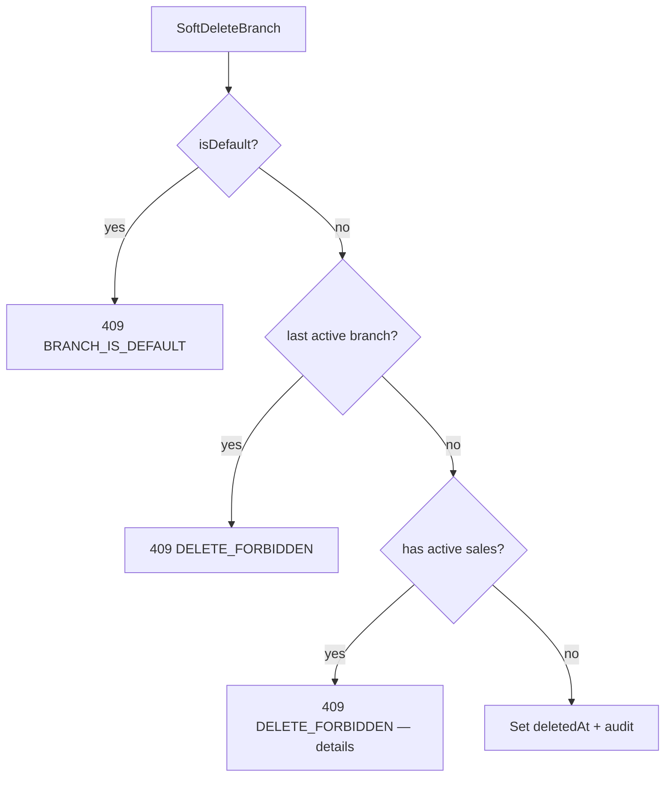

# TASK-089: Use Case — Branch CRUD

## Metadata

| فیلد | مقدار |
|------|--------|
| Phase | 1 |
| Epic | Epic-08-Core-Admin |
| ID | TASK-089 |
| Priority | P0 |
| Depends on | TASK-030, TASK-019, TASK-057, TASK-056, TASK-047 |
| Blocks | TASK-095 |
| Estimated | 8h |

---

## هدف

Use caseهای Create، Update، List، Get، SoftDelete برای Branch. **شعبه پیش‌فرض در TASK-057 ایجاد شده** — این task آن را دوباره پیاده نمی‌کند. حذف: soft delete only؛ default branch و last branch ممنوع.

---

## معیار پذیرش

- [ ] `CreateBranchUseCase` — plan limit check
- [ ] `UpdateBranchUseCase` — name, address, phone, isActive (not isDefault via update)
- [ ] `ListBranchesUseCase` — cursor pagination
- [ ] `GetBranchUseCase`
- [ ] `SoftDeleteBranchUseCase` — cannot delete default (`BRANCH_IS_DEFAULT`)
- [ ] Cannot delete last active branch → 409 `DELETE_FORBIDDEN`
- [ ] Audit: `branch.create`, `branch.update`, `branch.delete` (soft)
- [ ] Permissions: `core.branch.*` from rbac.md

---

## Operations & Permissions

| Operation | Permission | Audit |
|-----------|------------|-------|
| Create | `core.branch.create` | `branch.create` |
| Update | `core.branch.update` | `branch.update` |
| List/Get | `core.branch.view` | — |
| Soft delete | `core.branch.delete` | `branch.delete` |

**Data scope:** Branch admin is tenant-wide — `core.branch.*` typically owner/manager with `dataScope=all`. Branch-scoped staff may `view` only assigned branches in list filter.

---

## Soft Delete Rules



---

## Input — Create

```typescript
{
  tenantId: string;
  actorId: string;
  name: string;
  address?: string;
  phone?: string;
  isActive?: boolean;  // default true
}
```

---

## Error Codes

| سناریو | HTTP | Code |
|--------|------|------|
| Default branch delete | 409 | `BRANCH_IS_DEFAULT` |
| Last branch delete | 409 | `DELETE_FORBIDDEN` |
| Branch not found | 404 | `BRANCH_NOT_FOUND` |
| Plan branch limit | 403 | `TENANT_PLAN_LIMIT_EXCEEDED` |
| Name duplicate in tenant | 409 | `VALIDATION_ERROR` (details) |

---

## فایل‌ها

| عمل | مسیر |
|-----|------|
| Create | `packages/application/src/branches/create-branch.use-case.ts` |
| Create | `packages/application/src/branches/update-branch.use-case.ts` |
| Create | `packages/application/src/branches/list-branches.use-case.ts` |
| Create | `packages/application/src/branches/get-branch.use-case.ts` |
| Create | `packages/application/src/branches/soft-delete-branch.use-case.ts` |
| Create | `packages/application/src/branches/*.spec.ts` |
| Update | `packages/application/src/ports/branch.repository.port.ts` |

---

## مراحل پیاده‌سازی

1. Repository CRUD with soft delete extension
2. Create: `isDefault=false` always (only TASK-057 creates default)
3. Delete: guard default + count active branches
4. Optional: block delete if `Sale` exists with active status
5. Audit each mutation
6. Unit + integration tests

---

## Edge Cases & Errors

| سناریو | HTTP / Code | رفتار |
|--------|-------------|--------|
| Update default branch name | 200 | allowed |
| Set isDefault via update | 400 | ignored/rejected |
| List excludes soft-deleted | — | default |
| Restore branch | — | TASK-056 generic restore |

---

## تست

- [ ] Unit: cannot delete default
- [ ] Unit: cannot delete last branch
- [ ] Integration: create → list → update → soft delete
- [ ] Integration: plan limit on create

---

## Policy Alignment

- [ ] EXCELLENCE-STANDARDS §8 Branch
- [ ] SOFT-DELETE-POLICY
- [ ] ADR-009 default branch
- [ ] TASK-057 prerequisite — no re-implement default create

---

## مراجع

- `docs/02-architecture/rbac.md` — core.branch.*
- `Phases/Phase-0-Foundation/Epic-08-Core-Services/TASK-057-register-tenant-use-case.md`
- `docs/09-development/ERROR-CODES.md`

---

## Self-Review Score

| محور | سقف | امتیاز |
|------|-----|--------|
| Metadata | 10 | 10 |
| Completeness | 25 | 25 |
| Policy | 25 | 25 |
| Executability | 25 | 25 |
| Alignment | 15 | 15 |
| **جمع** | **100** | **100** |
