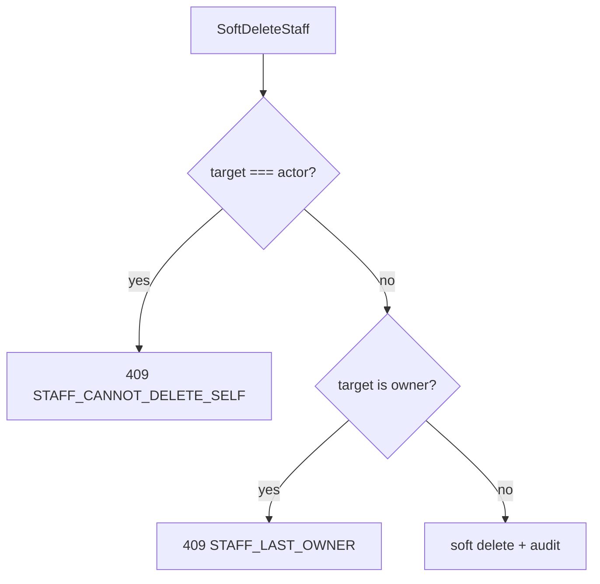

# TASK-090: Use Case — Staff CRUD

## Metadata

| فیلد | مقدار |
|------|--------|
| Phase | 1 |
| Epic | Epic-08-Core-Admin |
| ID | TASK-090 |
| Priority | P0 |
| Depends on | TASK-031, TASK-020, TASK-021, TASK-047 |
| Blocks | TASK-092, TASK-093, TASK-096 |
| Estimated | 10h |

---

## هدف

CRUD کارمند tenant: create، update، list، get، soft delete. Phone unique per tenant. Cannot delete owner (`STAFF_LAST_OWNER`). Cannot delete self (`STAFF_CANNOT_DELETE_SELF`).

---

## معیار پذیرش

- [ ] `CreateStaffUseCase` — resolve/create `User` by phone؛ unique `(tenantId, userId)` per tenant
- [ ] `UpdateStaffUseCase` — name, email, jobTitle, status, dataScope, assignedBranchIds, primaryBranchId
- [ ] `ListStaffUseCase` — filter status, branchId, cursor
- [ ] `GetStaffUseCase`
- [ ] `SoftDeleteStaffUseCase` — guards owner/self
- [ ] Audit: `staff.create`, `staff.update`, `staff.delete`
- [ ] Permissions: `core.staff.*`

---

## Permissions (rbac.md)

```
core.staff.view
core.staff.create
core.staff.update
core.staff.delete
```

---

## Create Input

```typescript
{
  tenantId: string;
  actorId: string;
  phone: string;              // normalize 09xxxxxxxxx
  name: string;
  email?: string;
  jobTitle?: string;
  dataScope: 'all' | 'branch' | 'own';
  assignedBranchIds?: string[];
  primaryBranchId?: string;
  roleIds?: string[];       // optional initial roles — or TASK-092
}
```

---

## Soft Delete Guards



---

## Error Codes

| سناریو | HTTP | Code |
|--------|------|------|
| Phone duplicate | 409 | `STAFF_PHONE_DUPLICATE` |
| Delete self | 409 | `STAFF_CANNOT_DELETE_SELF` |
| Delete owner | 409 | `STAFF_LAST_OWNER` |
| Staff not found | 404 | `STAFF_NOT_FOUND` |
| Invalid branch assignment | 400 | `BRANCH_NOT_FOUND` |
| Plan staff limit | 403 | `TENANT_PLAN_LIMIT_EXCEEDED` |
| Suspended staff login | 403 | `STAFF_SUSPENDED` |

---

## Data Scope (ADR-015)

List/Get staff: owner/manager `all` sees everyone; branch manager may see staff in assigned branches only (product decision: **owner-only staff admin** per SF-008 — enforce `core.staff.create` = owner only).

---

## فایل‌ها

| عمل | مسیر |
|-----|------|
| Create | `packages/application/src/staff/create-staff.use-case.ts` |
| Create | `packages/application/src/staff/update-staff.use-case.ts` |
| Create | `packages/application/src/staff/list-staff.use-case.ts` |
| Create | `packages/application/src/staff/get-staff.use-case.ts` |
| Create | `packages/application/src/staff/soft-delete-staff.use-case.ts` |
| Create | `packages/application/src/staff/*.spec.ts` |

---

## مراحل پیاده‌سازی

1. Phone normalize + unique check per tenant
2. Validate assignedBranchIds ⊆ tenant branches
3. primaryBranchId ∈ assigned or default
4. Create staff record + optional role assign
5. Soft delete guards
6. Audit all mutations
7. Tests

---

## Edge Cases & Errors

| سناریو | HTTP / Code | رفتار |
|--------|-------------|--------|
| Update phone | 400 | immutable after create |
| dataScope=branch + empty assigned | 400 | VALIDATION_ERROR |
| Deactivate staff | 200 | status=suspended via update |

---

## تست

- [ ] Unit: phone duplicate → 409
- [ ] Unit: delete owner → 409
- [ ] Unit: delete self → 409
- [ ] Integration: create staff → appears in list
- [ ] Integration: cross-tenant isolation

---

## Policy Alignment

- [ ] EXCELLENCE-STANDARDS §8 Staff + ADR-015 fields
- [ ] SOFT-DELETE-POLICY
- [ ] ADR-004 RBAC

---

## مراجع

- `docs/02-architecture/rbac.md`
- `docs/03-modules/installments/STAFF-FLOWS.md` — SF-008
- `docs/09-development/ERROR-CODES.md` § CORE Staff

---

## Self-Review Score

| محور | سقف | امتیاز |
|------|-----|--------|
| Metadata | 10 | 10 |
| Completeness | 25 | 25 |
| Policy | 25 | 25 |
| Executability | 25 | 25 |
| Alignment | 15 | 15 |
| **جمع** | **100** | **100** |
