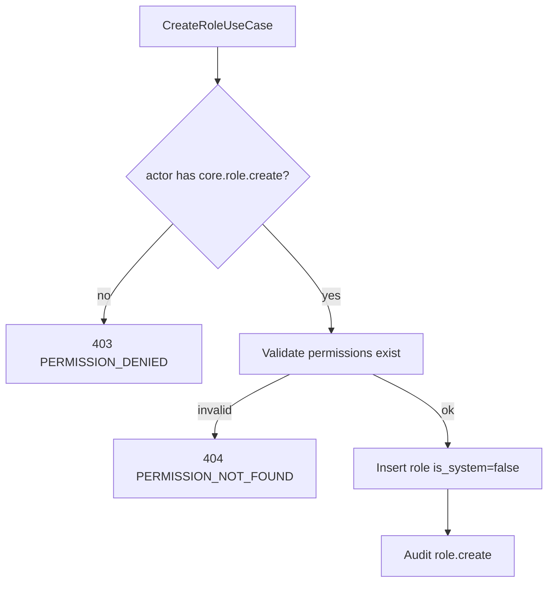

# TASK-091: Use Case — Role CRUD

## Metadata

| فیلد | مقدار |
|------|--------|
| Phase | 1 |
| Epic | Epic-08-Core-Admin |
| ID | TASK-091 |
| Priority | P0 |
| Depends on | TASK-034, TASK-021, TASK-047 |
| Blocks | TASK-092, TASK-097 |
| Estimated | 8h |

---

## هدف

CRUD نقش‌های سفارشی tenant. System roles (`owner`, `manager`, `cashier`, `viewer`) **immutable** — `ROLE_IS_SYSTEM`. فقط **owner** می‌تواند custom role create/update/delete (`core.role.create/update/delete`).

---

## معیار پذیرش

- [ ] `CreateRoleUseCase` — custom only, `is_system=false`
- [ ] `UpdateRoleUseCase` — permissions array + name; not system roles
- [ ] `ListRolesUseCase` — system + custom for tenant
- [ ] `GetRoleUseCase`
- [ ] `SoftDeleteRoleUseCase` — not system; no staff assigned
- [ ] Audit: `role.create`, `role.update`, `role.delete`
- [ ] Permissions from `core.role.*`

---

## Permissions (rbac.md)

```
core.role.view
core.role.create
core.role.update
core.role.delete
```

> Note: rbac.md matrix uses `core.role.manage` in places — implementation uses granular `core.role.*` per rbac.md § Core Permissions.

---

## Create Input

```typescript
{
  tenantId: string;
  actorId: string;
  code: string;           // slug unique per tenant
  name: string;           // display fa
  permissions: string[];  // must exist in registry
  dataScope: 'all' | 'branch' | 'own';
}
```

---

## System Role Rules

| Rule | Behavior |
|------|----------|
| `is_system=true` | no update/delete |
| owner role | always exists per tenant (seed) |
| permission list | validated against ModuleRegistry |

---

## Error Codes

| سناریو | HTTP | Code |
|--------|------|------|
| Update/delete system role | 409 | `ROLE_IS_SYSTEM` |
| Code duplicate | 409 | `ROLE_CODE_DUPLICATE` |
| Role not found | 404 | `ROLE_NOT_FOUND` |
| Invalid permission code | 404 | `PERMISSION_NOT_FOUND` |
| Delete role with staff | 409 | `DELETE_FORBIDDEN` |
| Non-owner create | 403 | `PERMISSION_DENIED` |

---

## Flow — Create Custom Role



---

## فایل‌ها

| عمل | مسیر |
|-----|------|
| Create | `packages/application/src/roles/create-role.use-case.ts` |
| Create | `packages/application/src/roles/update-role.use-case.ts` |
| Create | `packages/application/src/roles/list-roles.use-case.ts` |
| Create | `packages/application/src/roles/get-role.use-case.ts` |
| Create | `packages/application/src/roles/soft-delete-role.use-case.ts` |
| Create | `packages/application/src/roles/*.spec.ts` |

---

## مراحل پیاده‌سازی

1. Assert actor is owner (or has core.role.create)
2. Validate permission strings against registry
3. Prevent mutation on system roles
4. Soft delete: check no StaffRole assignments
5. Audit
6. Tests

---

## Edge Cases & Errors

| سناریو | HTTP / Code | رفتار |
|--------|-------------|--------|
| Empty permissions array | 400 | VALIDATION_ERROR |
| code = 'owner' for custom | 409 | ROLE_CODE_DUPLICATE |
| List includes system roles | 200 | is_system flag visible |

---

## تست

- [ ] Unit: system role update blocked
- [ ] Unit: invalid permission rejected
- [ ] Integration: owner creates custom role
- [ ] Integration: manager cannot create role

---

## Policy Alignment

- [ ] ADR-004 RBAC
- [ ] SOFT-DELETE-POLICY
- [ ] rbac.md — owner-only custom roles

---

## مراجع

- `docs/02-architecture/rbac.md`
- `docs/09-development/ERROR-CODES.md` § Role

---

## Self-Review Score

| محور | سقف | امتیاز |
|------|-----|--------|
| Metadata | 10 | 10 |
| Completeness | 25 | 25 |
| Policy | 25 | 25 |
| Executability | 25 | 25 |
| Alignment | 15 | 15 |
| **جمع** | **100** | **100** |
